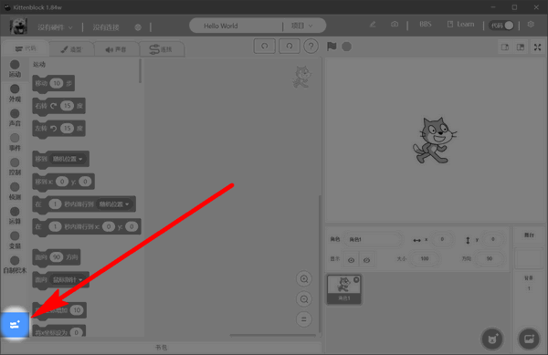
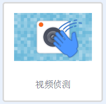
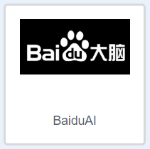
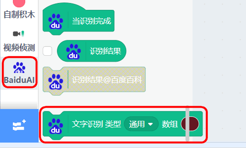
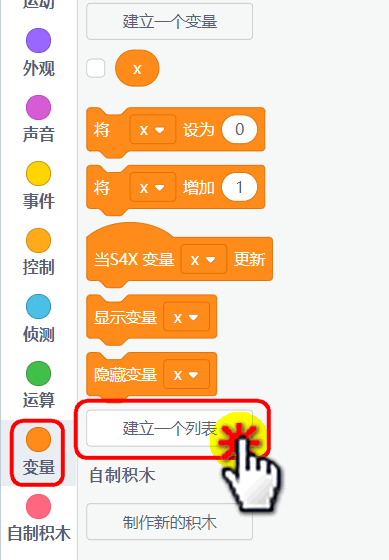
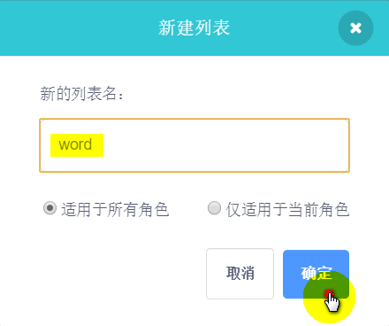
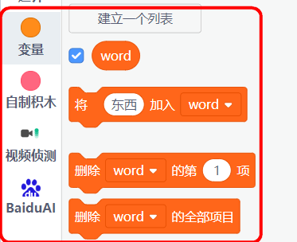
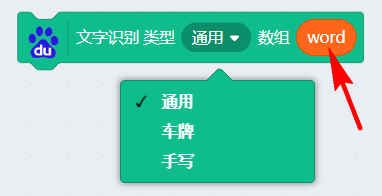
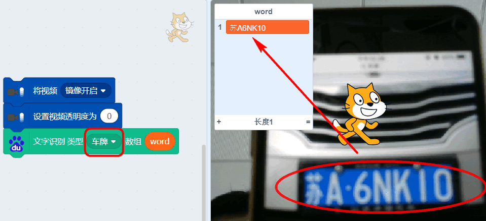
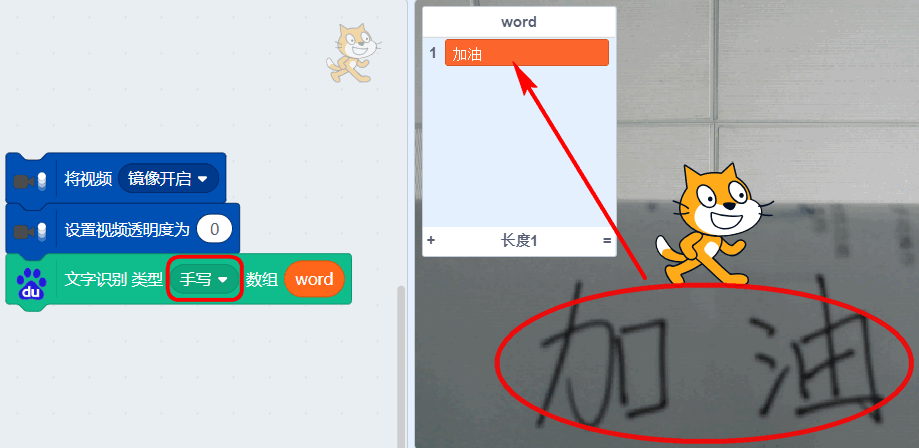

# 百度文字识别(可手写识别)

在FaceAI之前我们已经学过印刷字体识别与车牌识别，FaceAI中的车牌识别除非你使用个人的API，否则会因为同一时间太多人用会导致调用识别。因此喵家再引入了百度的文字识别功能，可以让用户有多个选择。

## 简介

百度文字识别涵盖了三种类型:

- 通用（印刷字体识别）
- 车牌识别
- 手写识别

## 插件加载

## 插件成功加载

这个就是新增的百度文字识别

## 积木块具体介绍

使用方法跟之前的FaceAI文字识别与车牌识别使用方法一致

### 新建列表

注意是列表！！不是变量！如图

### 把列表塞进文字识别积木块

## 示例程序——印刷字体识别

## 示例程序——车牌识别

## 示例程序——手写字体识别

## 后记

总体体验下来，识别效果：车牌>通用>手写。这种情况也是符合客观实际情况的。车牌识别只是在有限字库中进行识别匹配，通用（印刷字体）的字库比车牌识别的大多了。手写字那就更难，因为每个人都有每个人的写字风格，机器学习恰好没有训练到类似你那样的写字风格，就有可能没办法识别出来。