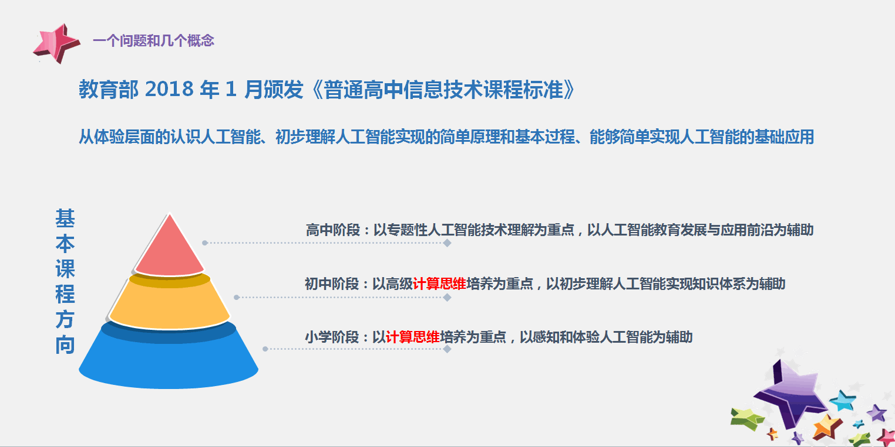
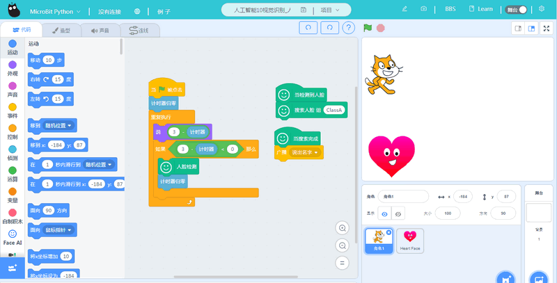
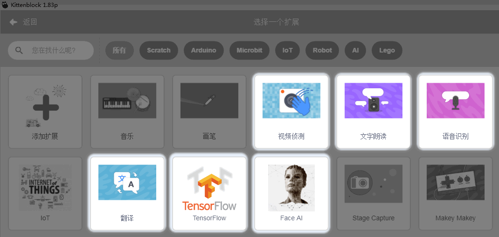
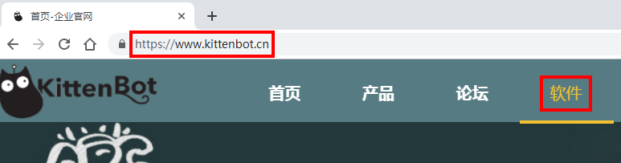
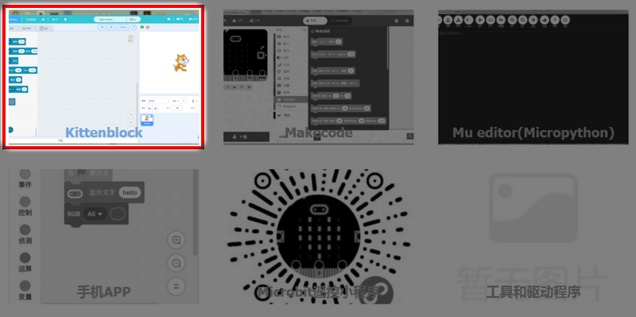
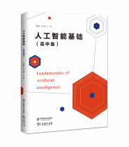

# 中小学人工智能应该怎么学？

自国家大力提倡人工智能发展，全国各地的中小学已经慢慢开始接触和学习人工智能。书店里不再是千篇一律的关于谷歌的TensorFlow机器学习书籍，也慢慢有相关中小学生可以看到的的书籍读物。人工智能也是近些年来走到社会关注的舞台中，不仅对于青少年来说，甚至对于大人来说都是一个非常新的事物，都需要慢慢花点时间去理解。

很多人可能有疑问，人工智能对于中小学生来说是不是学习过早？CC喵认为中小学生代表就是十多年后的国家最新的生产力，越早接触最顶尖的技术对于个人与国家来说都是有益处的。况且对于中小学阶段，学习人工智能，我们以学习概念为主，了解原理，最好能结合信息课程进行动手操作，让中小学生在动手操作这个过程中体会到人工智能的强大之处，激发他们学习和创造的欲望，等他们到高年级后，再进行深入甚至是底层性的开发。并且当今时代的节奏已经变了，变得非常快非常紧凑，现在的中小学生也是非常聪明，接受程度也足够强（你没看见每个小朋友手机ipad都玩得比你还溜~），所以我们作为新一代的领路人，我们不应该花时间在讨论应不应该学习人工智能这个事情上。必须学！毫无疑问要学！但是!作为领路人，我们更应该花多点时间与心思在设计人工智能的课程，需要花更多精力在如何让人工智能实践课变得更有趣！而不是以往的填鸭式的教育，将一股脑的知识与概念塞给小孩子，这不利于中小学生掌握人工智能方面的知识。我们可以在实践课中穿插人工智能的知识，将实践课程与生活应用相结合，最好做出的作品能有生活意义的，这样孩子们的印象就会更深刻了。

人工智能在我们生活中越来越显得重要，在我们编程教育界中，我们应该思考如何将人工智能落地，如何将这些高深的技术讲得通俗，如何让学生们接收到这些知识，如何让学生灵活运用人工智能的技术。未来的十年必然是人工智能的天下，现在学好人工智能，相当于给未来选好了一条弯道超车的赛道。作为STEAM教育公司,2019年人工智能是我们重点推广的技术，我们希望能把人工智能的技术门槛降低，让中小学生能真真正正把人工智能的技术操作起来，服务好全国的中小学生

## 人工智能与Scratch结合

现在几乎大部分中小学的电脑信息技术课程已经学习或者普及了Scrtach，小喵科技也在STEAM领域中深耕多年，技术上有很深的积累，对Scratch与各项软硬件技术研究十分透彻。所以小喵科技将晦涩难懂的人工智能技术化为Scratch积木块，让小学生也能在拖拽式编程中学习人工智能。

同时，现在市面上越来越多打着卖人工智能的概念，实际还是卖小车卖机器人的公司，在他们的二十几节课程中，可能只有一两节，是跟人工智能相关的，实际对学习人工智能一点帮助都没有，依旧是一样的配方，换汤不换药，只有编程，跟人工智能技术这些语音识别，人脸识别一点关系都没有。归根到底是技术创新示例不够。

技术创新一向是小喵科技的强项。为了普惠人工智能，方便中小学学习。小喵将人工智能技术结合在Kittenblock中（基于Scratch3.0），你可以选择结合Microbit或者arduino，或者不结合硬件，直接在Kittenblock中免费学习人工智能也是OK的。

## 小喵家人工智能的优势

- 拥有齐全的人工智能插件，涵盖的语音、视觉、机器学习等等
- 对高门槛的技术进行封装成积木块，中小学生也能操作
- 拥有丰富的教程示例，让您一键上手
- 普惠的人工智能插件不强依赖硬件，资源不足的学校也能学习人工智能 
- 支持市面上热门硬件，人工智能可以结合硬件进行使用
- 人工智能的师资培训（可以根据商业需求，区域性老师集体培训）

## 人工智能内容

小喵在Kittenblock中做了以下的插件，在后面的章节学习中，小喵会逐一讲解这些人工智能插件的用法。

小喵的人工智能绝不会是市面上的长篇大论，而是将技术封装，化作中小学能使用能编程的积木块，真正将人工智能落地的操作。希望各位老师如果觉得我们的课程教程写的不错，软件能真真正正与人工智能相关的，可以学到人工智能知识的。希望各位老师广而告之，或者可以把我们的软件技术写到本地的书籍教程中，我们小喵可以也会给出相应的特别技术支持。如果真心觉得我们不错，也可以买我们的Microbit与相关开源硬件产品来支持我们，等我们有更多的香蕉投放给程序猿，奖励他的辛勤工作。

后面的课程，涉及到人工智能相关的知识，有以下几大类：

### 文字朗读

### 语音识别

### 机器翻译

### 视觉侦测

### 人脸识别

### 机器学习（谷歌TensorFlow）

不用害怕，觉得这些知识很难，只要你跟着CC喵的脚步，定能把这些人工智能的知识都学会

## Kittenblock软件安装

在学习人工智能插件前，如果您是我们的新用户，你需要安装我们的Kittenblock软件。

[Kittenblock软件的下载与安装请点击这里](http://learn.kittenbot.cn/zh_CN/latest/kittenblock/index.html)

请访问：

https://www.kittenbot.cn/

点击页面进行下载：推荐下载绿色包

## 书籍推荐

因为后面的课程主要是软件结合人工智能的操作，简单介绍人工智能的一些实现原理，如果大家想对人工智能进行更深入的了解，了解更多的概念性东西，这里推荐本书。特别适合没有任何人工智能基础的老师和爱好者看。书籍通俗易懂，唯一缺点就是，数据知识点的系统性不够，知识点有点散乱。

另外一本推荐的书籍，是国内写的，比较有条理，适合高中或大学以上的人士看，也算比较通俗易懂，但是涉及的知识点比较深。

欢迎各位老师和爱好者加入我们群，进行探讨，谢谢大家

