# 文字朗读

## 简介

文字朗读是最基础的人工智能插件。在我们日常生活中，例如排队叫号，车站报播，高铁报站等等，或者是比较智能的机器人，与人的语音交互，都是以文字朗读为技术底层进行实现的。

文字朗读作用就是：将文字转换成语音，本文字朗读插件，除了支持中文朗读，还支持其他各国语言朗读

## 原理

文字朗读，也称语音合成，它也被称为文本转换技术（TTS）。它是将计算机自己产生的、或外部输入的文字信息转变为可以听得懂的、流利的口语输出的技术。国内文字朗读做得比较出色的两家是科大讯飞与百度。

文字朗读的几个发展阶段

在文字朗读发展的最早阶段，机器是根据文字所对应的字音读出来，这样逐字朗读出来是毫无感情可言，听起来完全就是一个机器人机械式进行朗读。嗯，这种是最没有技术含量的。

下一阶段，单元挑选拼接合成阶段。简单来说，将一个简单的句子分解成多个元素，这些元素一般是可以符合人的常理进行理解的。举了例子,将“小喵科技专注中小学图形化人工智能编程”，里面包含的元素有，“小喵科技”，“中小学”，“人工智能”，“编程”等。此阶段的技术的瓶颈在于语音合成数据库的元素。一旦语音数据库不包含这个元素，它还是被逐字的读出来。此阶段的缺点依旧是朗读没有感情。

再下一个阶段，基于HMM的参数语音合成。简单来说解决朗读没有感情这个问题，通过庞大的语料库，进行手工信息标注（网上经常有人调侃，人工智能背后是极其枯燥的人工不智能的人力标注出来的素材），上下特征，参数提取等，进行HMM训练。得出模型后，将输入的文本进行参数调整，最终输出有感情，抑扬顿挫的语音。

现今阶段，基于深度学习的语音合成。可以简单理解为，在HMM的基础上，它的模型能力更强，效率更高。

## 实验条件

- 安装好Kittenblock

- 电脑可以播放声音(记得调整好音量)

- 畅顺的网络（文字朗读是通过云端服务器实现，用的是MIT的服务器）

(除此外，您无需购买小喵任何硬件套件，人工智能，小喵真的是做到普惠，希望各位老师多多支持！）

PS：Kittenblock软件安装过程很简单，这里不再作介绍，具体参照：

http://learn.kittenbot.cn/ 的Kittenblock教程分栏

## 插件加载

双击打开Kittenblock，左下角加载插件

选择文字朗读插件

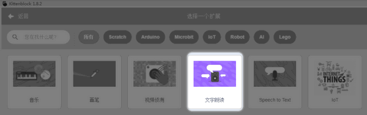

## 插件成功加载

文字朗读插件，只有3个积木块，使用非常简单

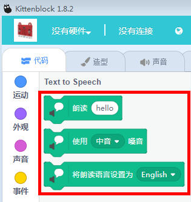

## 积木块具体介绍

语音合成的技术已经进行了底部封装，应用阶段，我们只需要掌握如何使用这个文字朗读即可。

首先朗读前必须设置朗读的语种（如中文、英文、日语等等），朗读的语种要与你填写的内容要对应上。

假设你设置朗读语种为英文，你朗读内容框应该填入英文字符串。

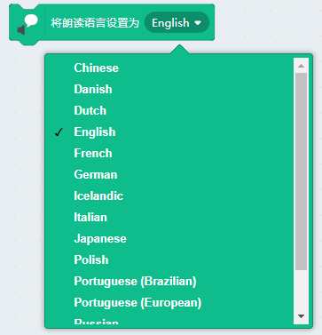

下拉菜单选定后，记得点击下这个积木块，不然命令是没有下发的，同理下文的积木块设置都是需要点击。

设置朗读的嗓音，中英文都可以设置成多种嗓音（中文相对英文少了一些嗓音）

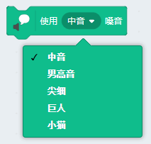

朗读内容，需要根据你的朗读语种进行对应填写

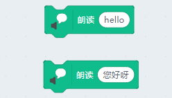

错误示范与正确示范：

例如英文，可以设置多种嗓音

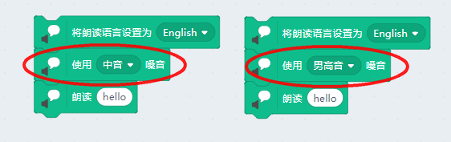

如果朗读中文，嗓音类型比较少，那就干脆不设置了

精灵角色被点击或者用按键检测，触发朗读内容

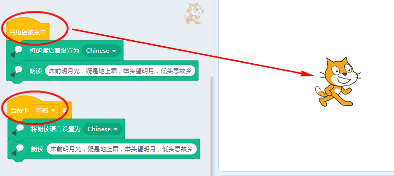

## 与Microbit交互的语音朗读

案例1：按键控制语音朗读

如果我手上有一个Microbit，我现在想做一个简单的实验，按键A键 让电脑说出一句话来，按B键让电脑说出另外一句话来。

首先你要先将Microbit恢复固件，连接上串口（[如果你对Kittenblock控制Microbit在线交互不熟悉，请看这里](http://learn.kittenbot.cn/zh_CN/latest/microbit/microbit_kittenblock/03microbit%E4%BD%BF%E7%94%A8%E5%9C%A8%E7%BA%BF%E8%B0%83%E8%AF%95%E6%A8%A1%E5%BC%8F.html)）

PS：恢复固件很简单，这里不再作介绍，具体参照：

http://learn.kittenbot.cn/ 的Microbit在Kittenblock中教程分栏

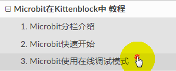

假设上面的步骤都没问题，我们编写程序

最后按下Microbit的按键A或者按键B，电脑就会把对应的语音朗读出来。（如果没有反应肯定是你硬件串口没有连接）

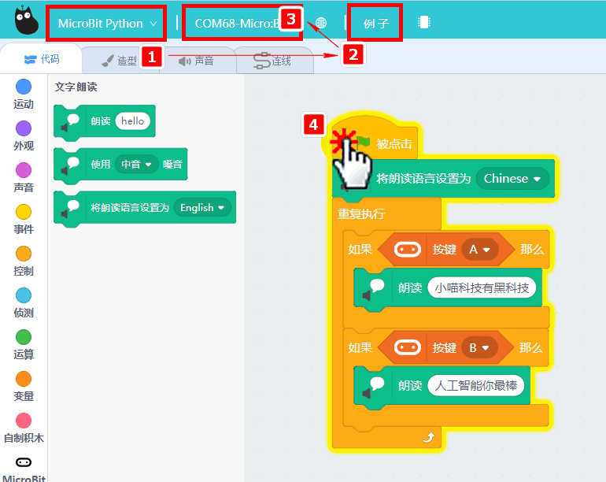

案例2：超声波控制语音朗读

首先要接好喵家的超声波（[喵家超声波接线方法](http://learn.kittenbot.cn/zh_CN/latest/electronics/%E7%8C%AB%E5%A4%B4%E8%B6%85%E5%A3%B0%E6%B3%A2.html)）

Robotbit——超声波模块

- 5V——V
- P1——D(超声波)
- GND——G
- P2——A(rgb灯)

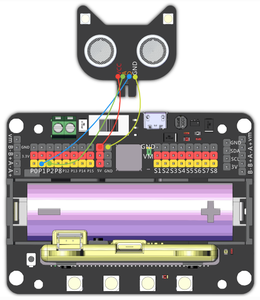

程序设计：

当超声波检测物体靠近，距离小于20厘米时候，触发文字朗读，朗读出对应的内容来。

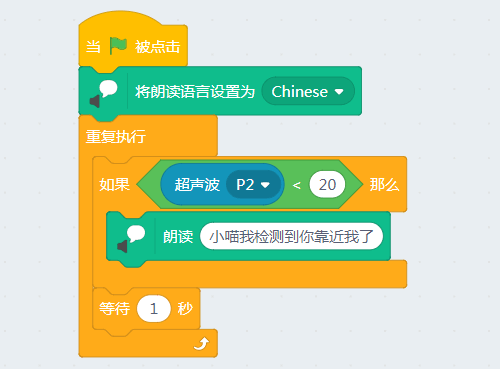

## 总结——硬件与语音交互本质

硬件恢复固件后，传感器信号通过串口与Kittenblock在线交互，例如按键触发，超声波距离触发，或者其他传感器触发等等。对应信号触发语音朗读的积木。

非常好理解，只需要你先把硬件恢复固件连接上串口即可实现在线交互。

## 疑问与解答

问1：我电脑不联网能用文字朗读吗？

答1：必须联网，朗读语言依赖人工智能云端服务器，本地电脑只是将最终传输的语音播放出来。

----------
问2：为什么我按朗读没有反应？

答2：朗读语言与朗读的内容必须对应才有反应的。

----------
问3：中文可以设置嗓音吗？

答4：可以设置嗓音，只是嗓音类型比较少，文字朗读是调用的国外MIT的服务器。国外对中文朗读优化比较少，所以只有几种嗓音，比英文嗓音少。
