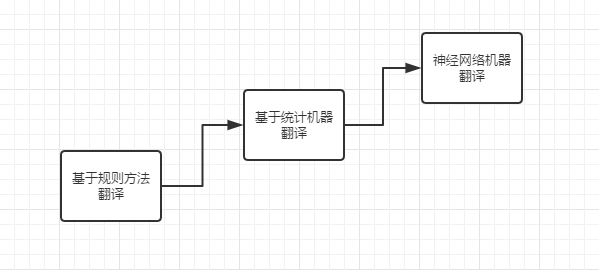
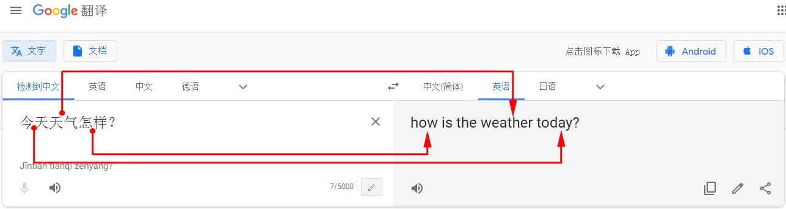
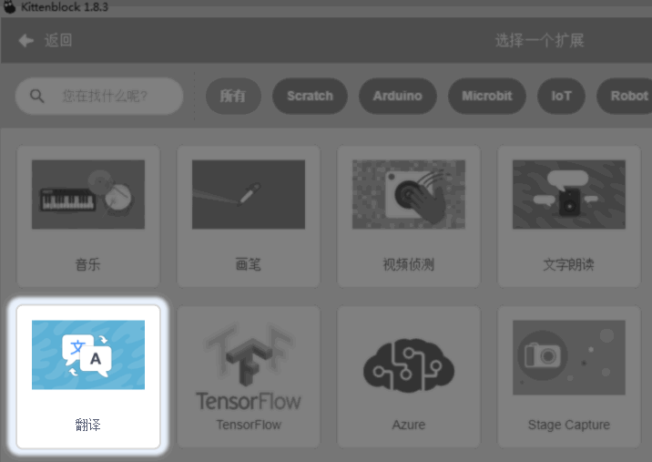
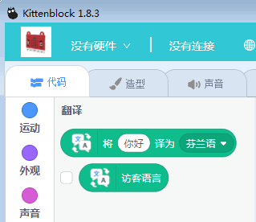
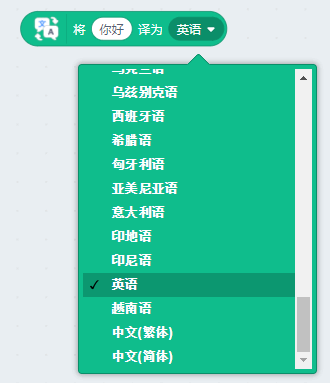
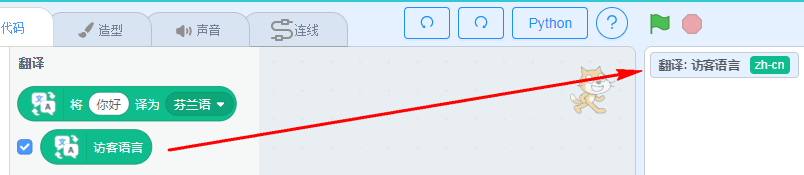
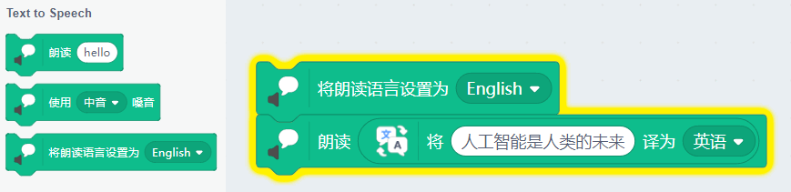

# 文字翻译

## 简介

翻译也在我们生活中用得很多，比如我们的翻译机，或者是平时网页翻译，我们很多时候都已经离不开翻译的工具了,尤其在我们查阅一些外文资料的时候。

## 原理

机器翻译（machine translation），又称为自动翻译，是利用计算机把一种自然源语言转变为另一种自然目标语言的过程，一般指自然语言之间句子和全文的翻译。它是自然语言处理 （Natural Language Processing）的一个分支，与计算语言学（Computational Linguistics ）、自然语言理解（ Natural Language Understanding） 之间存在着密不可分的关系.

机器翻译主要经历三个阶段：

1、基于规则翻译。这个阶段可以简单理解为逐词翻译，还有句子的成分翻译后是应该如何排序。这个阶段对于简单的句子，翻译的效果是很好的，但是一旦超出日常的范围，翻译出来的句子就会晦涩难懂，不知所言。另外一个缺点就是，不同语言之间你都需要一个语言专家来做成一对一的规则，这个需要花费很大的人力。因此就有了统计机器翻译的阶段。

2、统计机器翻译。这个阶段利用了统计学的方法。建立了一个数学模型。这种模型成本很低，它跟语言无关，一旦建立起来后，可以对任何语言都是适用。统计学基于语料库，如果语料库数据太少的情况下，这种方法就不适用了，因此产生了下一阶段发展的必要性。

3、神经网络机器翻译，神经网络机器翻译主要包括两部分，编码器与解码器，编码器根据神经网络的变换，将句子变为高维向量，解码器再将高维向量转换为目标语言。神经网络的机器翻译优势在于效率高，效果更好。随着神经网络翻译的不断发展，翻译质量不断的提高。

## 实验条件

- 安装好Kittenblock

- 电脑可以播放声音(记得调整好音量)

- 畅顺的网络（文字朗读是通过云端服务器实现，用的是MIT的服务器）

(除此外，您无需购买小喵任何硬件套件，人工智能，小喵真的是做到普惠，希望各位老师多多支持！）

PS：Kittenblock软件安装过程很简单，这里不再作介绍，具体参照：

http://learn.kittenbot.cn/ 的Kittenblock教程分栏

## 插件加载

双击打开Kittenblock，左下角加载插件

选择翻译插件

## 插件成功加载

文字朗读插件，只有2个积木块，使用非常简单

## 积木块具体介绍

执行翻译积木块，前面框框填入你要翻译的内容（如果你会其他语言，可以输入其他语言试一试，例如英文、日本等），后面下拉菜单即翻译的目标语言。

翻译语言多达61种。

记得点击积木块执行翻译

第二个积木块一般没什么用...是用来显示当前用户的语言

## 长句子翻译也是很溜

不仅仅翻译单词，更擅长翻译长语句。独立的词组意思可能有很多种，长语句更能表达真正的意思。

输入后，点击积木块即可翻译

## 翻译积木块与语音朗读积木块组合使用

学会了这个翻译积木块，相当于你有个61种语言的翻译机，你已经是个全球通了~

翻译积木一般会结合朗读积木块进行使用。翻译并朗读出来，如图所示：

切记设置朗读语言应该与你的翻译语言的语种一致，否则发不出声音来！

