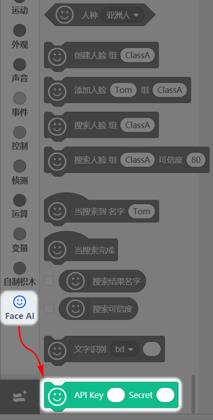
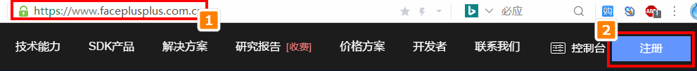
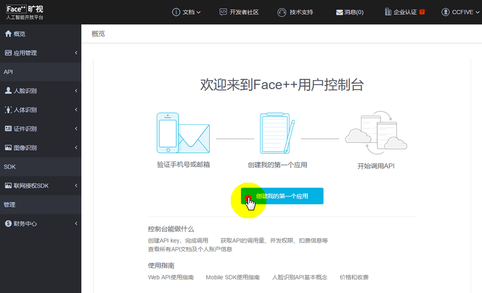
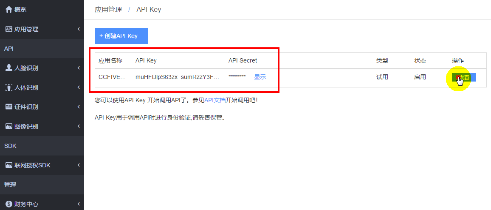
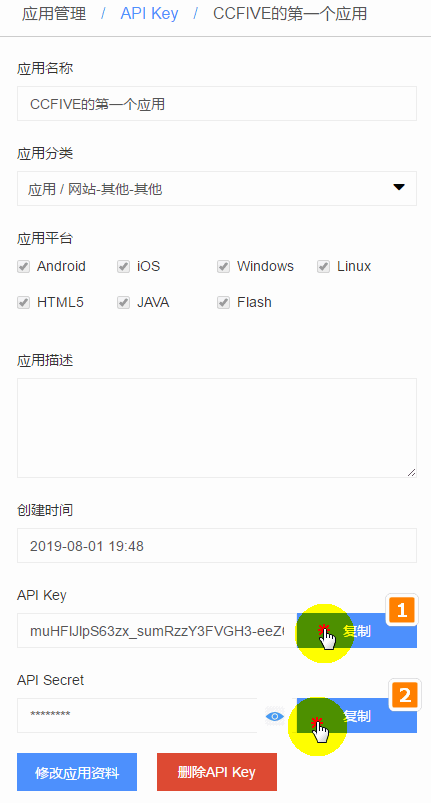
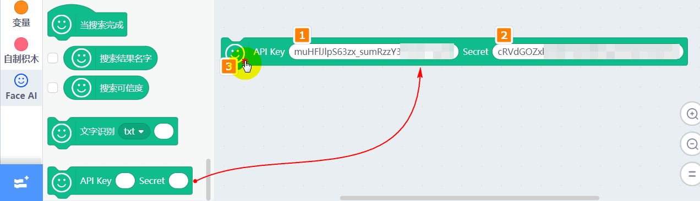

# 进阶独享你的FaceAI账号

## 简介

最近如果有细心的用户会发现，FaceAI插件下多了一个新积木块。

这个积木块实际用来登录FaceAI的账户，插件默认是登录喵家的公共账户。

喵家重度人工智能插件用户可能会发现，如果频繁调用喵家的FaceAI，有时会返回不了结果（过一会就好了），原因是因为一秒内同时有很多人用这个插件功能，超出了账户一秒内最大的用户调用数。

如果你人工智能是重度使用用户，很简单，创建自己的一个独立账号，这样就不会受到喵家其他用户的影响，下面就手把手教大家如何进行创建你的独立账号

## 登录FaceAI

打开浏览器，点击网址跳转 https://www.faceplusplus.com.cn/

按下图的注册步骤进行注册：

需要注意两个地方：

- 注册需要手机验证码，自备手机。
- 选择个人开发者

点击——创建我的第一个应用

点击查看具体 API详情

把API Key和Secret复制下来，准备粘贴到Kittenblock的积木上

粘贴到积木块上，然后点击一下积木块即可。这个过程只需要设置一次，之后只要你软件重装了或者FaceAI这个插件有更新，才需要重新设置下。后面这个积木块可以不用管了。

后续，大家继续按照FaceAI的常规用法进行使用就可以了，这个积木块就不用管了，因为你已经设置了，在软件内部底层已经切换成你的账号了。

