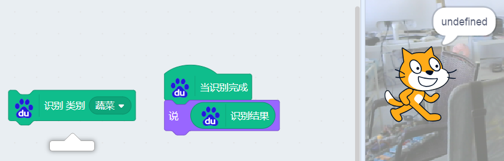
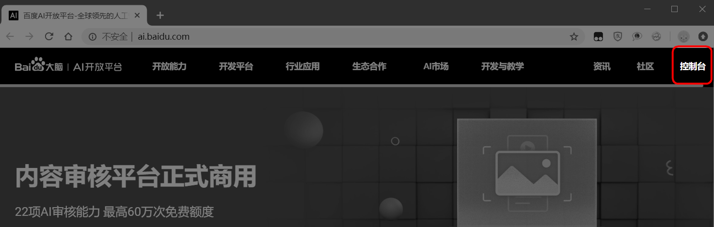
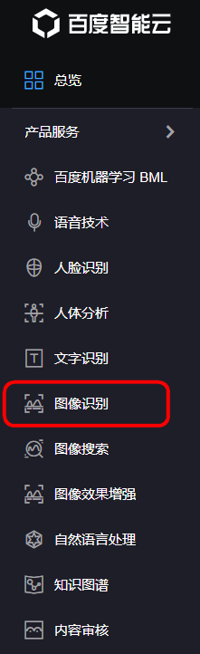
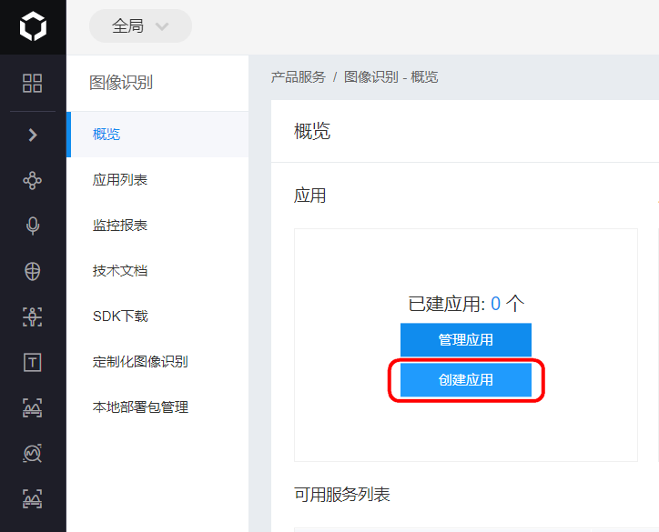
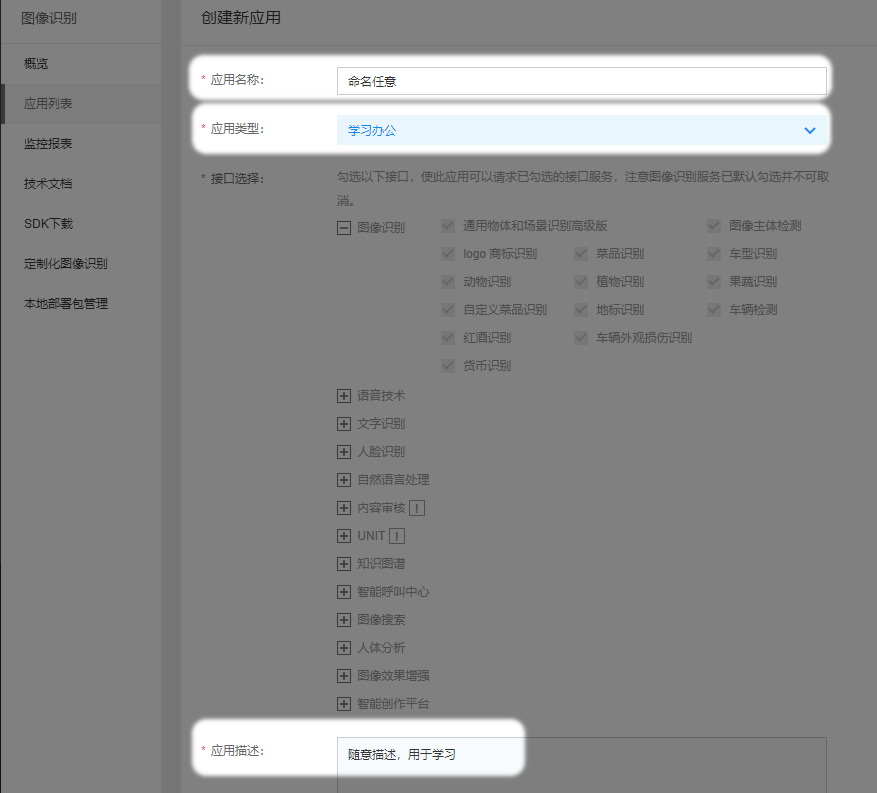
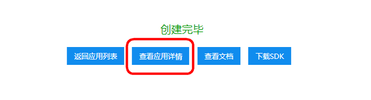
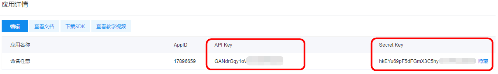
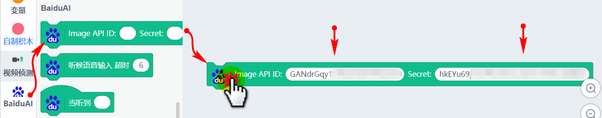
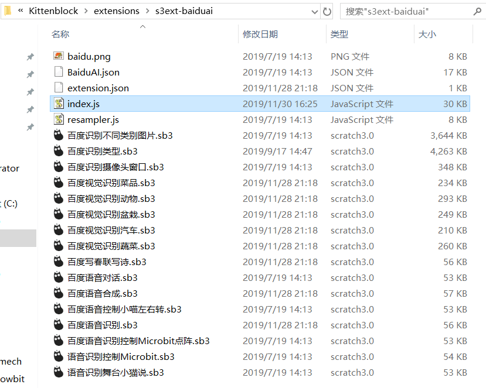

# 进阶独享你的百度大脑账号

## 简介

最近有用户跟我们反馈，在用百度大脑的物体识别时，返回undefined，无法反馈正确的参数。

这是用于同时使用的用户数比较多，因此无法返回正确数值。

解决办法，注册自己独立的账号，针对后期大批量的教育用户，我喵家稍后有针对性的解决方案，方案还在研发中。老师们请耐心等候

## 登录百度大脑

打开浏览器，点击网址跳转 http://ai.baidu.com/

点击控制台进行注册登录（实质就是注册一个百度账号，或者你可以用你原有的百度账号）

注册完成后，选择图像识别

创建应用

填写信息，信息随意，不会影响什么的

创建完成查看应用

记录下你的API和secret，稍后再Kittenblock中用到

打开1.8.4y，加载百度大脑，加载API积木，填入你自己的 API和Secret

这样你就能自己独享你的账号，一个免费的账号物品识别每个种类大概是500次，可以满足一般用户的需求。

## 1.8.4x 解决百度大脑物体识别问题

因为以上介绍的积木 是在1.8.4y上，由于1.8.4y还需要有段时间才会更新。

因此，大家用这个补丁文件自行替换软件目录的文件就可以了。如图操作，注意文件的目录！不要替换错了！

粘贴覆盖替换

[index.js下载](https://bbs.kittenbot.cn/forum.php?mod=attachment&aid=MzM1Mnw3MjMzNTAxMXwxNTc1MTA3MTA4fDN8ODUx)

