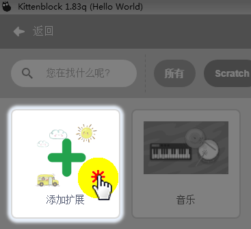
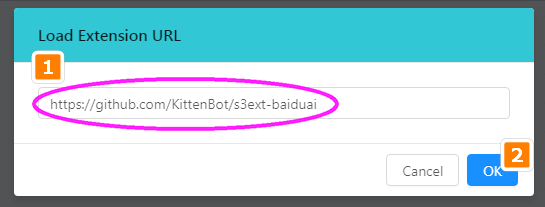
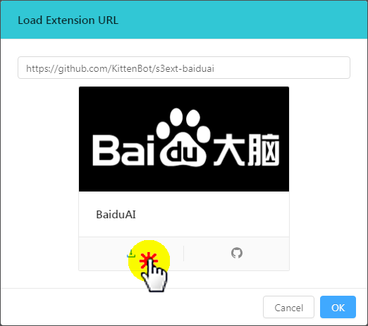
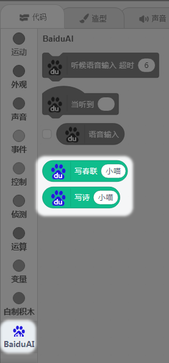
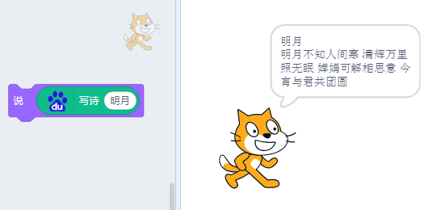

# 百度大脑写诗写对联

## 简介

最近Kittenblock又加了一个百度大脑的写诗和写对联功能

## 原理

百度大脑经过巨大的诗词库与对联库进行学习，慢慢“学懂”了，给出关键字就能写出古诗与对联

## 实验条件

- 安装好Kittenblock

- 麦克风或者带麦克风的USB摄像头（型号没有限制，但是麦克风质量最好是好一点的，不然识别率不是很高）

- 电脑可以播放声音(记得调整好音量)

- 畅顺的网络（文字朗读是通过云端服务器实现，用的是MIT的服务器）

(除此外，您无需购买小喵任何硬件套件，人工智能，小喵真的是做到普惠，希望各位老师多多支持！）

PS：Kittenblock软件安装过程很简单，这里不再作介绍，具体参照：

http://learn.kittenbot.cn/ 的Kittenblock教程分栏

## 插件加载——百度大脑

双击打开Kittenblock，左下角加载插件，按下图操作

填入地址：https://github.com/KittenBot/s3ext-baiduai

点击下载，下载完成后，软件会自动重启

重新选择百度语音识别插件

## 插件成功加载

语音识别插件，使用非常简单，如果你用过手机的语音助手，那就很简单了。一般我们使用手机语音助手，需要按住一个虚拟按键，然后等待出现麦克风图标后，再进行语音对讲。

## 让小喵写春联

## 让小喵写诗

## 你还想有什么好玩的玩法？告诉小喵