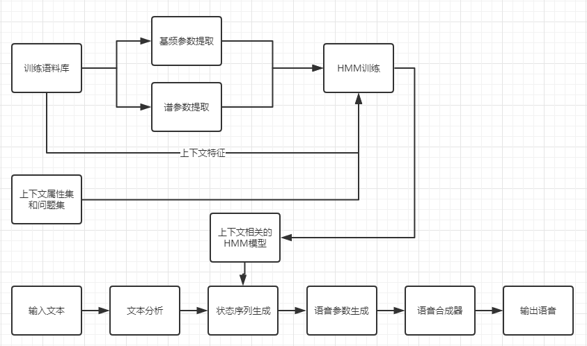
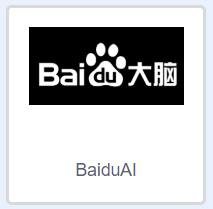
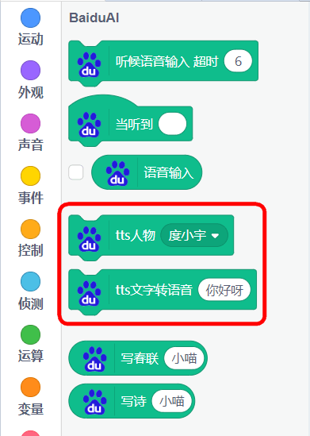
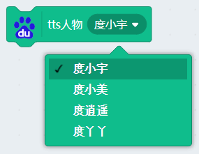

# 百度大脑文字朗读

前面我们已经学习了Scratch官方插件文字朗读，但在国内的部分学校网络不太好，也会出现无法朗读的情况。所以喵家这里针对国内情况，加入了百度大脑的文字朗读，以适应国内的渣渣网速情况。使用方式实质与MIT的文字朗读一样。

## 简介

文字朗读是最基础的人工智能插件。在我们日常生活中，例如排队叫号，车站报播，高铁报站等等，或者是比较智能的机器人，与人的语音交互，都是以文字朗读为技术底层进行实现的。

文字朗读作用就是：将文字转换成语音，本文字朗读插件，除了支持中文朗读，还支持其他各国语言朗读

## 原理

文字朗读，也称语音合成，它也被称为文本转换技术（TTS）。它是将计算机自己产生的、或外部输入的文字信息转变为可以听得懂的、流利的口语输出的技术。国内文字朗读做得比较出色的两家是科大讯飞与百度。

文字朗读的几个发展阶段

在文字朗读发展的最早阶段，机器是根据文字所对应的字音读出来，这样逐字朗读出来是毫无感情可言，听起来完全就是一个机器人机械式进行朗读。嗯，这种是最没有技术含量的。

下一阶段，单元挑选拼接合成阶段。简单来说，将一个简单的句子分解成多个元素，这些元素一般是可以符合人的常理进行理解的。举了例子,将“小喵科技专注中小学图形化人工智能编程”，里面包含的元素有，“小喵科技”，“中小学”，“人工智能”，“编程”等。此阶段的技术的瓶颈在于语音合成数据库的元素。一旦语音数据库不包含这个元素，它还是被逐字的读出来。此阶段的缺点依旧是朗读没有感情。

再下一个阶段，基于HMM的参数语音合成。简单来说解决朗读没有感情这个问题，通过庞大的语料库，进行手工信息标注（网上经常有人调侃，人工智能背后是极其枯燥的人工不智能的人力标注出来的素材），上下特征，参数提取等，进行HMM训练。得出模型后，将输入的文本进行参数调整，最终输出有感情，抑扬顿挫的语音。

现今阶段，基于深度学习的语音合成。可以简单理解为，在HMM的基础上，它的模型能力更强，效率更高。

## 实验条件

- 安装好Kittenblock

- 电脑可以播放声音(记得调整好音量)

- 畅顺的网络（文字朗读是通过云端服务器实现，用的是MIT的服务器）

(除此外，您无需购买小喵任何硬件套件，人工智能，小喵真的是做到普惠，希望各位老师多多支持！）

PS：Kittenblock软件安装过程很简单，这里不再作介绍，具体参照：

http://learn.kittenbot.cn/ 的Kittenblock教程分栏

## 插件加载

双击打开Kittenblock，左下角加载插件

选择百度大脑插件

## 插件成功加载

## 积木块具体介绍

百度的语音合成，可以朗读中文和英文（英文朗读起来口音不太自然），相比MIT的文字朗读，百度是国内的服务器，在国内使用会比较畅顺。

- 朗读嗓音设置（朗读人物设置）

有4种嗓音可以选择

- 朗读内容设置

内容可以填入中文，或者英文（英文朗读效果不太好）

## 示例程序

使用非常简单，保证电脑在联网状态下，分别点击两个积木块，就可以发出声音

