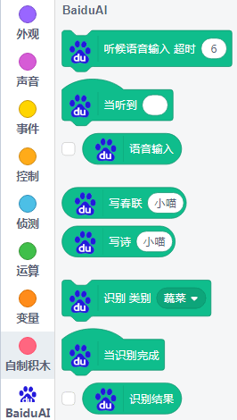
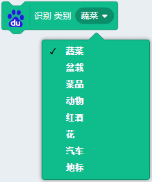
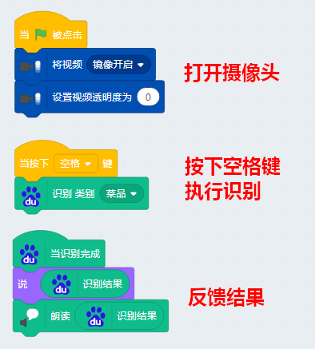
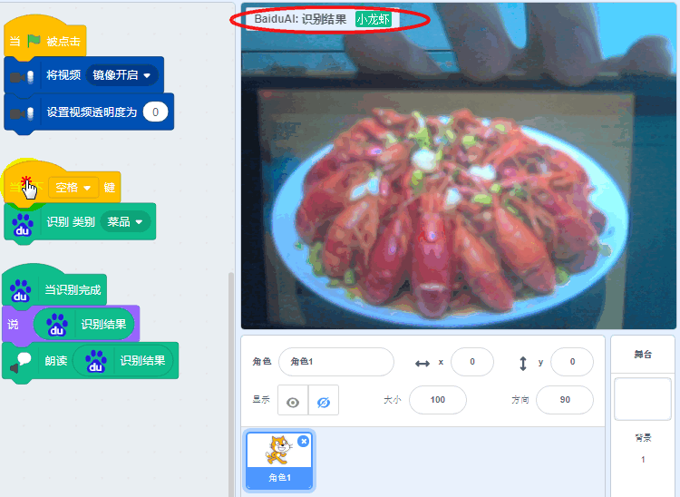
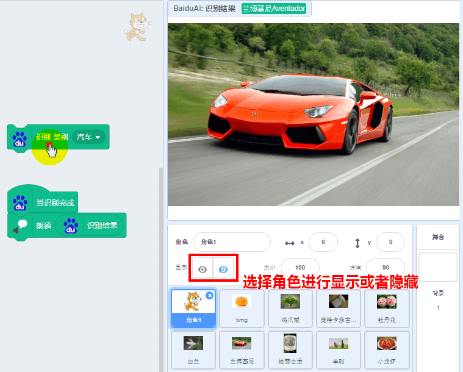
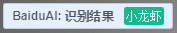
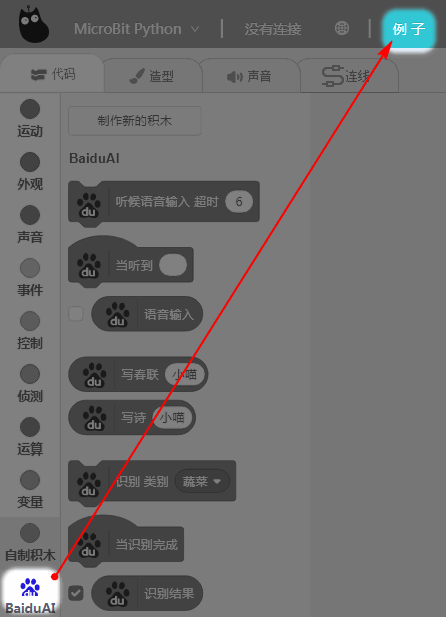

# 百度大脑识别不同物体

## 简介

百度细粒度图像识别目前支持动物、植物、菜品、地标等，能精准识别超过十万种物体和场景，包含多项高精度的识图能力

## 实验条件

- 安装好Kittenblock

- 畅顺的网络

- USB摄像头（型号没有限制）

(除此外，您无需购买小喵任何硬件套件，人工智能，小喵真的是做到普惠，希望各位老师多多支持！）

PS：Kittenblock软件安装过程很简单，这里不再作介绍，具体参照：

http://learn.kittenbot.cn/ 的Kittenblock教程分栏

## 插件加载

双击打开Kittenblock，左下角加载插件

选择百度大脑

## 插件成功加载

1.8.4g 百度大脑积木块如下：

## 识别类型包括

## 示例程序编写

这里写了一个对菜品进行识别的程序（其他类别同理）

你需要自行加入“视频侦测”、“语音朗读”插件

## 结果验证

点击绿旗子运行，用手机准备好菜品的图片，放在摄像头前进行识别。

按下空格键，即进行识别。

## 识别给定的图片

百度大脑类型识别，除了可以识别摄像头窗口，当然也可以识别本地的图片，只需要把本地图片上传到舞台上即可。

程序如图所示：

[示例程序下载戳我](https://bbs.kittenbot.cn/forum.php?mod=attachment&aid=MzAyMnw0OTQzYTJlYXwxNTYzMjc1MDk3fDN8NzA1)

## 小技巧提醒

### 勾上识别结果

这样可以在舞台的左上角可以直接看到识别出的结果

### 直接打开例子学习

为了方便大家快速入门，百度大脑相关例子已经内置在软件中，用户可以直接打开进行使用。

