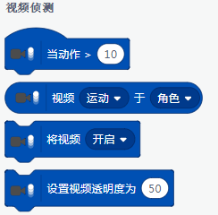
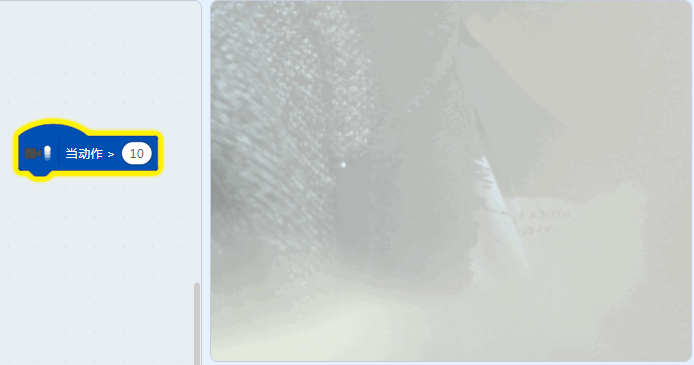
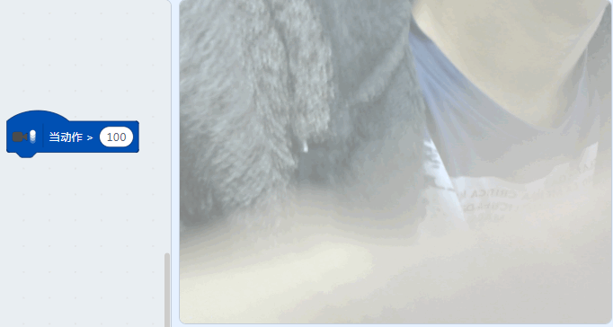
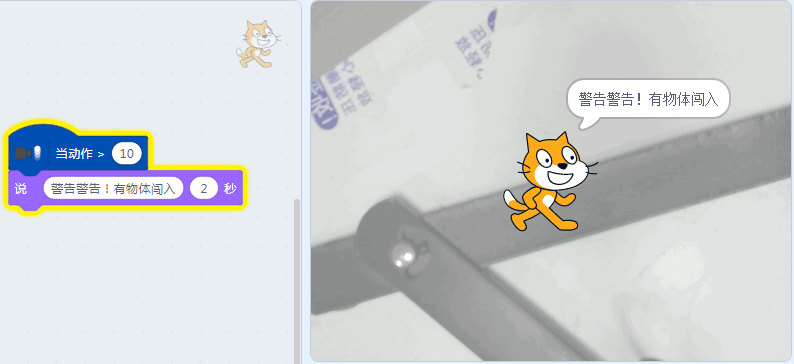
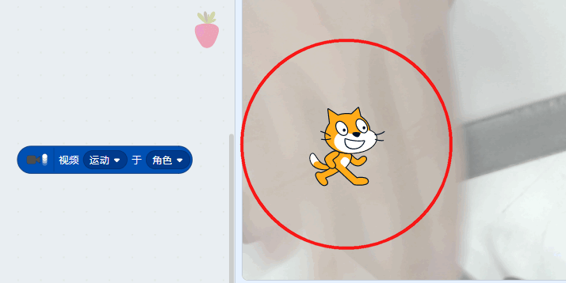
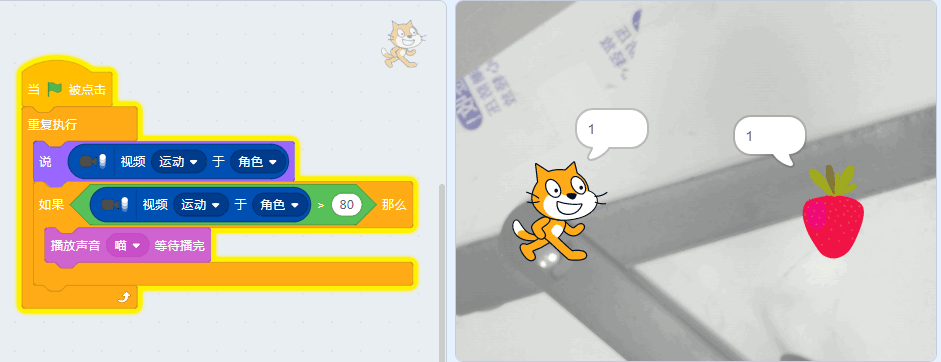
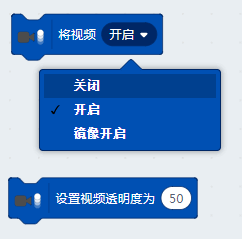

# 视觉识别01初探

## 简介

视觉识别也是人工智能中很大很重要的一个版块，类似现在市面上某些手机已经用上人脸解锁等等，无人驾驶视觉识别道路的环境，视觉跟随机器人等，维护治安的天网系统等等，视觉识别已经慢慢融入到我们的生活中。

本节首先入门视频侦测

## 实验条件

- 安装好Kittenblock

- 畅顺的网络

- USB摄像头（型号没有限制）

(除此外，您无需购买小喵任何硬件套件，人工智能，小喵真的是做到普惠，希望各位老师多多支持！）

## 插件加载

双击打开Kittenblock，左下角加载插件

选择视觉识别插件

## 插件成功加载

切记在打开Kittenblock已经插上USB摄像头，并且保证USB摄像头是可用的。

一旦插件成功加载后，舞台背景即成为摄像头的取景框（与实际镜像），如果舞台没有变化那么说明你的摄像头没有成功驱动或者被其它软件占用了

## 动作检测介绍

实际这个视频侦测模块在Scratch2.0的时候也已经有了，小喵在这个视频侦测的基础上增加人脸检测追踪，可以让初学者无门槛的接触人工智能的魅力。

也有很多朋友之前没有接触过这个视频侦测插件，或者不熟悉这个插件，所以本节教程先讲解视频侦测的原积木块是如何使用，在人工智能很多场景中，会用到视频侦测检测。所以本节为必要的入门课程。

视频侦测主要有以下四个积木块。

当摄像头画面变化时，即可触发，数值越低越容易触发，如设置阈值为100时，你在镜头前狂挥手也不一定能触发成功。

这种视频侦测在安防经常会被用到，在很多安防环境中，正常情况下画面是稳定的，不会有太大的变化，当有人闯入后，这时候利用视频侦测就可以进行报警进行提醒。这样就不需要非常劳神的盯着屏幕。米家的安防摄像头甚至是当检测到变化时，拍下几张照片发送给目标用户中。

## 动作检测编程

## 角色视频侦测介绍

角色视频侦测这个也很常用，经常用于多个角色一起与视频进行互动，此积木块返回的是数值大小，一般用逻辑判断

## 角色视频侦测编程

这里写了两个角色当被视频中“碰到”，就会发出声音，两个角色的编程几乎一样，唯一不同就是发出的声音不一样。

## 摄像头开启与设置透明度

只要加载这个插件，摄像头就默认开启，当然你也可以手动关闭或者开启

视频的透明度也可以进行设置，0为不设置透明度，100镜头几乎全白

