# 视觉识别02人脸追踪

## 简介

人脸追踪是属于一种特性物体的识别，根据人脸的生物属性，将识别点进行标定，对应把位置反馈回来。人脸追踪一般是科幻电影中用得比较多，例如金刚中的大猩猩表情如此生动丰富，就是将人脸的关键点映射到建模3D的大猩猩上。

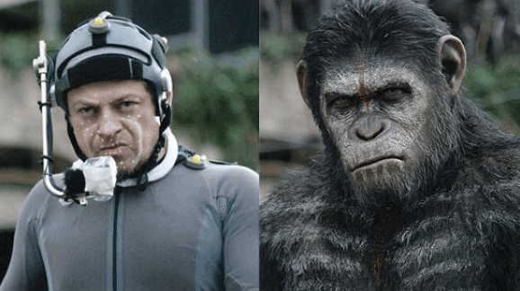

本节学习体验科幻电影制作，给自己戴面具，如国外著名电影指环王，里面就用了动作捕捉与人脸捕抓，今天我们学习的是人脸追踪捕抓。

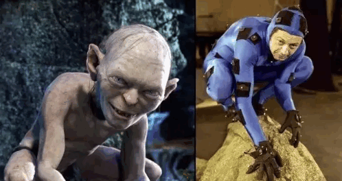

## 原理

人脸追踪本质就是人脸关键点检测，人脸关键点检测是人脸识别与分析的基础。这里不得不说经典的人脸关键点检测算法的鼻祖——Cootes，在1995年提出的ASM(Active Shape Model) ，主动形状模型即通过形状模型对目标物体进行抽象，首先进行训练，训练过程需要大量的样本，手动进行标记人脸的关键点，并把这些关键点做特征向量处理。然后进行搜索，计算眼睛(或者眼睛和嘴巴)的位置，做简单的尺度和旋转变化，对齐人脸，再匹配每个局部关键点(常采用马氏距离)，得到初步形状;修正匹配结果;迭代直到收敛。这个算法可以简单这么理解，用一张标定的人脸模型，根据鼻子或者眼睛对正到要识别的人脸样本上，然后再慢慢修正收敛到五官和人脸轮廓上。发展至今已经用到深度学习算法来进行关键点检测，由于涉及到比较复杂的数学，这里就不展开讲了，大家了解简单的原理即可。

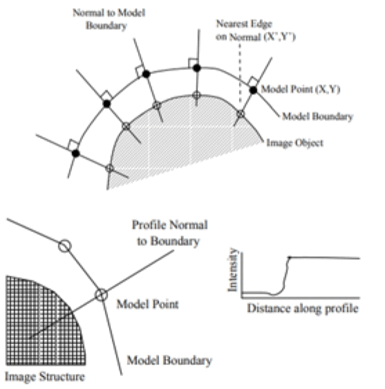

## 实验条件

- 安装好Kittenblock

- 畅顺的网络

- USB摄像头（型号没有限制）

Kittenblock软件安装过程很简单，这里不再作介绍，具体参照：

小喵科技官网——Learn文档——Kittenblock教程分栏

## 插件加载

双击打开Kittenblock软件，左下角加载插件

选择视觉识别插件

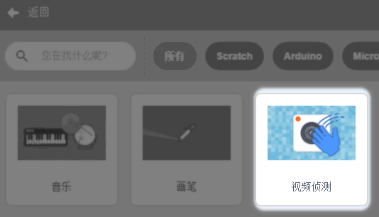

## 插件成功加载

切记在打开Kittenblock已经插上USB摄像头，并且保证USB摄像头是可用的。

一旦插件成功加载后，舞台背景即成为摄像头的取景框（与实际镜像），如果舞台没有变化那么说明你的摄像头没有成功驱动或者被其它软件占用了。

## 人脸检测积木块介绍

### 人脸检测

今天我们来具体学习下人脸检测相关积木块。人脸检测默认没开启，需要单击一下积木块。人脸检测积木块如下图所示：

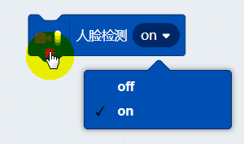

点击积木块后，开启识别，人脸检测功能就会启动。同时检测调试也是默认开启，摄像头窗口中已经有绿色的小点对脸部进行拟合了，先通过识别算法提取人脸的特征点后，在用线条进行连接拟合。（绿色的小点和线条是调试的信息）

### 检测调试

此积木块用于关闭绿色的小点和线（关闭检测调试，不等于关闭人脸检测）

### 戴面具

点击戴面具，面具有多种类型。选择后记得点击积木块。（戴面具这里需要访问网络，面具需要从网络进行下载）

这里我选择了钢铁侠，人脸离开摄像头远一点，这样戴面具的拟合效果才会比较好

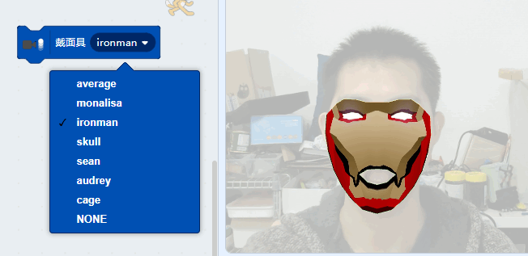

## 人脸位置

戴面具功能它的实现基础是五官的各个坐标进行获取，再进行对应拟合。

可以获取以下五官的位置

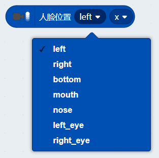

对应的x坐标与y坐标

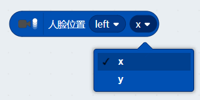

这里写了一个很简单的程序，让小猫说出鼻子的x坐标。坐标是指舞台的绝对值坐标。Scratch舞台的坐标情况如下：

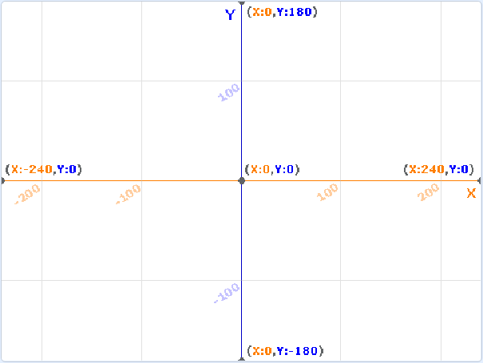

当我的鼻子在舞台左侧时候，小喵说出我鼻子的x轴坐标是-107（对照上图的坐标图，也可以大概看的出来）

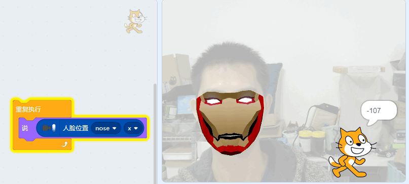

当我的鼻子在舞台右侧时候，小喵说出我鼻子的x轴坐标是81，通过这样简单的程序我们就可以把五官的坐标获取出来。

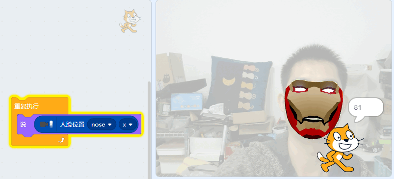

## 实战演练

既然我们能追踪的到人脸五官的位置，我们做一个好玩的程序。之前抖音上有一个很好玩的特效，就是会自动给人脸戴上墨镜，脖子戴上金项链，还有嘴巴吊着一根烟。今天我们来简单实现“戴眼镜”这个功能。

第一次使用人脸追踪的朋友可能不太熟悉，可以借助软件的例子系统，直接使用示例程序。

图中标记的例子就是与人脸追踪有关联的，另外的例子是跟视频侦测有关联的。这里我们直接打开“摄像头_戴眼镜”的例子

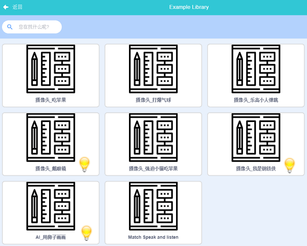

## 程序分析

打开程序后，左下方舞台出现两个圆圈角色，我们把这两个圆圈姑且当做是左镜框和右镜框。

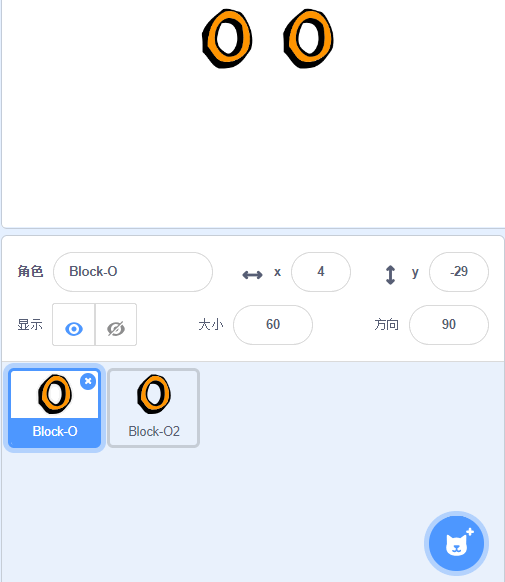

Scratch的程序是针对角色进行编程。因此对应左镜框的程序，我们点选左镜框角色，程序如下，

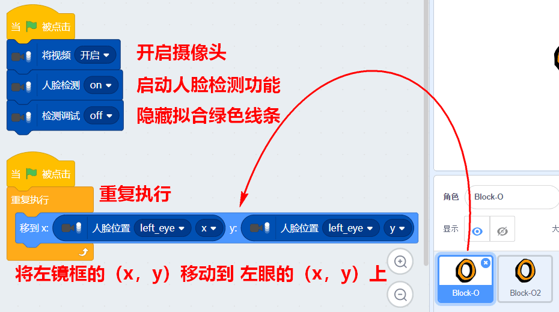

点选右镜框角色

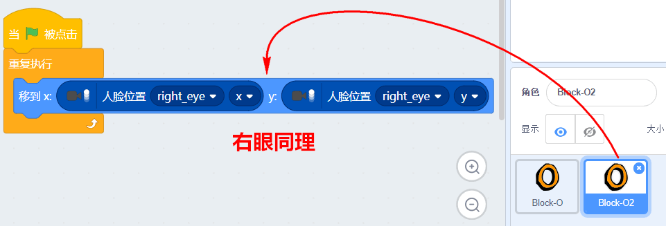

点选界面的右上角的的绿旗子，程序就运行起来。动动你的头，可以看到”眼镜“已经跟随着你的左右眼进行移动了。可以尝试更改下程序，给你的头部打个码。（提示：可以捕抓鼻子的xy坐标）

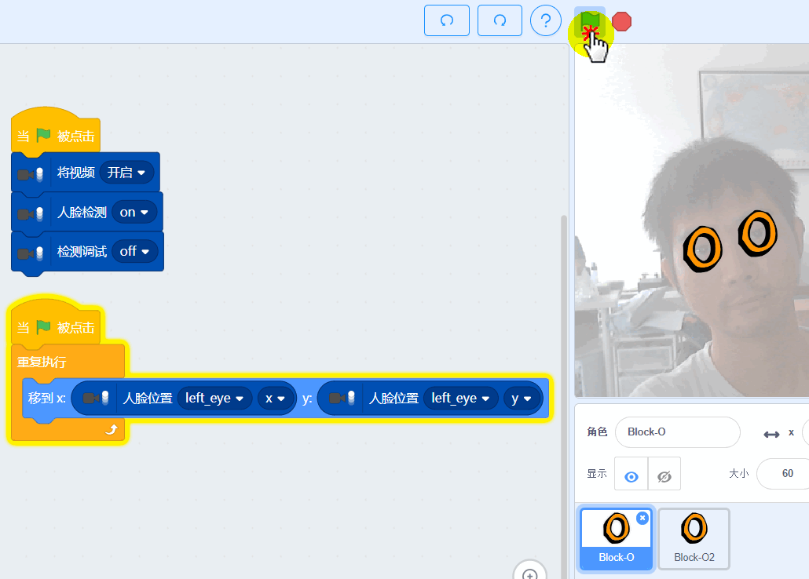

