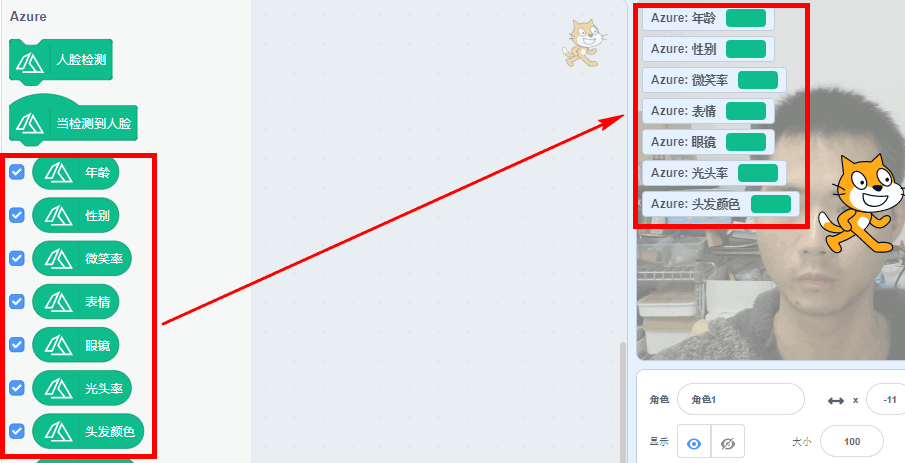
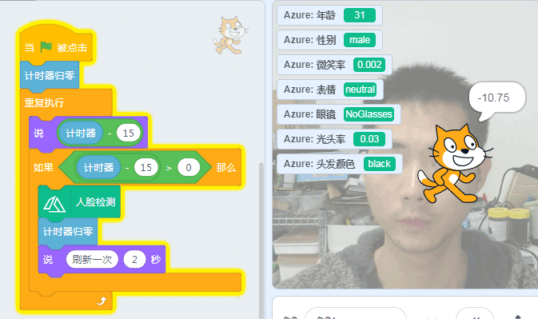
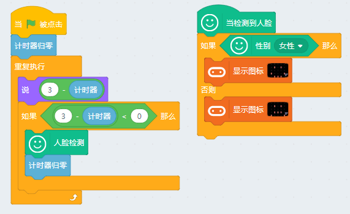
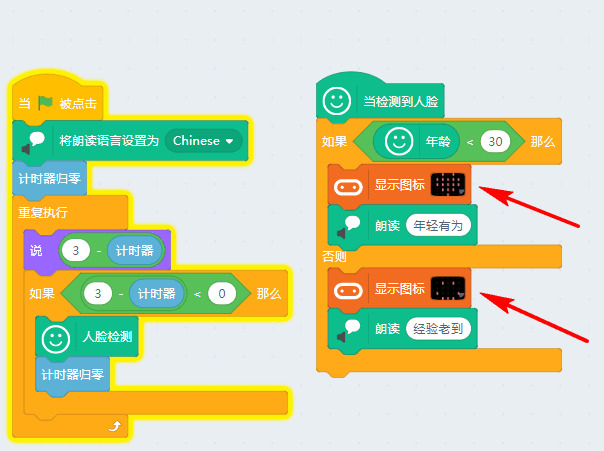
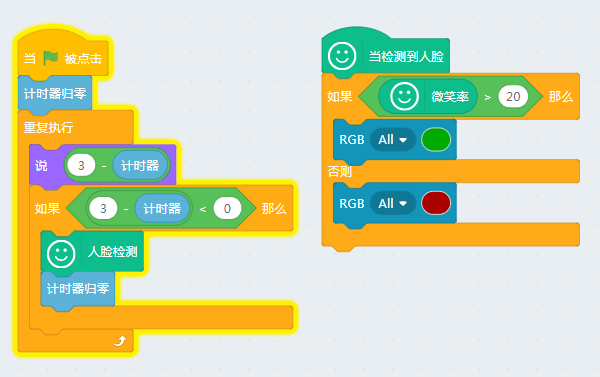
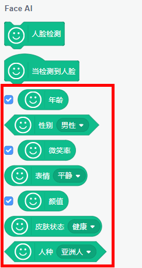

# 视觉识别03人脸检测

## 简介

在前些年智能手机的拍照功能中非常流行一个功能就是，当你拍照的时候，可以预测你的年龄，预测年龄这个功能看是简单，实际运用了人工智能才能得到准确的答案，通过你的脸上皮肤的光滑度、皱纹、肤色、斑点等等...

本节我们对人脸进行性别，年龄等等进行检测

## 实验条件

- 安装好Kittenblock

- 畅顺的网络

- USB摄像头（型号没有限制）

(除此外，您无需购买小喵任何硬件套件，人工智能，小喵真的是做到普惠，希望各位老师多多支持！）

## 插件加载

双击打开Kittenblock，左下角加载插件

选择视频侦测插件与Face AI插件（调用视频侦测插件的原因是因为要开启摄像头）

## 插件成功加载

切记在打开Kittenblock已经插上USB摄像头，并且保证USB摄像头是可用的。

一旦插件成功加载后，舞台背景即成为摄像头的取景框（与实际镜像），如果舞台没有变化那么说明你的摄像头没有成功驱动或者被其它软件占用了

## Face AI人脸检测使用

因为Face AI是国内旷视科技提供的一个人工智能的服务，它是免费的，但是调用有时间的限制（每3秒返回一次检测的结果），非常良心，因为国内有很多相关的企业一上来就收费，而且效果还很差，因为人工智能这边是免费普及给大家，小喵科技也没办法办法承担去购买企业服务，所以有时间限制，望大家理解下。如果觉得我们软件好用，不妨多支持一下我们的硬件。

使用前，我习惯性将这些勾勾勾上，这样就可以轻易看到检测结果了。

点一下人脸检测积木块，右侧则里面返回检测结果。

前面已经提到过调用是有时间间隔限制的，在3秒内如果你再点击一次检测结果，也只会返回上一次的结果。所以这里做了一个3秒的时间判断程序，每3秒自动检测一次，并用小猫把时间说出来（好比你拍照喊茄子），这样就可以保证检测刷新是真实的。

## 人脸检测与硬件交互

我们可以通过对年龄或者性别做程序的判断，这样就能做出好玩的程序出来了。

案例1：判断性别，触发Microbit点阵显示

案例2：判断年龄，触发Microbit点阵显示并用语音朗读语句

案例3：判断微笑率，触发Robotbit的RGB灯（判断老板今天心情好不好，让我好跟他说加工资的事情，滑稽脸）

## 后记

人脸检测非常有趣，可以自己多大开脑洞，多于硬件交互（CC喵黔驴技穷，老控制Microbit的点阵屏，实际可以能量魔块或者Arduino的一些好玩的魔块），希望大家在我们讨论群多多分享，也可以对我们人工智能智能这块的插件多提宝贵意见

