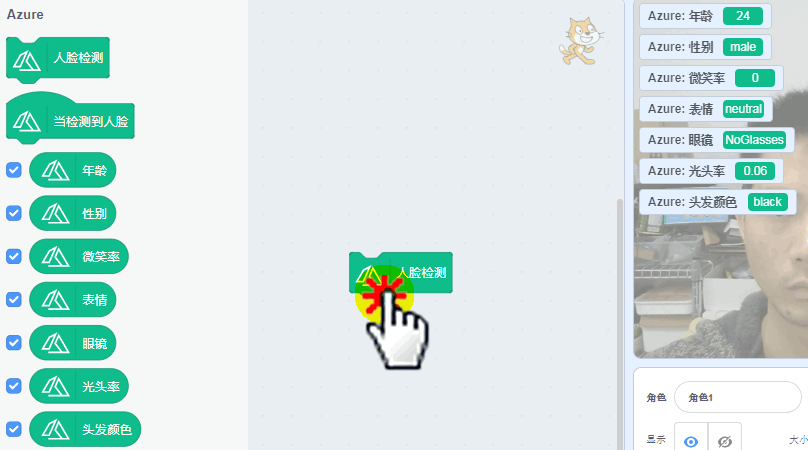

# 视觉识别03人脸检测

## 简介

在前些年智能手机的拍照功能中非常流行一个功能就是，当你拍照的时候，可以预测你的年龄，预测年龄这个功能看是简单，实际运用了人工智能才能得到准确的答案，通过你的脸上皮肤的光滑度、皱纹、肤色、斑点等等...

本节我们学习微软的Azure检测，对人脸进行性别，年龄等等进行检测

## 实验条件

- 安装好Kittenblock

- 畅顺的网络

- USB摄像头（型号没有限制）

(除此外，您无需购买小喵任何硬件套件，人工智能，小喵真的是做到普惠，希望各位老师多多支持！）

## 插件加载

双击打开Kittenblock，左下角加载插件

选择视觉侦测插件与Azure插件

## 插件成功加载

切记在打开Kittenblock已经插上USB摄像头，并且保证USB摄像头是可用的。

一旦插件成功加载后，舞台背景即成为摄像头的取景框（与实际镜像），如果舞台没有变化那么说明你的摄像头没有成功驱动或者被其它软件占用了

## Azure人脸检测使用

因为Azure是微软提供的一个人工智能的服务，它是免费的，但是调用有时间的限制（每15秒返回一次检测的结果），不过也比国内的一上来就收费的企业要好，因为人工智能这边是免费普及给大家，小喵科技也没办法办法承担去购买企业服务，所以有时间限制，望大家理解下。

使用前，我习惯性将这些勾勾勾上，这样就可以轻易看到检测结果了。

点一下人脸检测积木块，右侧则里面返回检测结果。

前面已经提到过调用是有时间间隔限制的，在15秒内如果你再点击一次检测结果，也知会返回上一次的结果。所以这里做了一个15秒的时间判断程序，每15秒自动检测一次，并用小猫把时间说出来（好比你拍照喊茄子），这样就可以保证检测刷新是真实的。

我们可以通过对年龄或者性别做程序的判断，这样就能做出好玩的程序出来了。