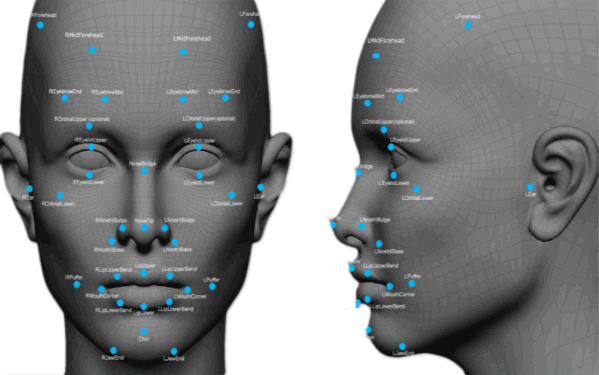
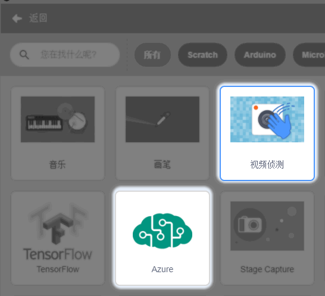
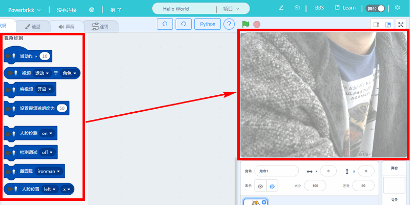
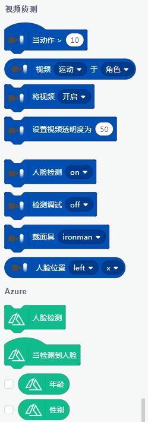
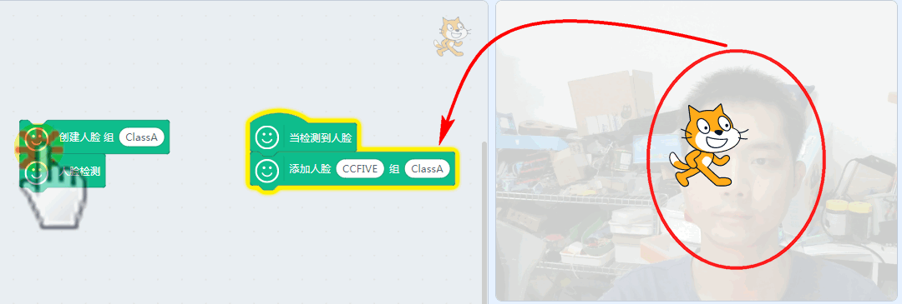
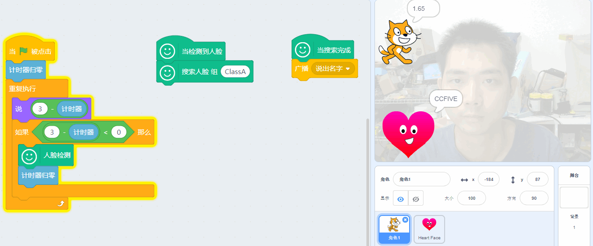
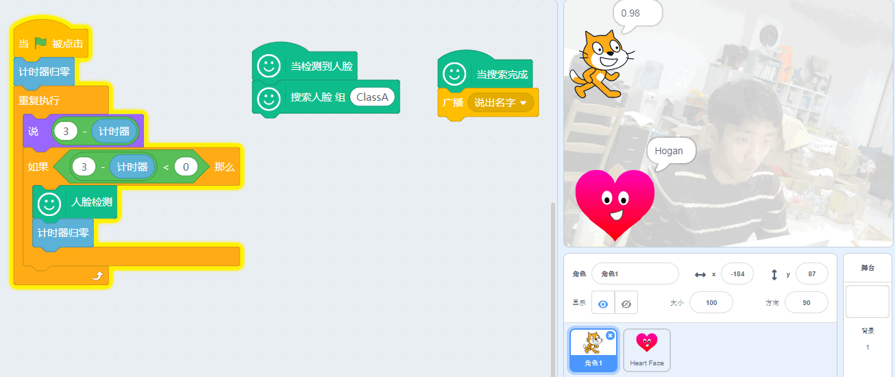

# 视觉识别04特定人脸辨认

## 简介

我们已经学习人脸检测，不过做起实验来还是感觉没趣，能不能让电脑记住我这张脸，以后当我出现的时候，它能认得我呢？这样才算人工智能！

可以的！可以做到！

本节就带你学习如果进行特定人脸辨认。

## 原理

人脸识别的过程中其实已经将每张脸的特征提取出来了，所以进行人脸辨认这个过程中实际实际就是将当前识别的样本与数据中的人脸数据库进行对比匹配，就可以“认得”这个人了。

## 实验条件

- 安装好Kittenblock

- 畅顺的网络

- USB摄像头（型号没有限制）

(除此外，您无需购买小喵任何硬件套件，人工智能，小喵真的是做到普惠，希望各位老师多多支持！）

PS：Kittenblock软件安装过程很简单，这里不再作介绍，具体参照：

http://learn.kittenbot.cn/ 的Kittenblock教程分栏

## 插件加载

双击打开Kittenblock，左下角加载插件

选择视觉侦测插件与Face AI插件（调用视频侦测插件的原因是因为要开启摄像头）

## 插件成功加载

切记在打开Kittenblock已经插上USB摄像头，并且保证USB摄像头是可用的。

一旦插件成功加载后，舞台背景即成为摄像头的取景框（与实际镜像），如果舞台没有变化那么说明你的摄像头没有成功驱动或者被其它软件占用了

## 人脸辨认

对于人类来说，辨认一张人脸是非常简单的，但是对于机器来说，辨认一张人脸可能要涉及到非常多的算法（烧死很多软件工程师的脑细胞）。

对于人类来说，辨认一张人脸，首先你要让这个人看到这张脸，然后跟他说张脸的人叫什么名字，以后看到这张脸，你要叫得出这个名字哦！

如果你理解上述的过程，那么我们这个特性人脸辨认就很好理解了，也是这样的辨认过程。

首先——添加需要辨识的人脸

将这张人脸加入到一个识别库的组中，如组ClassA(命名随意)，人脸组只要创建过1次就不用再次创建了！（人组会在服务器保存大概3天左右，就会自动清除，也就是说在3天内，你无需重复添加你这张人脸，云端服务器这边也能把你认出来）

然后重新创建一个新的检测程序，正式进行人脸辨认，并把这个人的名字说出来（计时器调用人脸检测3秒检测一次）

然后我也偷偷录入了我同事hogan的脸

## 后记

这节人脸辨认我们也是蛮拼的，作为工程师的我们一般都不想上镜,但是又要做人脸辨认，只能硬着头皮上，所以如果觉得我们这个人脸功能辨认不错，记得在群里大喊给工程师加鸡腿哈（滑稽脸）