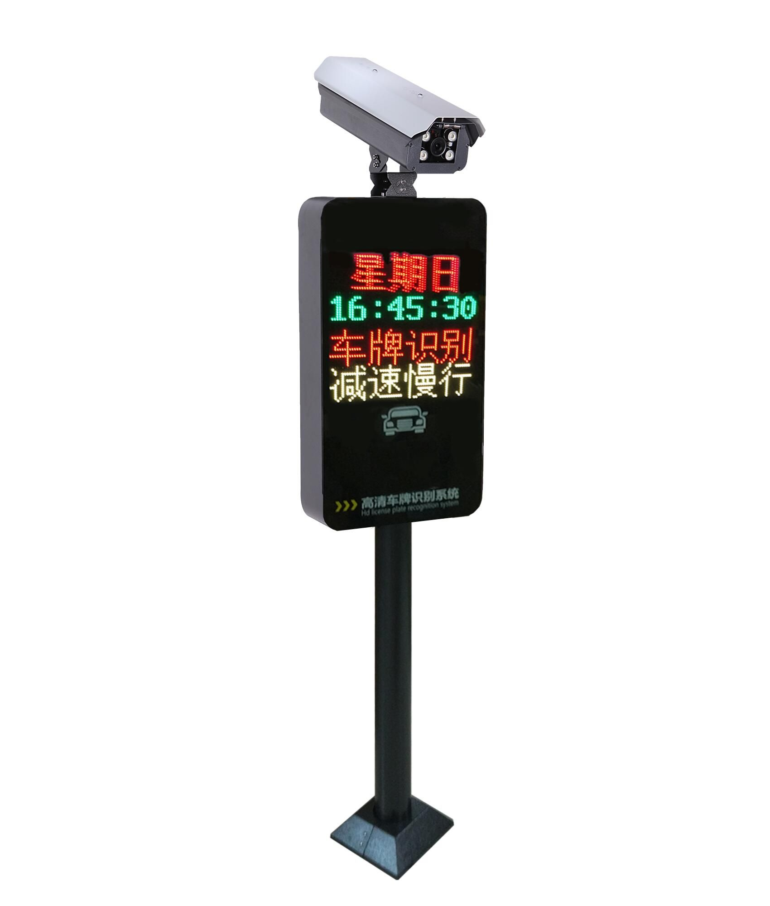
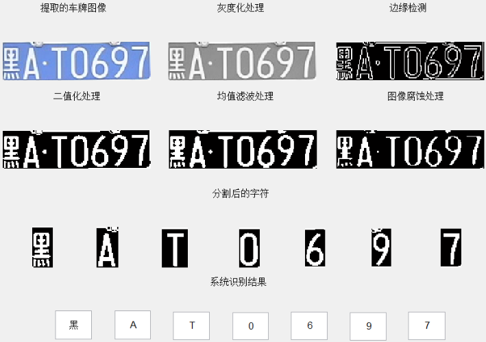
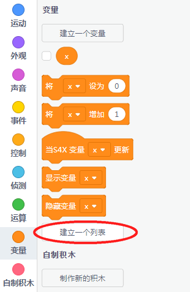
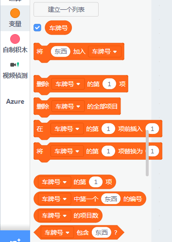
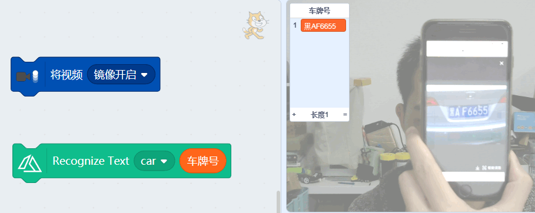
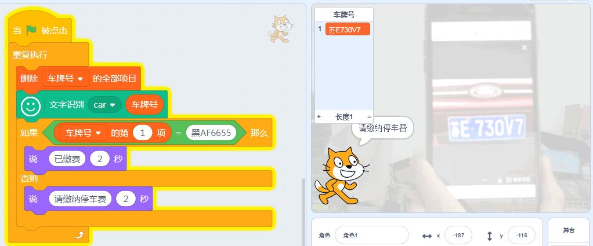
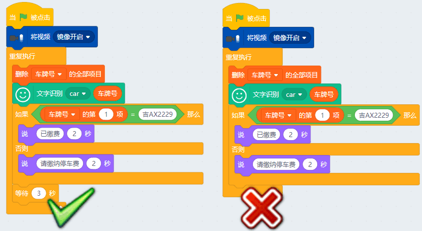

# 视觉识别05识别车牌

## 简介

车牌识别在社会上已经被广泛使用，小区停车场，商场的计费停车系统等等，车牌识别是一个本质是一个印刷体识别，但是揉入了，中文、英文、数字三种，所以对识别难度上也是大大增加了，而且，车牌后面的画面不是纯白的，而且车牌的位置也不定，对车牌识别也是一个很大的干扰，所以车牌识别上用了很多图形的处理技术。

本节就带大家来做车牌识别的实验（1.83以上版本才有~），本质上这节的车牌识别技术和停车场真正车牌识别技术都是一样的，都是利用了云端人工智能服务器进行运算。

## 原理

车牌识别本质是一个文字识别过程，对于国内车牌，里面揉入了中文、英文与数字，并且把这些文字信息从杂乱的的背景中提取出来。车牌识别其实更多的运用是图片的处理技术。如果下图，就是车牌识别的处理过程：

## 实验条件

- 安装好Kittenblock

- 畅顺的网络

- USB摄像头（型号没有限制）

- 手机一台（用来播车牌照片，或者你也可以吧车牌照片打印成纸质）

(除此外，您无需购买小喵任何硬件套件，人工智能，小喵真的是做到普惠，希望各位老师多多支持！）

PS：Kittenblock软件安装过程很简单，这里不再作介绍，具体参照：

http://learn.kittenbot.cn/ 的Kittenblock教程分栏

## 插件加载

双击打开Kittenblock，左下角加载插件

选择视觉侦测插件与Face AI插件（调用视频侦测插件的原因是因为要开启摄像头）

## 插件成功加载

切记在打开Kittenblock已经插上USB摄像头，并且保证USB摄像头是可用的。

一旦插件成功加载后，舞台背景即成为摄像头的取景框（与实际镜像），如果舞台没有变化那么说明你的摄像头没有成功驱动或者被其它软件占用了

## 车牌号识别基本操作

首先你需要建立一个列表（注意是列表！不是变量！），我这里命名为车牌号列表

列表已建立

把列表塞入识别车牌号的积木块（**这里新手一般会操作错误**）

必须开启视频镜头镜像，不然看上去字是左右反的。点击下识别车牌，基本上是实时识别的。

识别出来的车牌号会保存在列表中，我们只需要判断列表中的车牌是否与目标车牌一致，就可以做出结果判断。

## 车牌识别判断程序

这里是一个简单的车牌号判断是否有缴费，本质上与停车场车牌识别缴费系统没区别。唯一真实的停车场车牌识别就多了微信二维码扫描付费，云端更改它的缴费状态，涉及了物联网的概念。

## 加延时

车牌识别如果放在循环中使用时间间隔在3秒以上，如果不加延时，软件会进行报错。报错由于是网络端频繁调用。

## 进阶

如果你对调用时间要求很高，或者是你使用以上的加延时方法还会报错。你可以注册自己独立的API账号，这样最大程度保证效果。

操作方法参考帖子：

http://learn.kittenbot.cn/zh_CN/latest/AI/%E7%8B%AC%E4%BA%AB%E4%BD%A0%E7%9A%84FaceAI%E8%B4%A6%E6%88%B7.html

