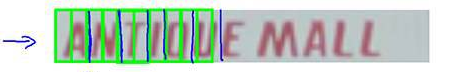
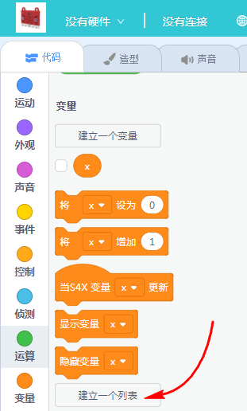
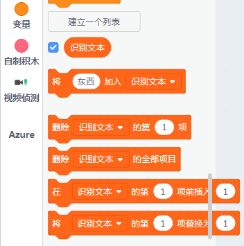
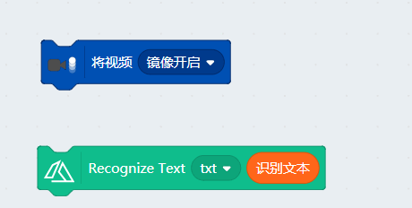
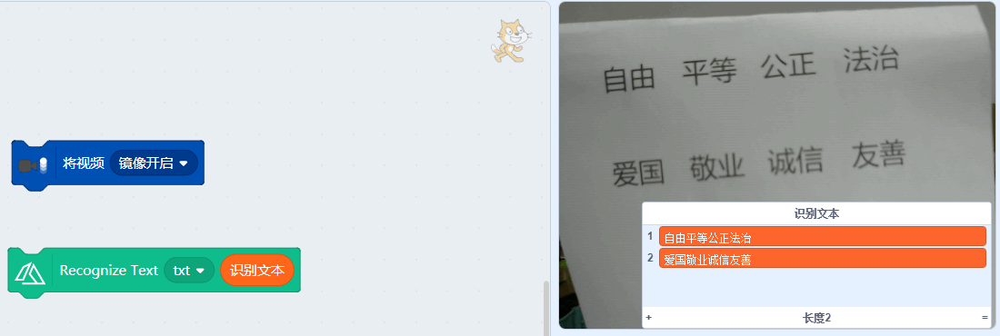

# 视觉识别06识别印刷文字

## 简介

OCR印刷字体识别也广泛引用到我们生活中，例如商务人员经常用到的是什么名片识别，发票识别等。还有在图书馆中，我们经常需要摘录一些文章，都可能用到文字识别。现在社会流行的文字识别，一般是针对印刷体（例如书籍、发票、个人名片等等），手写体因为太千变万化了，所以市面上还没有一个很好的解决方案，但是印刷字体，字体基本上就是有限的那么多种，所以视觉识别印刷体准确率是非常高。

本节我们来学习如何识别印刷字体

## 原理

OCR对图像文本的识别可以划分为三个步骤

1. 文本检测，一张图片里面并不是所有地方都是填满字或者是整整齐齐的写在同一段里面，这时候需要对文本进行检测提取。

2. 字符分隔，根据规则对中文字符或者英文字符进行分割成独立的单元

3. 字符识别，对独立的单元做算法处理进行识别

## 实验条件

- 安装好Kittenblock

- 畅顺的网络

- USB摄像头（型号没有限制）

- 打印好文字的A4纸或者字比较大的书籍

(除此外，您无需购买小喵任何硬件套件，人工智能，小喵真的是做到普惠，希望各位老师多多支持！）

PS：Kittenblock软件安装过程很简单，这里不再作介绍，具体参照：

http://learn.kittenbot.cn/ 的Kittenblock教程分栏

## 插件加载

双击打开Kittenblock，左下角加载插件

选择视觉侦测插件与Face AI插件（调用视频侦测插件的原因是因为要开启摄像头）

## 插件成功加载

切记在打开Kittenblock已经插上USB摄像头，并且保证USB摄像头是可用的。

一旦插件成功加载后，舞台背景即成为摄像头的取景框（与实际镜像），如果舞台没有变化那么说明你的摄像头没有成功驱动或者被其它软件占用了

## 识别印刷文字

首先你需要建立一个列表（注意是列表！不是变量！），我这里命名为识别文本列表

列表已建立

把列表塞入印刷体识别（txt）的积木块，

将视频开启镜像，不然看上去字是左右反的。

## 识别印刷文字结果

文本如果有很多行，识别结果会以行位结果，把每一行存成列表的一个项

在通过语音朗读，我们可以做一个古诗朗读机器人。

