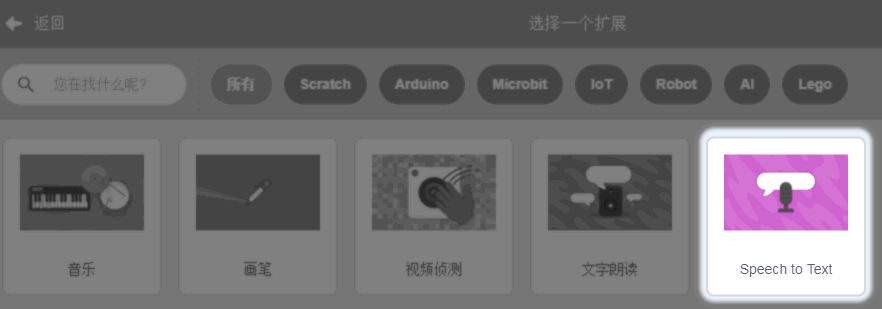
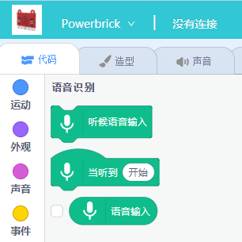
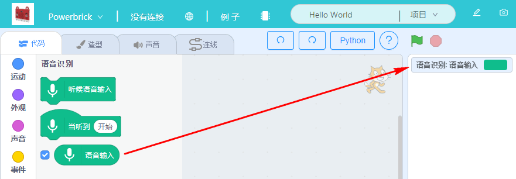
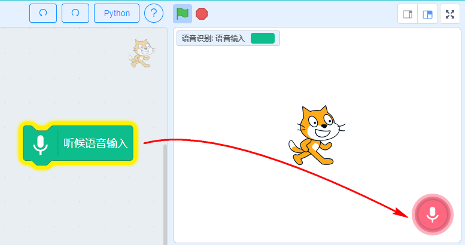
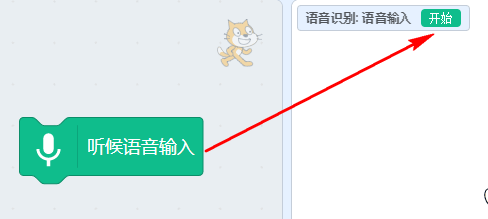
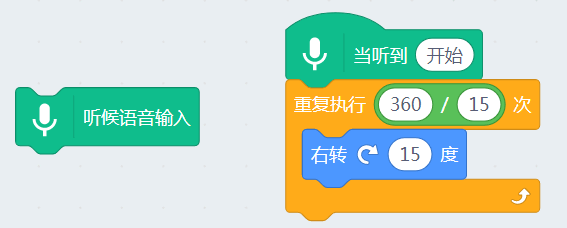

# 语音识别

## 简介

语音识别，是CC喵最喜欢的一个人工智能功能。近年来智能音响大热，大家喜欢的功能无非就是，多了个语言控制，感觉很神奇很智能，那么本节，就有我带领你学会语音识别控制。

## 实验条件

- 安装好Kittenblock

- 畅顺的网络

- 麦克风或者带麦克风的USB摄像头（型号没有限制）

(除此外，您无需购买小喵任何硬件套件，人工智能，小喵真的是做到普惠，希望各位老师多多支持！）

## 插件加载

双击打开Kittenblock，左下角加载插件

选择语音识别插件（程序猿忘了翻译）

## 插件成功加载

语音识别插件，使用非常简单，如果你用过手机的语音助手，那就很简单了

## 积木块具体介绍

一般使用语音识别插件，习惯性会把语音输入勾上，如图所示，因为语音识别的识别会被环境噪音或者朗读者的口音影响。所以为了知道电脑那边把我们的话识别成什么样,我们最好把勾勾上，这样最直观。

语音录入按钮，点击一下。舞台的右下方就会出现一个红色的麦克风图标，这时候你就可以对着麦克风说话了。（等红色麦克风图标出现后，再说话）

例如我说了“开始”，稍等片刻后，可以看出识别的结果为开始，识别率还是挺高的，虽然我的普通话真的好普通

已经测试语音识别内容是OK的，我们写一个完整的识别程序，让舞台小猫进行反馈，当识别到我说话“开始”，小猫顺时针转一圈

## 加入硬件更好玩

控制虚拟的东西总是有点无聊，我们能不能利用语音识别来控制喵家的产品套件呢？当然

本示例所用的套件————能量模块（Microbit、主控盒、电池盒、灰色乐高Geekservo）

如果你对能量魔块不熟悉，你可以在learn的相关页面进行学习，是一款结合Microbit与乐高结构件的一款电子套件

选择Powerbrick硬件，恢复固件后，连接串口（[如果这里遇到问题，请在learn的相关页面进行学习](http://learn.kittenbot.cn/zh_CN/latest/powerbrick_KB/index.html)）

编写对应的语音识别控制硬件的程序，这里是控制S2的角度，当识别到“举起手”，S2舵机转到90度，当识别到“放下手”，S2舵机转到180度

