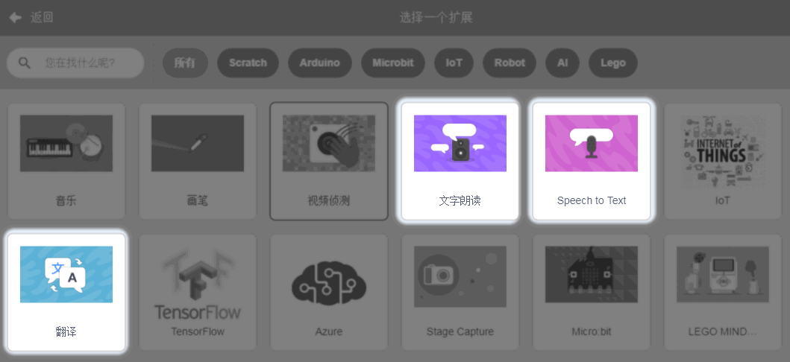
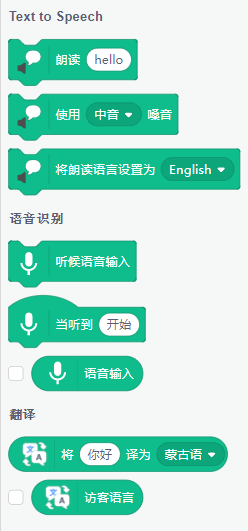
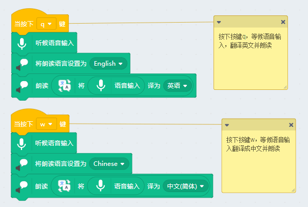

# 超级翻译官（复合应用）

## 简介

超级翻译官，是类似市面上科大讯飞那种旅游神器手持翻译器。当你对着它说中文时候，他可以对应翻译成你想要的语言。或者其他语言互译。这类型的翻译器最早的时候是非常依赖网络的，经过一两年的发展，已经可以实现，常用语言的一些常用简单语句，可以实现离线翻译。这就方便在一些网络不好的地方，也可以保证正常的基本交流。

所以本示例的“超级翻译官”也来实现类似的功能，让大家做一个翻译器

本节属于是，人工智能插件，文字朗读、翻译、语音识别三个插件复用的示例（复合使用在生活中很常见）

## 实验条件

- 安装好Kittenblock

- 畅顺的网络

- 可以播放声音的电脑（音量要调整好）

- 麦克风或者带麦克风的USB摄像头（型号没有限制）

(除此外，您无需购买小喵任何硬件套件，人工智能，小喵真的是做到普惠，希望各位老师多多支持！）

PS：Kittenblock软件安装过程很简单，这里不再作介绍，具体参照：

http://learn.kittenbot.cn/ 的Kittenblock教程分栏

## 插件加载

双击打开Kittenblock，左下角加载插件

选择加载需要的插件，三个都要加载进来

## 插件成功加载

三个插件已经成功加载了

## 超级翻译官设计思路

- 当我们按下某个按键时，电脑等候麦克风进行语音输入（人工智能——语音识别）
- 语音识别后转为文本（人工智能——语音识别）
- 文本对应翻译成目标语言（人工智能——翻译）
- 然后把翻译的文本朗读出来（人工智能——文字朗读）

好好理解以上的思路，思路明白后，写程序都是特别的简单

## 程序编写

按下键盘q按键或者w按键，进行中文与英文的翻译，赶紧试试吧~