# 人工智能实战项目——垃圾分类（上篇）

本项目由于篇幅比较长，分为上下两篇，上篇主要是项目的一些知识性讲解、机械搭建、电子连接。下篇主要是软件的操作，设计机械学习，软件在线控制与整体项目的调试。

注意这个人工智能项目是需要**实时连着电脑**的，因为摄像头识别的数据处理只能依靠电脑进行运算处理，Microbit是无法处理摄像头数据，请周知。

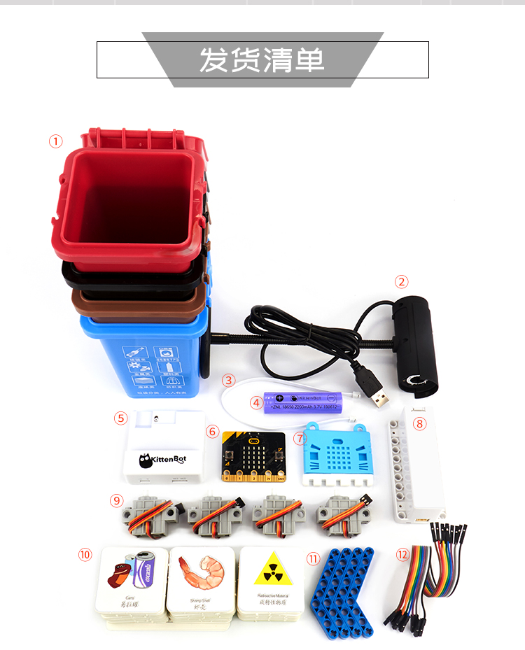

##  项目简介

如果有关注喵家的友友可以发现，喵家除了硬件产品比较有特色外，图形化编程软件功能也是非常强大，除了涵盖Scratch官方的所有功能意外，人工智能与机器学习的功能尤为突出。喵家Learn上连载了很多关于[人工智能](http://learn.kittenbot.cn/zh_CN/latest/AI/index.html)和[机器学习](http://learn.kittenbot.cn/zh_CN/latest/machinelearning/index.html)的教程，很多爱好者和老师也进行了学习，大部分都已经掌握了使用方法，但仍然还不知道如何结合实际做项目。应群众要求，不仅仅讲讲纯软件，要尽量结合硬件，做点贴近生活的项目。

最近网上上海的垃圾分类火了一把，本文利用喵家教授的机器学习相关的知识和技术，做出通过摄像头能自动给垃圾进行分类的装置。

垃圾分类装置主要分为两部分。识别部分为摄像头与支架装置，摄像头的数据传到到电脑进行机器学习特征提取分类。执行部分为4个可自动开合的垃圾桶装置与主控板，主控板用当下比较火的Microbit，电脑控制Microbit从而控制舵机的开合。

[垃圾分类项目视频](https://www.bilibili.com/video/av59951914)

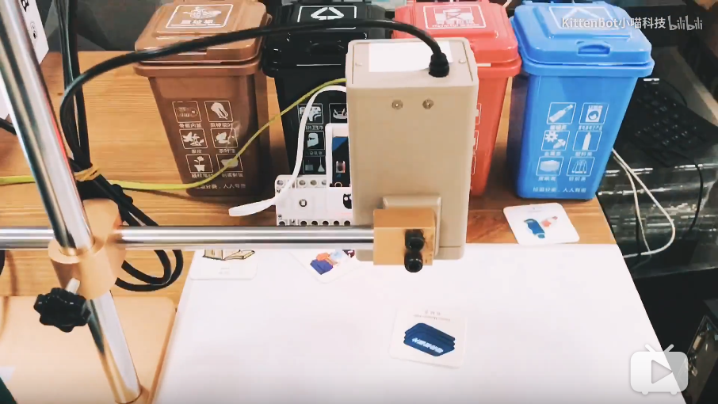

## 项目适合人群

中小学生及广大爱好者

## 项目难度

机械搭建：三颗星

电子接线：两颗星

软件编程：五颗星

此项目要求有一定的基础，至少在Kittenblock里面会在线控制Microbit以及掌握了喵家人工智能机器学习的基础。

如果软件是没有安装的或者是第一次使用，强烈推荐！观看这里的[前5视频](https://www.bilibili.com/video/av70344368?pop_share=1)（01下载安装~05Microbit分栏积木块），视频挺短的，可以帮助你快速上手软件的基本操作。

视频连接如下：

https://www.bilibili.com/video/av70344368?pop_share=1

## 时间准备

上篇：

机械结构制作与搭建：30mins

电子接线：10mins

下篇：

软件编程：40mins

## 材料准备

你可以自备零件 或者 直接**购买喵家淘宝**的“[AI人工智能 垃圾分拣学习套件](https://item.taobao.com/item.htm?spm=a230r.1.14.1.3fd41cd80pCInJ&id=601297742998&ns=1&abbucket=3#detail)”，省心方便

1. Microbit主控板，USB数据线
2. 能量魔块十合一套装（能量魔块主控盒、电池盒、4xGeekservo灰舵机、乐高结构等等）
3. 垃圾分类垃圾桶+分类卡片。
4. 常见杜邦线4PIN以上（用于拉起垃圾盖）
5. USB摄像头和摄像头支架（用于识别种类卡片，不推荐用电脑自带摄像头的原因是，分离式的摄像头录入图片数据，调整USB摄像头为俯视状态录入会更方便些）

   

## 工具准备

1. AB胶（套件已含）或者热熔胶枪（无型号要求，能用的就行，我自己用的也就是十来块的热熔胶枪，套件不含）
2. 美工刀或者小电钻（无型号要求，用于给垃圾桶开个小孔，绑杜邦线，套件不含，**套件的垃圾桶我们已为大家钻好孔，用户无需再进行加工**）

警告：使用工具必须小心注意，AB胶切勿弄到眼睛中，美工刀使用请勿割伤手，**中小学生必须在家长或者老师的指导下进行使用。**

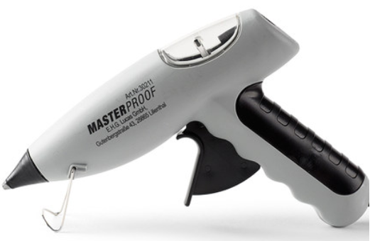

## 软件准备

1. Kittenblock图形化编程软件（软件左上角版本号要求在1.8.4h以上），首次下载安装需要**升级**，推荐观看[系列视频](https://www.bilibili.com/video/av70344368?pop_share=1)，[软件下载](https://www.kittenbot.cn/kittenblock)地址：https://www.kittenbot.cn/kittenblock
2. Microbit串口驱动安装（Kittenblock软件界面小齿轮上可进行安装），推荐观看[系列视频](https://www.bilibili.com/video/av70344368?pop_share=1)

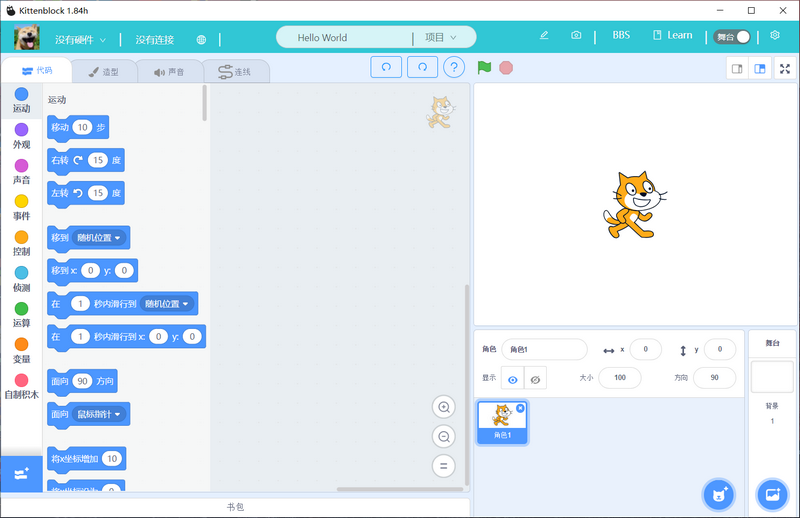

## 项目原理

1. 使用Kittenblock的机器识别通过摄像头进行数据录入，训练机器模型。当识别到对应的图片返回图片内容的名字。再通过Scratch的控制进行逻辑判读处理。
2. Kittenblock可以与Microbit进行在线通讯，控制舵机的运动

简单总结一句：机器学习处理图片数据，进行逻辑判断控制硬件。

## 学习预备

1. 喵家Learn上有机器学习的入门帖子，可以先自行学习，只需要掌握特征提取器的录入与识别即可。具体帖子请参考：[http://learn.kittenbot.cn/zh_CN/latest/machinelearning/09%E7%89%B9%E5%BE%81%E6%8F%90%E5%8F%96%E5%99%A8_%E8%AF%86%E5%88%AB%E7%89%A9%E4%BD%93.html](http://learn.kittenbot.cn/zh_CN/latest/machinelearning/09特征提取器_识别物体.html)

2. 机器学习仅仅这个项目的软件的其中部分，我们还需要学习Kittenblock如何在线控制Microbit（本项目的主控板为Microbit，所谓的在线控制指通过串口控制Microbit）
    具体帖子请参考：
    
      http://learn.kittenbot.cn/zh_CN/latest/microbit/microbit_kittenblock/index.html
    
3. Scratch基础是必须的，掌握Scratch的一些基础操作与常用积木块的操作。这部分Scratch基础可以网上自行找资料进行学习。

## 机器学习原理

### 引入

机器学习原理比较复杂。这里先引入一个例子。

大家都学过二元一次方程，二元一次方程可以在平面坐标系上表示。

我们得知任意的（x，y）都能在坐标上可以找到其对应的点。可以将平面的点归为三大类：

- 点在直线上
- 点在直线的上方
- 点在直线的下方

机器学习中，图像、音频、文字、数字这些本质还是数据，我们可以通过特定的算法和特定的数学方式将他们进行转化成同类型的数据，从而可以对数据集进行分类学习，得到某类数据集的特征。可以简单理解为是“高阶版本的二元一次方程”

### 特征分类概念

特征提取是计算机视觉和图像处理中的一个概念。

它指的是使用计算机提取图像信息，决定每个图像的点是否属于一个图像特征。特征提取的结果是把图像上的点分为不同的子集，这些子集往往属于孤立的点、连续的曲线或者连续的区域。

因此可以简单理解为，机器学习的特征分类实际高阶的数据分类。

## Kittenblock在线控制原理

Microbit在Kittenblock中恢复固件（恢复一个通讯固件），Microbit上自带USB串口芯片，电脑可以通过串口给Microbit下发通讯指令，进而可以控制Microbit的点阵屏、舵机等等各种电子器件。

## 机械搭建

机械搭建最主要就是将现有的垃圾桶改造成可以用舵机控制的（这也是DIY项目常用的做法，好处省成本，速度快，美观）。思路很简单，用舵机带动一根杜邦线，把垃圾盖拉起。当舵机往反方向转动时，控制垃圾盖关闭。

### 开孔

**购买套件的用户已无需钻孔，喵家以为你们钻完孔了**

首先在垃圾盖钻一个小孔（你可以使用美工刀，我这里使用了小电钻），杜邦线恰好能穿过小孔即可。杜邦线在垃圾盖内侧需要使用AB胶进行粘贴（[AB胶使用方法](https://jingyan.baidu.com/article/fec7a1e52bbb7f1191b4e769.html)），或者使用热熔胶。同理另外三个垃圾盖按照相同的方法进行处理。

### 安装拉线

首先将杜邦线的另外一头剪掉，**我们用剩下的那部分从垃圾盖的内部穿出到外表面**。垃圾盖内部，用热熔胶把杜邦线和垃圾盖粘在一起。

用杜邦线穿过乐高摇臂零件的孔，不用打结或者打热熔胶，多穿几圈即可。

很有友友这里不明白，为什么一定要使用硬硬的杜邦线，我用普通的绳子不行吗？起到拉起效果的时候，这两种材料是没有什么区别的。

但当垃圾盖闭合的时候，因为垃圾盖比较轻，无法依靠自身重力把盖子合上。杜邦线本身材质比较硬。所以在舵机的带动下，杜邦线提供一定的推力，使垃圾盖合上。

这里演示使用了热熔胶，你可以使用AB胶进行粘贴更方便。

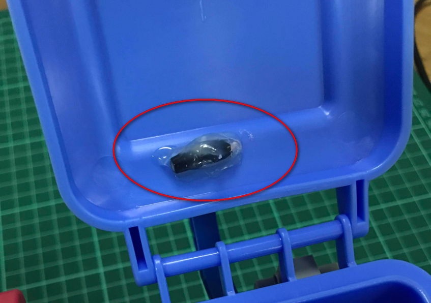

### 粘贴舵机

舵机这里采用是能量魔块套件里的舵机。这个舵机的优势是尺寸方正，可以与乐高结构件结合。可惜是我们的垃圾桶是没有乐高孔，我们也是借助AB胶或者热熔胶枪把舵机粘贴垃圾桶的背后侧壁上。

在舵机的凹陷涂上均匀的一层AB胶水或者热熔胶（这里演示是用热熔胶），趁热把舵机粘贴到垃圾桶上。注意舵机的粘贴位置尽量保持一致。这样软件上的控制就可以保持四个都是一致了。

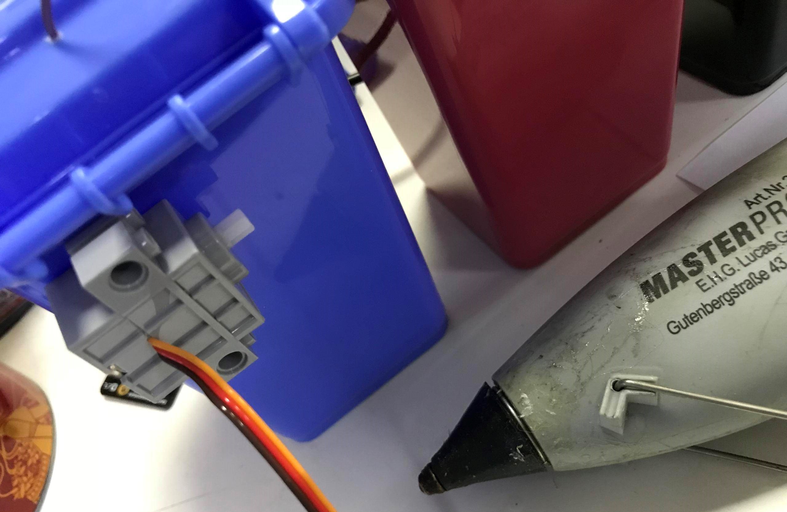
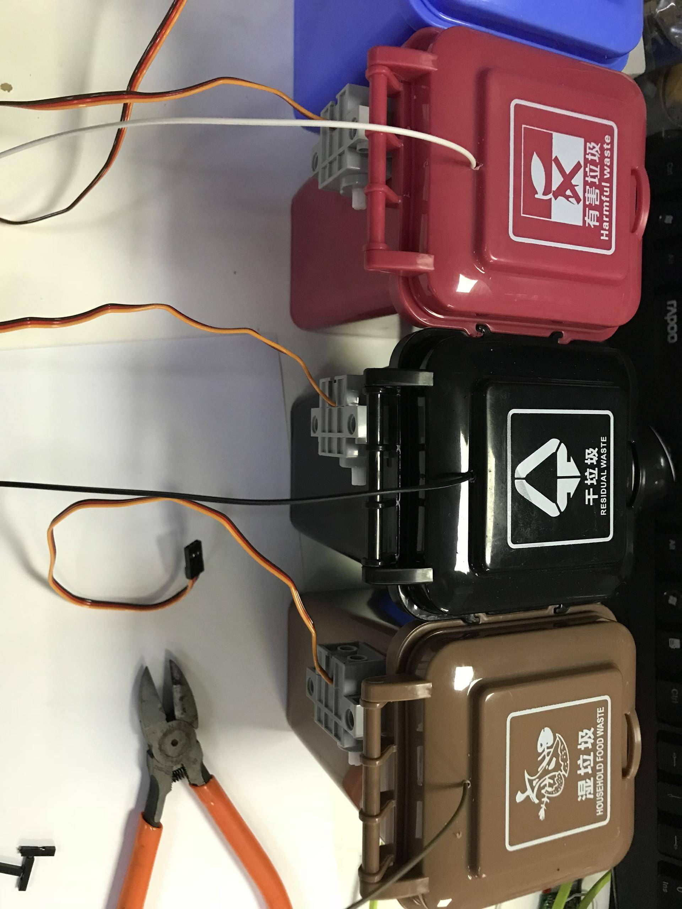

### 安装舵机摇臂

这个乐高摇臂也是能量魔块套装里面的乐高零件，取4个出来，安装到舵机的输出轴上

### 手动模拟

我们手动模拟下舵机拉线，直接摆动乐高零件，检查垃圾盖是否能被正常拉起。

## 电子接线

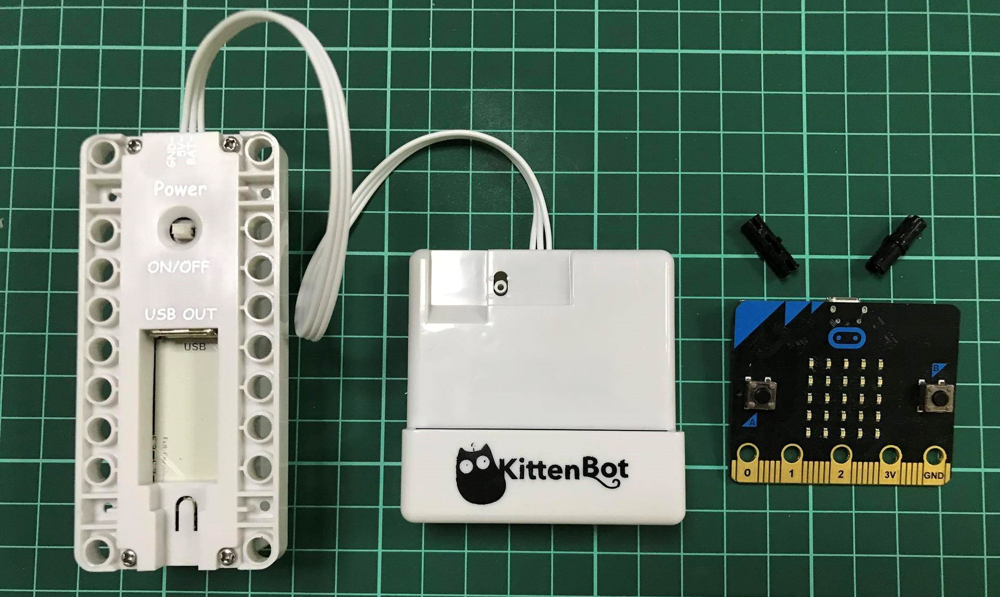

###  主控盒与电池盒结合

能量魔块的一个优点就是，它们既是电子模块，又是机械机构件，所以拼装的时候会显得十分紧凑而美观。

**电池盒的自锁开关记得打开**，因为舵机的动力是由电池盒进行提供的。

能量魔块的主控是Microibt，采用主流的主控板可以减少用户的学习成本。

### 舵机接线

舵机的线序是由黄红黑组成，恰好对应主控盒背后的黄红黑插针。注意不要插错。舵机我们这边是接S1-S4

- 可回收物—>S1
- 有害垃圾—>S2
- 干垃圾    —>S3
- 湿垃圾    —>S4

尽量按照我的方式进行插接，方便程序的调试。

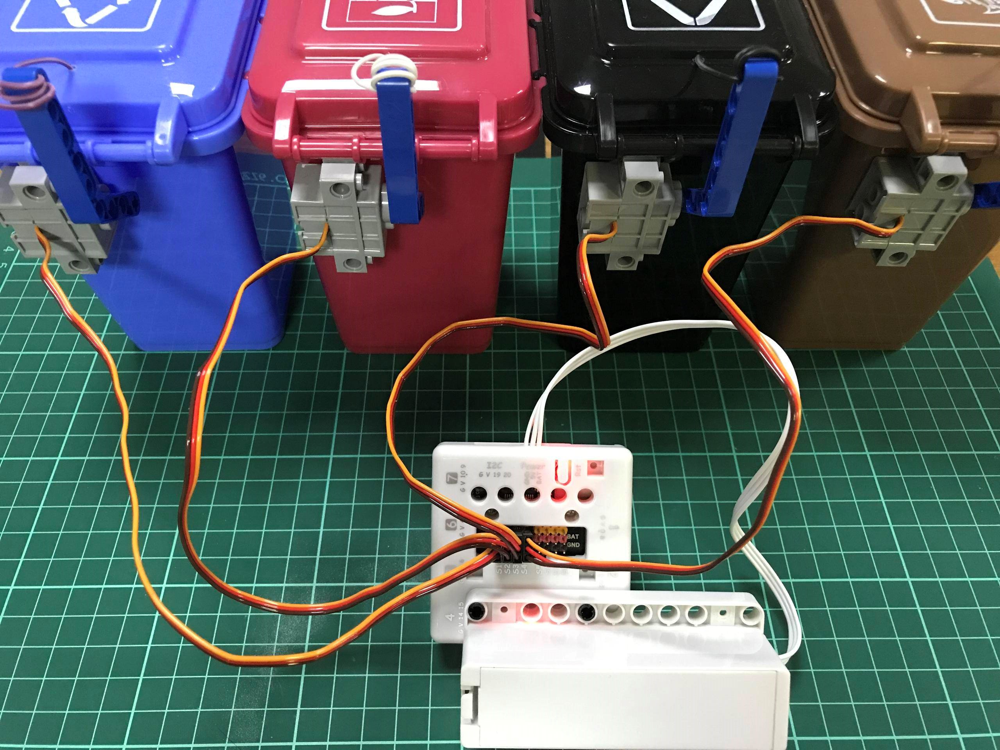
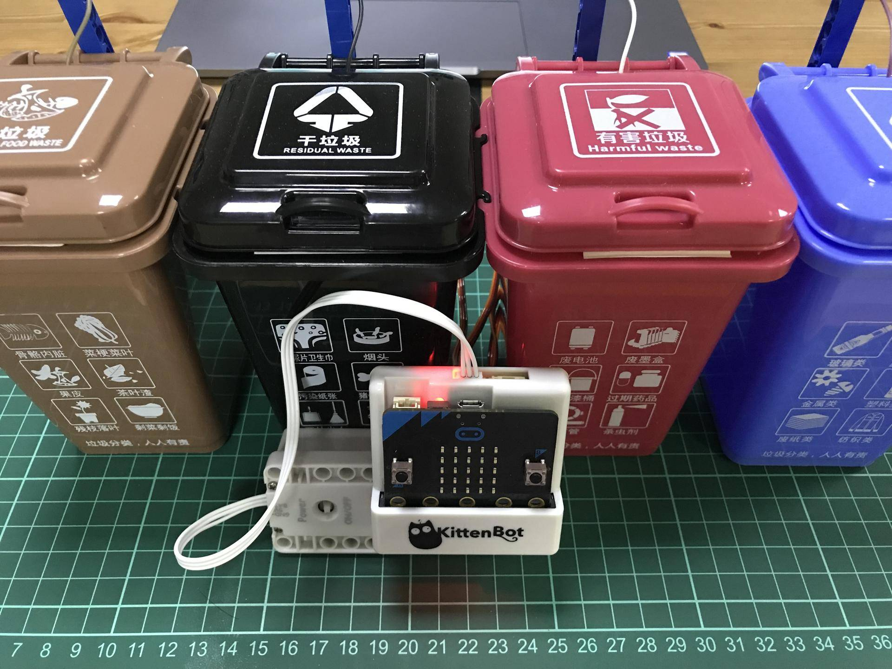

## 简单测试

机械和电子都接好了。这时候我们用usb数据线将Microbit和电脑连接。打开Kittenblock软件

1. 恢复固件

   恢复固件后，Microbit点阵屏上是显示流动的英文字符串。
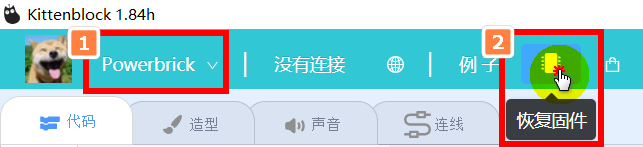
   
2. 连接串口

   成功恢复固件后，点击连接，就可以看到Microbit的板子（如果找不到Microbit板子，可能是串口驱动没有安装）

3. 编写简单的测试程序

   这里编写控制垃圾桶盖开合的程序。

   - 首先先将**乐高的蓝色摇臂**拆下来，因为需要初始化舵机的输出轴角度。如果不把摇臂给拆下来（4个都拆下来），有可能导致在转动的过程中，摇臂卡住了，导致舵机烧坏。
   
   
   
   - 程序初始化舵机停在50度（为什么是50度，因为我测过这个角度，摇臂安装角度最好看）

将舵机控制积木块拖拽出来，更改舵机的角度，并更改舵机的引脚

**单击积木块，此积木块的指令就会立马执行。舵机输出轴就会转到50度的角度**

另外三个积木块也单击下，初始化舵机的角度。

   - 把**乐高摇臂重新装回去**，这样做就可以保证每个舵机在50度时，垃圾盖是关上的。这样程序上控制比较简单。
   - 程序控制垃圾桶盖打开，这个过程中需要自己不断的调整角度，测试出最佳数值，我这边根据实际情况测出来90度左右效果最好。如果你的舵机安装方式和杜邦线拉线方式与我一致的，角度应该是差不多的。

设置舵机50度四个积木块，我们分别也点击下，保证指令执行和实物是对应的。

4. 以上操作没有问题后，就把装置留着备用，下篇结合机器学习，就能把智能垃圾桶分类装置做出来。如果以上操作有问题，请再三检查，一般是操作有遗漏的问题。

### 温馨提示

因为本身这四个垃圾桶不是为智能垃圾桶而设计的，所以当盖子盖合时，它边缘是有卡扣的，所以会导致舵机拉动垃圾盖时很难拉动。所以这里我在垃圾桶与盖子配合的地方，粘了一些贴纸（随意），这样做可以阻止盖子与垃圾桶完全贴合，减少舵机开盖的力度。

## 总结

开展一个项目前，首先要考虑项目的难度对于自己是否合适，大概估算下项目所需的时间，否则项目很容易烂尾。

开展项目前，需要提前做一个初步的实施方案规划，硬件的选型，硬件选型建议从使用的可行性入手。之前遇到很多用户买了一个带摄像头的板子，然后就过来问怎么和我们软件对接上，这个是一个很典型新手硬件选型问题。

购买前首先你要对这个硬件有所了解，这个硬件是针对哪部分人群（如果针对开发者，如果你不是专业的人员，一般不推荐购买，上手难度很高）是用来做什么的，它的编程方式和软件是什么。我们这边必须理清一个概念，一个软件平台绝对不可能支持市面上的所有硬件。如果你选定了一个对于自己难度适中软件平台，这时候应该主动了解它支持的硬件有哪些，你的选型优先从支持的硬件列表选择。

硬件选型简单总结：

- 从自身的能力，优先选自己能用起来的硬件，其次再考虑硬件的价格
- 购买硬件前，先查查硬件是否有详细的使用资料是否有技术支持，这个对新手入门尤其重要。
- 硬件选项优先选择软件所支持的。

