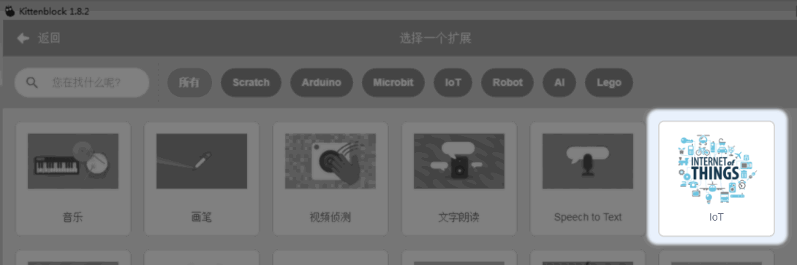
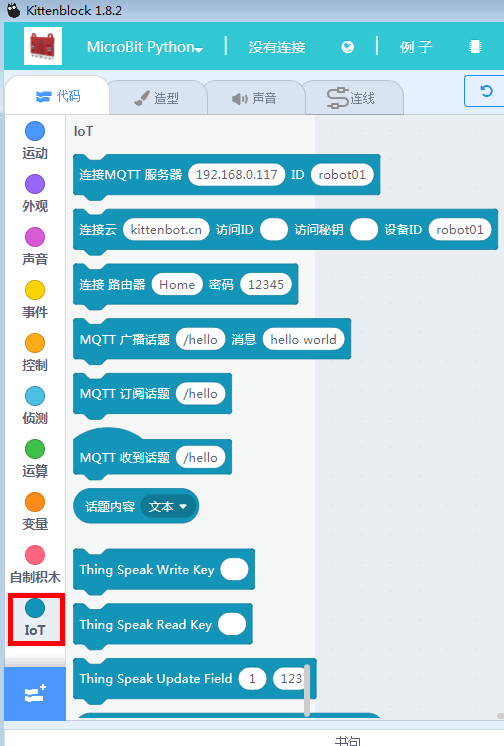
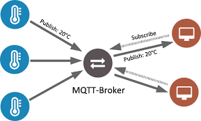
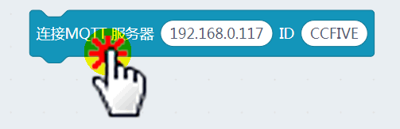
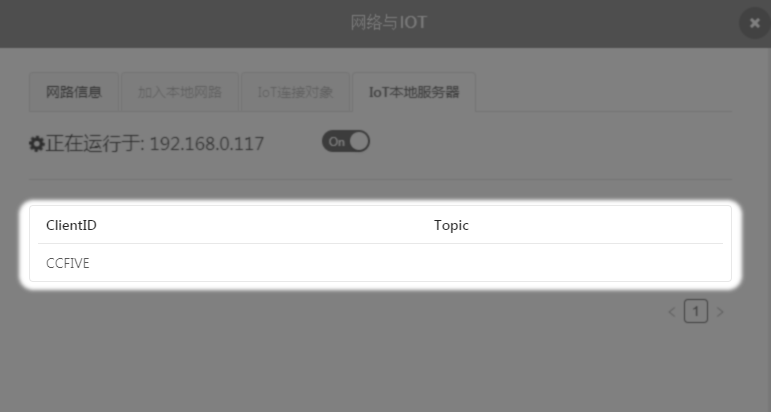
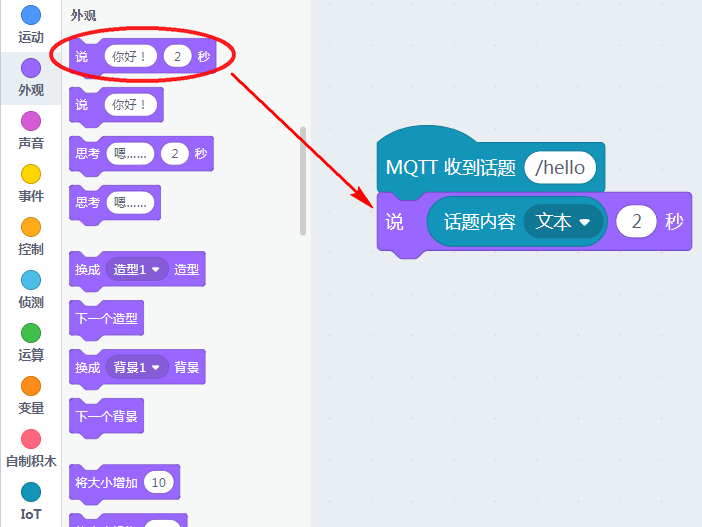
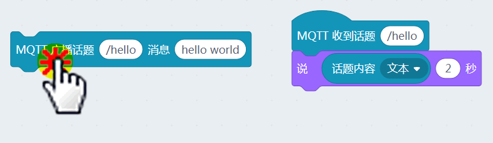
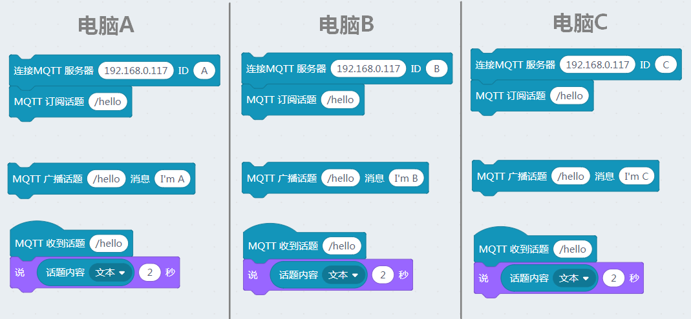

# Kittenblock本地IoT服务器--快速上手

## 加载IOT插件

插件已经成功加载：

## 建立IOT本地服务器

我们重新复习下MQTT物理模型：

1.首先物联网肯定有一台服务器。不然那些要联网的设备把接收到的数据发给谁呢？服务器的作用就是接收数据，处理数据，分发数据

2.多个联网的设备。它们的作用就是给服务器发送数据，或者接受服务器的数据。

本节实验，我们用我们的Kittenblock将本机电脑设置为IOT本机服务器，并且本机也作为一个联网的客户端，对服务器进行消息发送

为了方便学校上课场景（连接外网服务器不方便），我们可以直接通过Kittenblock后台建立起IOT本地服务器。

刚建立器IOT本机服务器，设备列表是空的，当然因为没有设备连接到本地服务器上

## 连接服务器

拖拽积木，设备的ID名称可以自由填写，这个名称是显示在服务器上的

更改完信息后，记得点击下积木块，才会执行这条指令

回到本地服务器的列表查看，可以看到设备CCFIVE已经连上上服务器了

## 订阅话题

设备已经与服务器成功连接后，我们需要进行话题订阅，话题的形式一般是“/”+英文，当然不用“/”也是OK的

回到本地服务器的列表查看，可以看到设备CCFIVE已经订阅了"/hello"的话题

## 话题广播与接收

因为我们现在只有一台设别，所以话题我们自己发送自己接收，我们写一个接收程序，让舞台的小喵说出来

话题发送与接收

现象结果：

## 多台电脑MQTT相互通讯

如果你的实验环境下有多台设备，不妨将多台设备都连接到同一个服务器上，例如下图电脑A、B、C都连接到192.168.0.117上，然后对应向共同的话题推送消息，这时候其它设备如果也订阅了这个话题，它也会收到消息更新。

