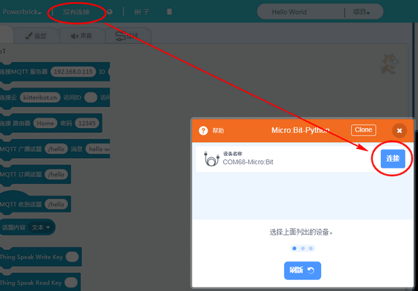
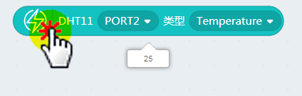
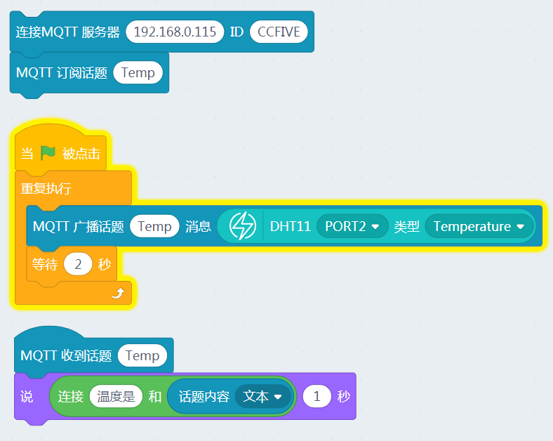

# Kittenblock本地IoT服务器--温度推送

上节，我们已经学习了IOT的消息推送，本节我们结合硬件，把检测到的物理量温度，推送到IOT中。这样的IOT才具有实际的意义，IOT中的温度推送是很常见的，包括气象站的，智能大棚种植等等，都运用的IOT的温度推送。

本节实验器材清单：

能量魔块主控盒

能量魔块电池盒

能量魔块温湿度魔块

## 连接能量魔块恢复固件

将能量魔块按上图插接好后（温湿度魔块连接在Port2口上），首先进行固件恢复，再进行串口连接

## 通讯连接测试

我们可以尝试点击Microbit对应的点阵积木块，看下实物是否有反应，如果实物有反应则表示通讯已经建立起来。

## 温湿度魔块温度读取

点击温湿度积木块则可以返回，实时温度

## 加载IOT插件并编写程序

IOT服务器的开启，请看上节的详细介绍，这里不再演示了。

打开网络与IOT，从IOT本地服务器列表看到，设备已经成功连接，话题也成功注册了。

## 实验结果

可以看到舞台小猫每隔一阵子，就会推送温度值出来。

## 后记

IOT与环境物理量检测结合就是这么简单，我们只需要替换推送的消息内容即可。
