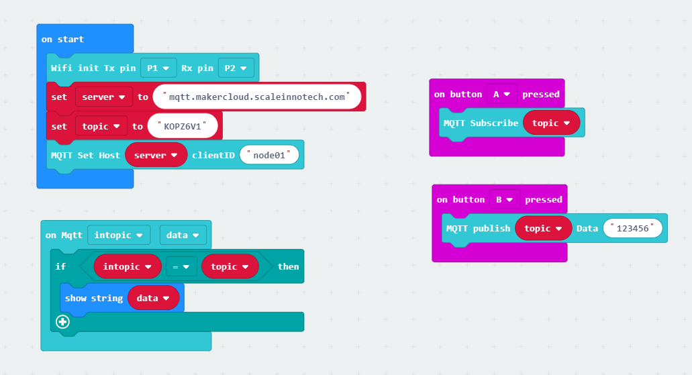
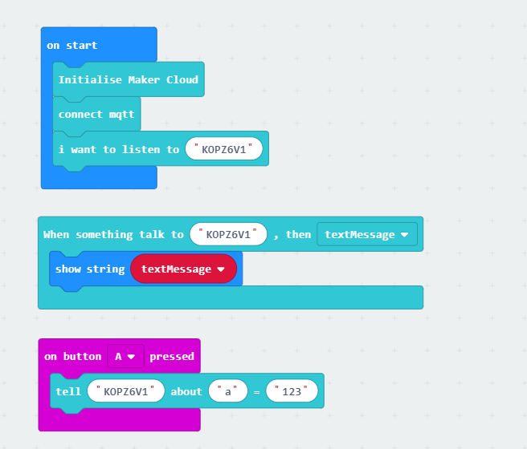

# Makecloud Iot对接

使用您的邀请链接登录到 http://makercloud.scaleinnotech.com 

## 创建项目和主题

创建一个新的项目 

项目类型选择Iot/mqtt 类型， 进入项目选项后我们先需要创建一个主题 

主题创建完成后，系统会自动给你分配一个topic名称，这里是`KOPZ6V1`：

## 使用pxt-kittenwifi插件连接 broker

首先我们需要保证你的wifi模块能够正常连接入互联网，并且与robotbit或powerbrick正确连接，这部分其他教程有详细说明，不再重复了。

拖动如下积木块，需要注意`on Mqtt`事件回调函数的第一变量是`intopic`

代码地址如下

<iframe style="position:absolute;top:0;left:0;width:100%;height:100%;" src="https://makecode.microbit.org/---codeembed#pub:_LikX5RFRybbo" allowfullscreen="allowfullscreen" frameborder="0" sandbox="allow-scripts allow-same-origin"></iframe>

https://makecode.microbit.org/_LikX5RFRybbo

## 使用pxt-makercloud插件连接 broker

除了kittenwifi的插件，大家还可以使用 https://github.com/KittenBot/pxt-makercloud 连接makercloud。插件中支持了makercloud专有的通讯协议，可以在平台上更完整的显示和交互体验。

未完待续~