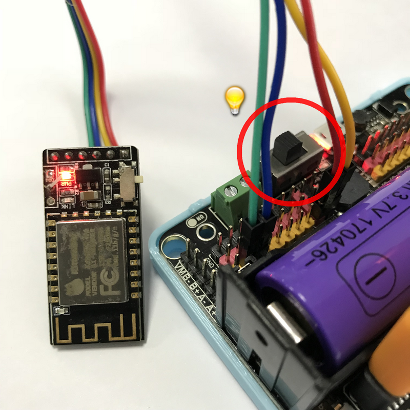
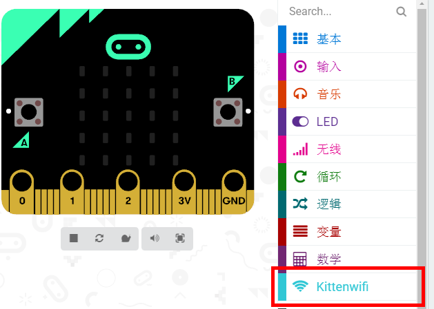
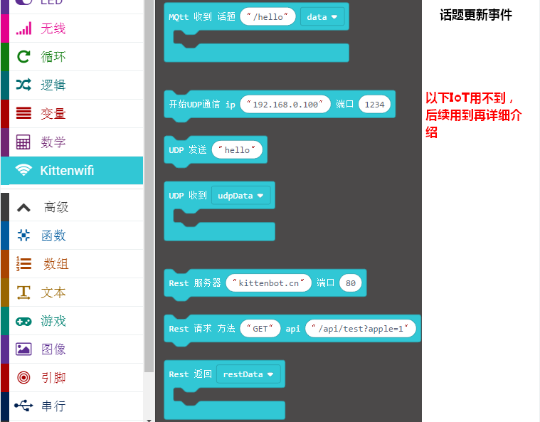
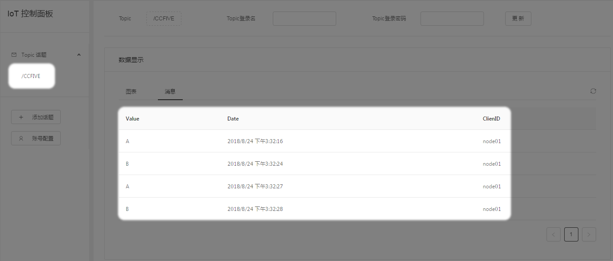
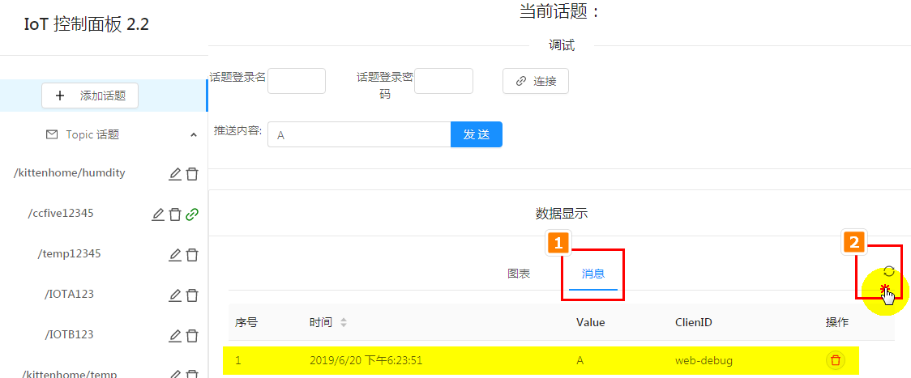

# 让Microbit加入IoT

## IoT服务器端创建话题
 
确保看过第一篇的[喵家外网IoT服务器-快速上手](http://learn.kittenbot.cn/zh_CN/latest/IoT/meowIoT/%E5%96%B5%E5%AE%B6IOT%E6%9C%8D%E5%8A%A1%E5%99%A8%E5%BF%AB%E9%80%9F%E5%85%A5%E9%97%A8.html)


## 电路板连线

新手按照图示接线，因为这个接法是跟下面程序所对应的

wifi模块->Robotbit:

RX->P1

Tx->P2

GND->GND

5V->5V


Microbit插上USB线，准备进行编程 


```attention:: Robotbit上的电源开关记得打开,由于wifi需要的电流较大因此需确保18650电池电量充足
```



## 软件

在线版：[https://makecode.microbit.org](https://makecode.microbit.org)  
离线版：[https://www.kittenbot.cn/makecode](https://www.kittenbot.cn/makecode)  

- 加载喵家wifi积木块插件 
`https://github.com/KittenBot/pxt-kittenwifi`




## 积木块介绍




## 示例1——向特定话题广播消息  


```attention:: 如果你的wifi已经连上了你的路由器，请尽量不要重复使用 [加入路由器]积木块
```  

1、下载到microbit上后，等待心形出现(过程需要的事件和你的网络有关，1分钟以内都是正常的)

如果很久依然没反应，尝试按下microbit复位键让程序重新运行（并确保你的电池提前已经打开了）

2、按下A或B按键

3、登录[喵家IOT服务器](http://iot.kittenbot.cn/)，就可以看到对应话题已经收到的消息



## 示例2——监听特定话题消息 


黄色是你必须更改的内容（因为我的路由器wifi名字、密码和你家的不一样。另外我们定义的话题名称也不一样）

1、下载到Microbit上，等待三角形出现 

2、可以向话题发送A或者B，观察Microbit点阵显示 

```hint::如果你有多套Microbit（烧录的程序示例1）+Robotbit+wifi模块，你可以按A、B按键，观察这块Microbit点阵显示
```

## IoT网页调试

在喵家IoT控制面板，有个调试窗口，连接后，就可以对话题发送信息。这时候如果话题有内容更新，wifi模块也会检测到的。


这里可以看到收到信息




