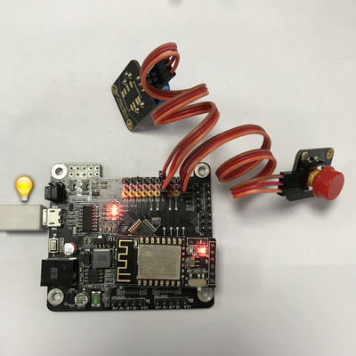
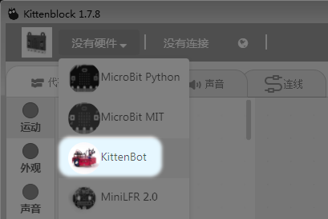
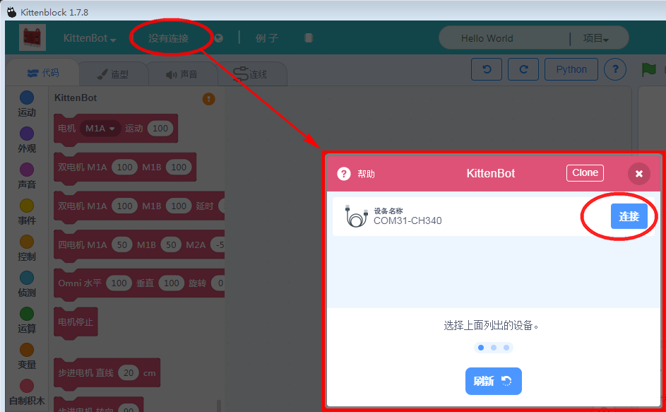
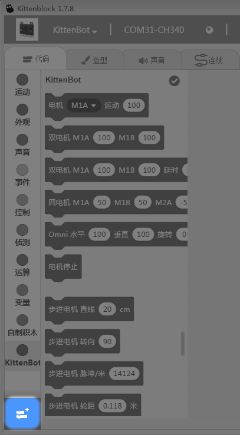
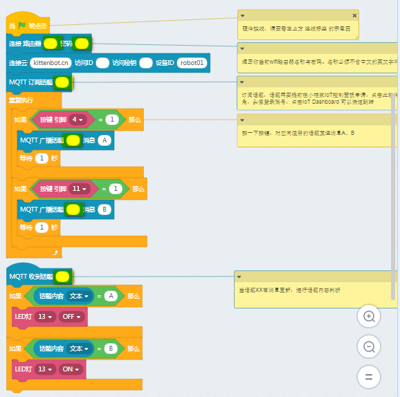
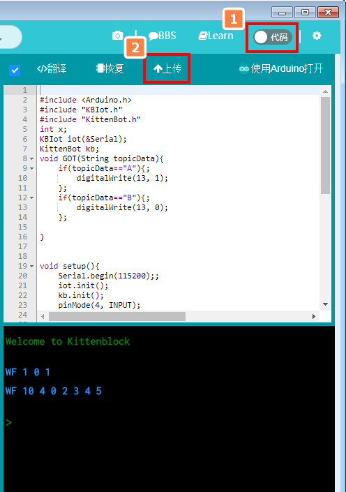
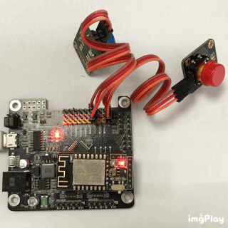
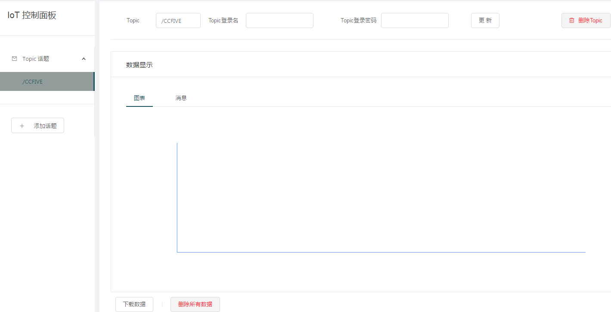
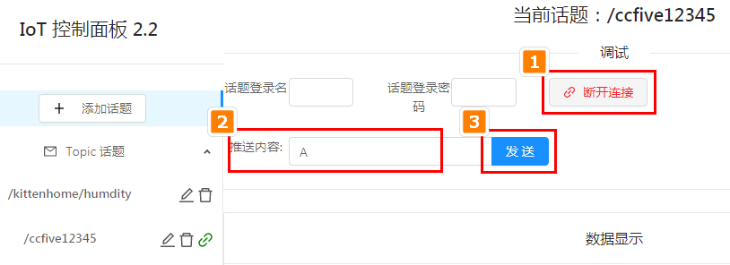

# 让Rosbot加入IoT

## IoT服务器端创建话题
 
确保看过第一篇的[喵家外网IoT服务器-快速上手](http://learn.kittenbot.cn/zh_CN/latest/IoT/meowIoT/%E5%96%B5%E5%AE%B6IOT%E6%9C%8D%E5%8A%A1%E5%99%A8%E5%BF%AB%E9%80%9F%E5%85%A5%E9%97%A8.html)

## 电路板连线

新手按照图示接线，因为这个接法是跟下面程序所对应的 

wifi模块->Rosbot:

直接wifi模块插好在Rosbot上，按键按照图示所接。 

 

```hint:: 没有按键模块也没关系，了解原理可以间断发送固定数值
```

Rosbot插上USB线，准备进行编程



插入电源后，wifi模块的电源指示灯红灯会亮，蓝灯会快闪（表示还没加入路由器，如果之前已经加入过路由器后，蓝灯会慢闪）


### 编程开始

打开Kittenblock后，硬件选择Rosbot 

```attention:: 请确保你的kittenblock是最新版
```



硬件连接选择你对应的串口



关闭窗口


连接成功


加载IoT插件




加载成功后，在示例中，找到IOT button示例


先把程序黄色荧光笔的空格填写完毕。（填写你的路由器账号密码，你的话题名称等）

再把程序下载到Rosbot板上 

```hint:: 如果没有按键的朋友可以直接将按键发送部分改成发送数字并且加上延时，让板子自动每个一定时间给IoT发消息，再观察服务器上的消息接收
```

 



如果操作都没错后，下载完成，稍等片刻（wifi联网需要几秒到几十秒不到，具体看网络环境）。连接成功后，wifi状态如下：




按下按键（4引脚），Rosbot板上的13脚蓝灯会熄灭。按键（11引脚），Rosbot板子，Rosbot板上的13脚蓝灯会亮。


同时在喵家IOT服务器控制面板上也会看到对应话题接受到的消息



### IoT网页调试

在喵家IOT服务器控制面板，最下方有个调试窗口，连接后，就可以对话题发送信息。这时候如果话题有内容更新，wifi模块也会检测到的。


### 积木块介绍

比较好理解，把本文MQTT的一个工作过程理解后，就能理解这些积木块了


