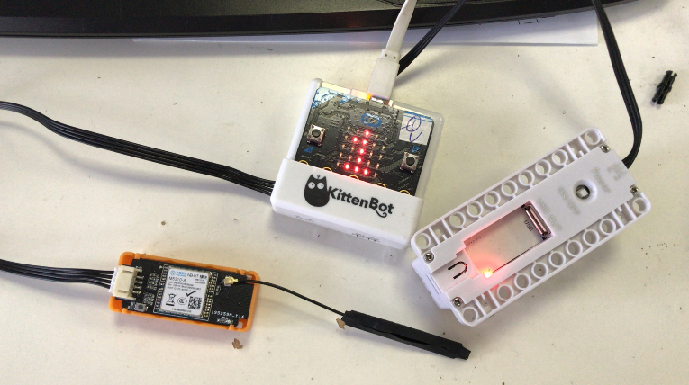
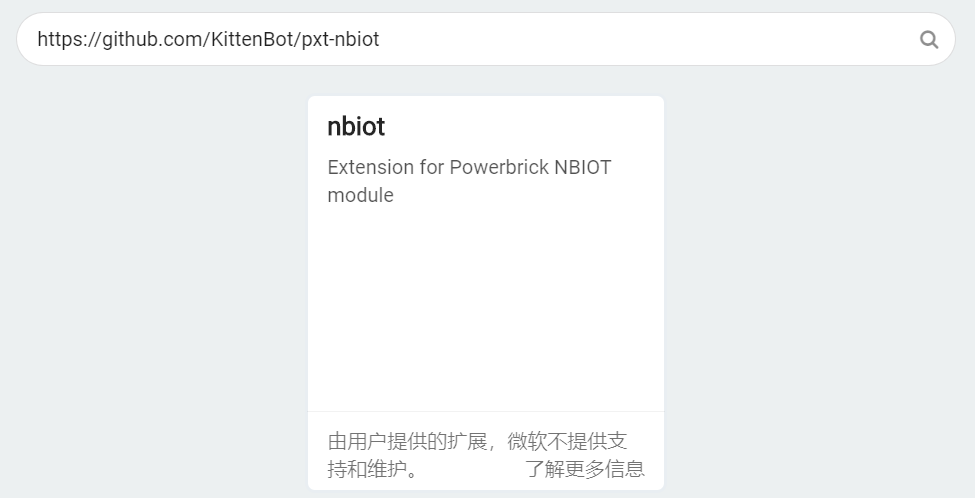
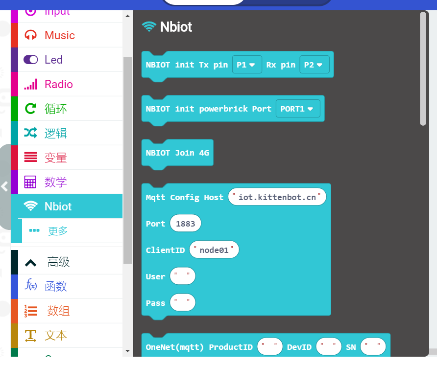
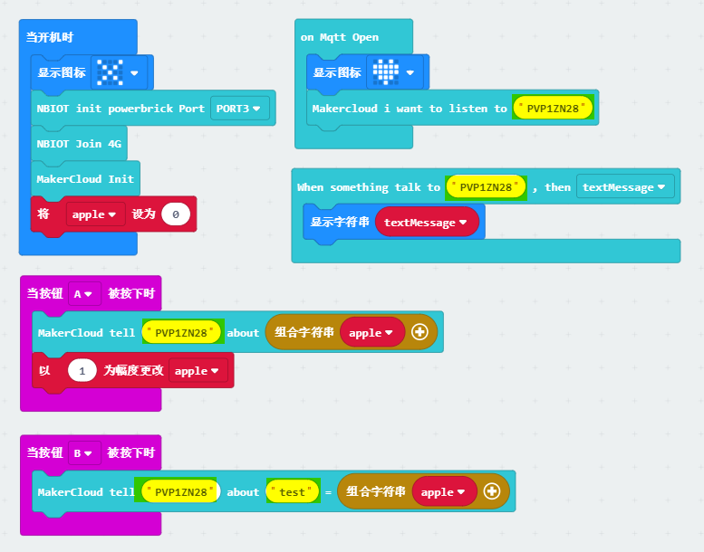
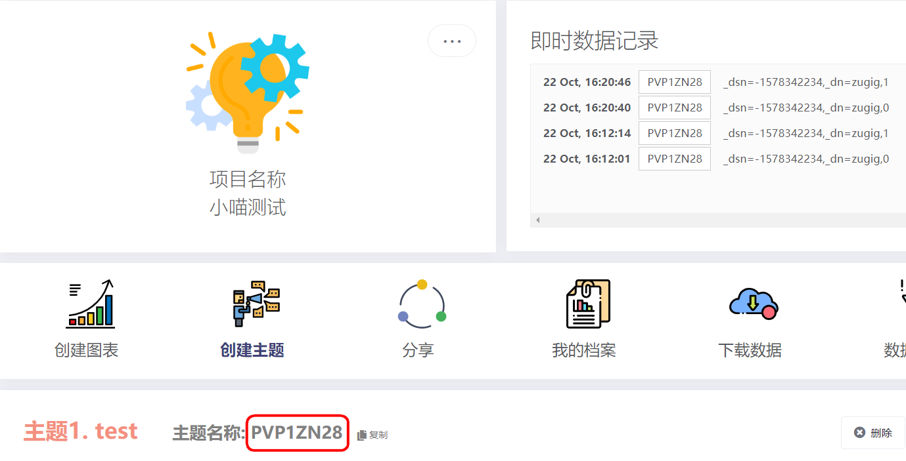

# nbiot

## 简介

随着物联网的不断深入，喵家做了一款NBIOT模块。直接插移动的4G卡进行使用，拜托WIFI的束缚，解决校园WIFI网络复杂无法连接，或者是在一些不方便连接WIFI的环境下依然能连接上网络，例如可以做一个户外的气象站。

## 准备工作

1、喵家nbiot模块

2、移动4G物联网卡（这卡一般人还真买不到）

3、把卡插到nbiot模块的卡槽上

4、连接好硬件（nbiot模块接在Port3上，电池盒已经打开开关）

## 打开Microbit的beta版本编程地址

暂时只能在beta版本下使用，等待微软的正式版更新

https://makecode.microbit.org/beta

## 加载nbiot插件地址

https://github.com/KittenBot/pxt-nbiot

扩展地址栏中，加入插件地址：

插件成功加载

## 编程

编程这里以makercloud为例，这里做了一个自发自收的程序，注意更改黄色标注的对应你自己的话题名称，关于makercloud平台上的使用，这里不多说。

我的makercloud控制面板

## 下载

下载后就OK了。程序开始跑，会显示一个“X”，接着是跳动的“◇”，连接成功后，显示一个“红心”

按下AB按键进行消息推送，同时，稍等片刻，Microbit点阵会显示，这个话题的信息。程序我新建一个变量apple，让按键A去增加它的值。

