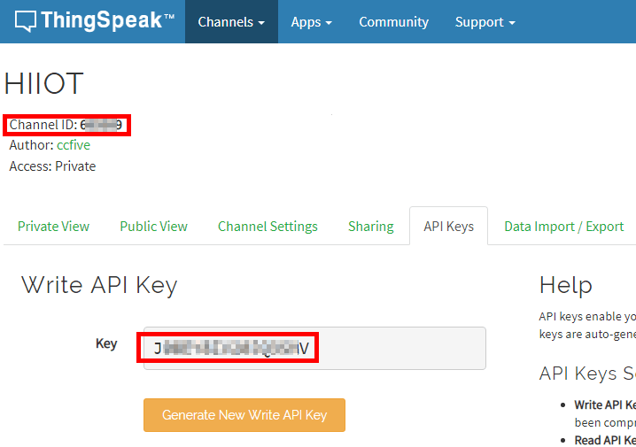
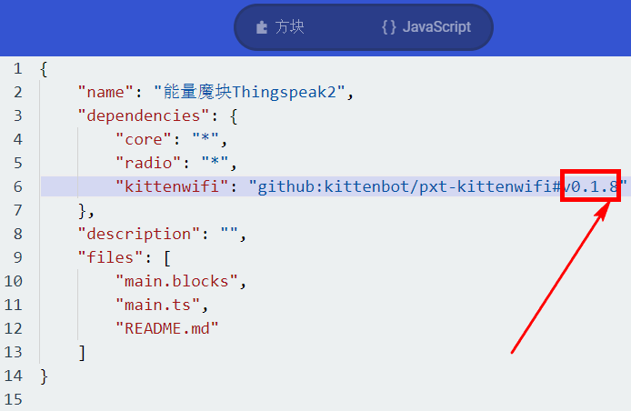
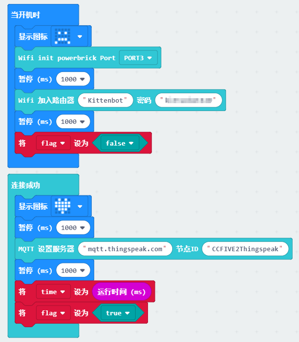
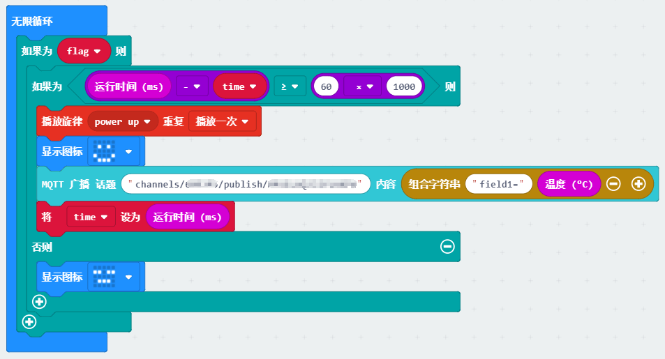

# Thingspeak中应用--Microbit

## Thingspeak介绍

Thingspeak是Mathworks在物联网(Internet of Things)大潮下的一个产品线，它是物联网的数据收集和数据分析的云平台。大多数使用Thingspeak的用户都是Maker,也叫做创客，他们有工程和硬件方面的经验，开发和使用可联网的硬件收集数据，并把数据传向云端，Thingspeak扮演的角色是物联网的后端，即 免费 存储硬件所收集的数据，以及提供 免费的在线使用MATLAB 分析这些数据的功能。

## Thingspeak的准备

在使用Microbit连接Thingspeak前，我们需要再Thingspeak进行账号注册和Channels建立，这里不细说，操作很简单。

注册完毕后，我们需要建立Channels,把ID与Write API Key记下来，编程需要用到。

## 硬件接线

这里用了能量魔块作为演示（你也可以用Microbit+Robotbit+wifi模块），接线如下，注意电池盒一定要接上，否则wifi模块会因为电流不足工作不正常。wifi模块接在Port3口，当然你也可以选用（Port1、2、4）

## 程序编程

### 加载wifi插件

### wifi插件版本更新

Makecode离线版本3.5的wifi插件还没有更新，需要自己手动更新，操作如下：

切换回去编程界面

如图所示，更改成0.1.8

### 编写程序

你需要更改两处地方：

你的路由器相关信息

广播对应的话题内容：channels/888888/publish/XXXXXXXXXXXXXXXX

把888888和XXXXXXXXXXXXXXXX改为你Thingspeak对应账号的信息

## 程序提升

因为Thingspeak是一个商业的IOT平台，它是有时间间隔限制的，所以这里我们改动下程序，每隔一分钟推送一次温度。

初始化过程与上面的程序没有什么差别，主要不同就是无限循环里利用判断系统时间间隔对消息进行推送

程序如下：

## 后话

小喵一直秉承开放的态度对做技术做产品，IOT不仅仅支持我们家的IOT服务器，也支持Thingspeak，个人觉得如果你人在国内，就直接利用喵家IOT
服务器即可。Thingspeak是老外做的，全英文的界面，虽然有matlab数据分析的强大功能，但是一般人用不到。所以看个人喜好把~

