# 中国移动Onenet使用--能量魔块

为了帮助用户直接入门OneNET的IOT，我们针对能量魔块WIFI（接在Port3口）写了一个程序下载：

[microbit-Onenet_iot_Publish1.hex](https://bbs.kittenbot.cn/forum.php?mod=attachment&aid=Mjk3NnwwZTc2NWFmZHwxNTYxMDIyNTkxfDF8NjQw)

请在离线版本打开，或者这个旧版的的在线版本：[https://makecode.microbit.org/v1](https://makecode.microbit.org/v1)

## 注册OneNET账号

注册账号这个过程很简单，要求有个手机号接受验证码就可以了

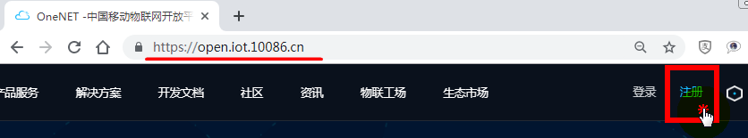

## Step1：新建产品

## Step2：添加设备

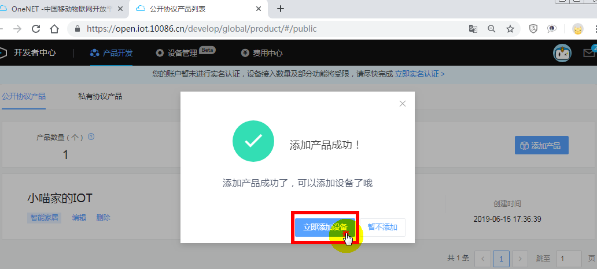

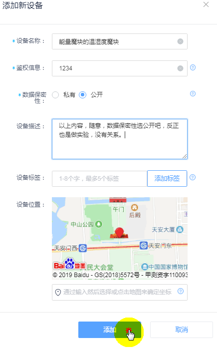

## Step3：添加数据流（是指就是话题）

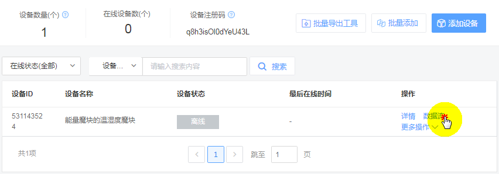

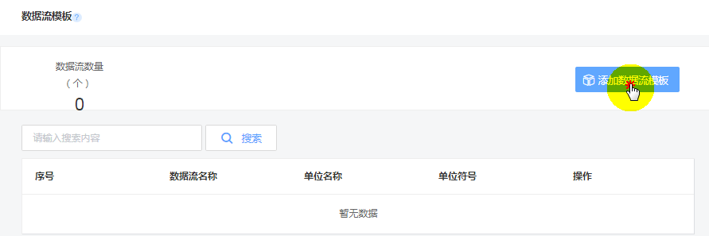

> 数据流名称只能是，英文和数字，不能是中文！！！

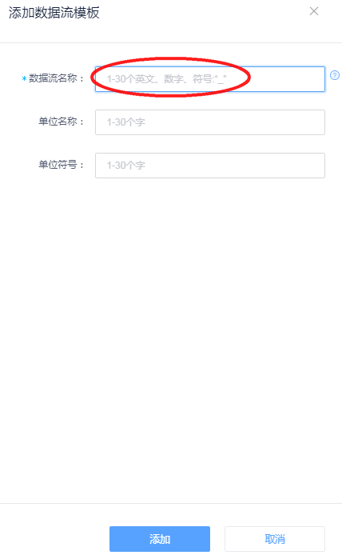

> 如图，温度，我就用英文名——temp来表示

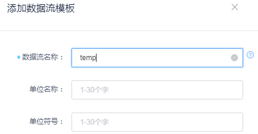

### 成功建立了两个数据流，temp——温度；humi——湿度。如图所示

## 记下OneNET平台产生的信息——编程会用到

> 建议在桌面新建一个txt文本，把以下三个信息记录下来：

### 产品ID

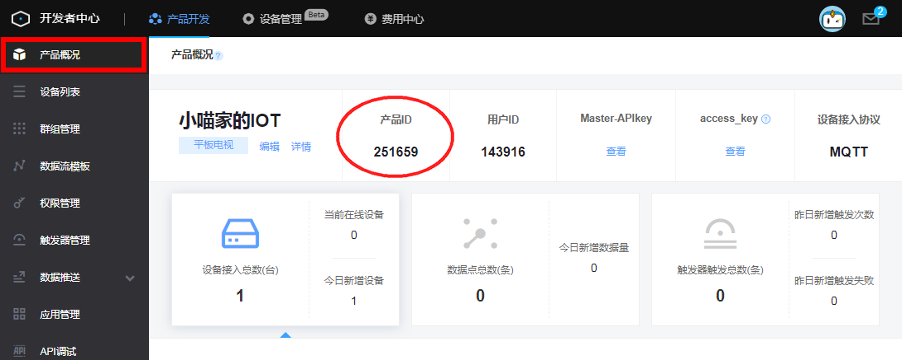

### 设备ID与鉴权信息

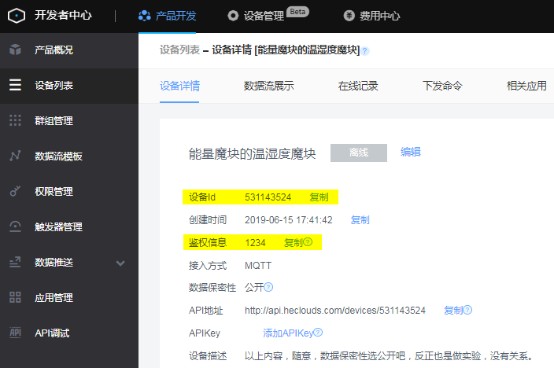

## 最终得到的信息（每个用户都不一样，你用你自己的）

产品ID（Product ID）：251659

设备Id（DEV ID）    ：531143524

鉴权信息（SN）       ：1234

## 接线

### 材料

- Microbit
- Powerbrick Armourbit
- Powerbrick 电池盒
- Powerbrick WIFI魔块（接->Port3）
- **Powerbrick WIFI魔块固件V2.8.4**
- Powerbrick 温湿度魔块（接->Port2）
- 连接线

[wifi模块固件更新V2.8.4方法](http://learn.kittenbot.cn/zh_CN/latest/electronics/wifi2.html)

## Makecode上正式编程

### 加入OneNET插件与Powerbrick插件（本实验是基于Powerbrick进行）

OneNET插件与Powerbrick插件地址分别是：

### 加载Makecode中的onenet插件

https://github.com/KittenBot/pxt-onenet

### 加载 Powerbrick的插件

https://github.com/KittenBot/pxt-powerbrick

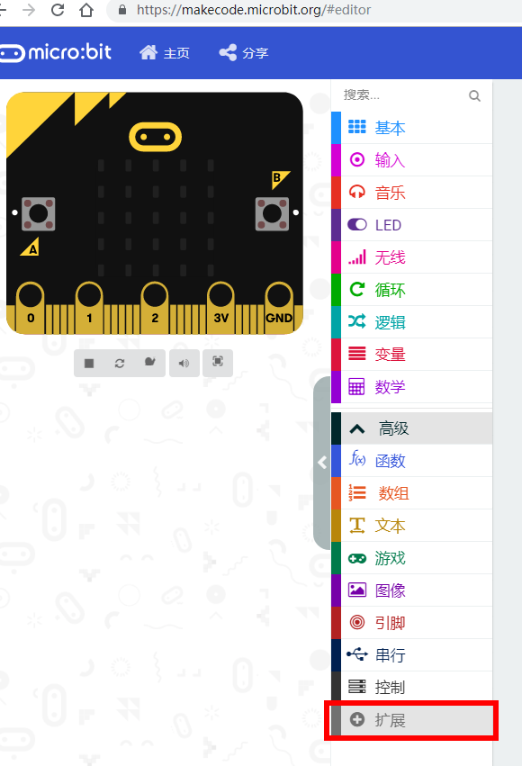

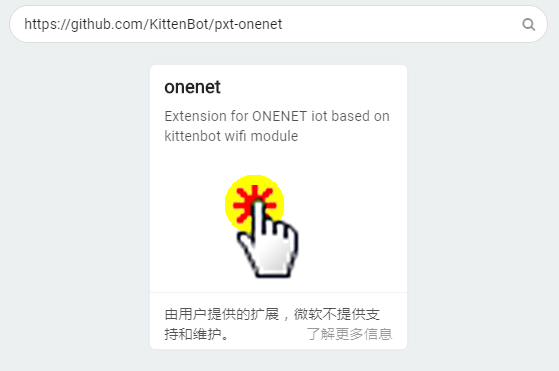

还记得我们记录下来的信息吗？

嗯，对应我们编写一个OneNET的消息推送程序。

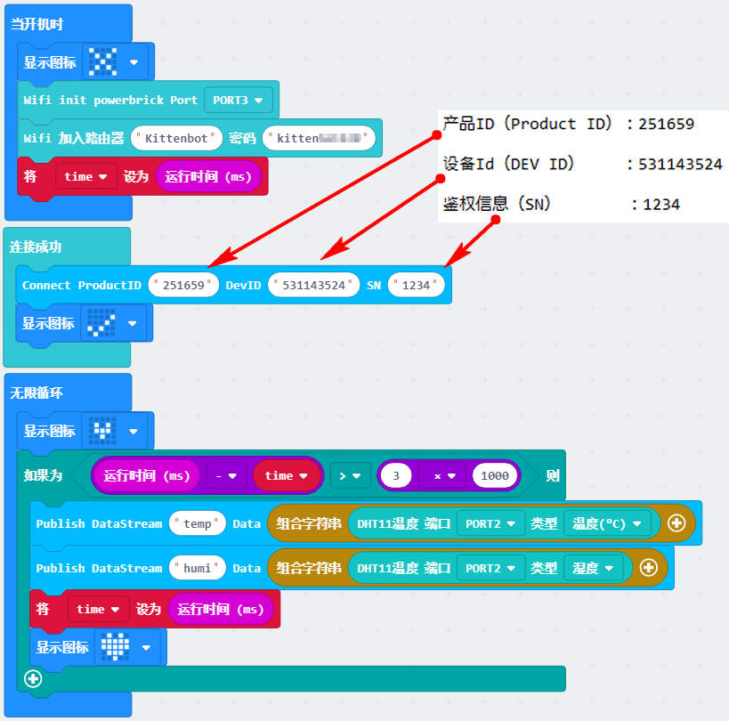

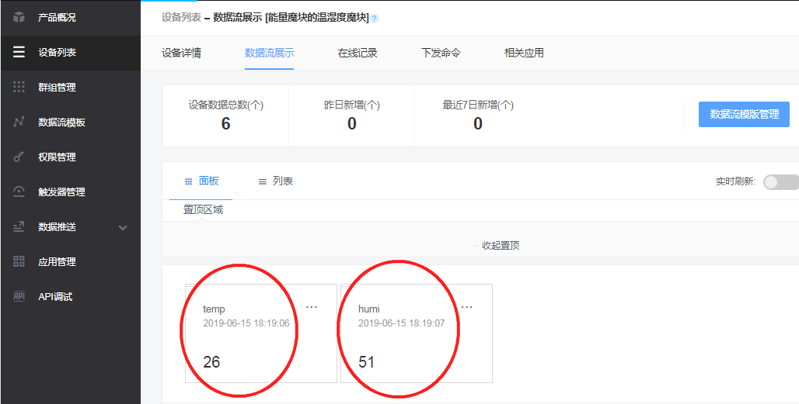

到这里，Powerbrick与OneNET的IOT实验已经成功了！！！可以看到Powerbrick的温湿度魔块把温度和湿度推送上来了。点击去就可以查看详细的信息。但是看数据总是觉得效果不那么好。OneNET还有一个进阶，就是可以利用里面的应用管理分栏，把你IOT推送上来的数据做成，图标呀~表盘呀~等等好玩的应用。

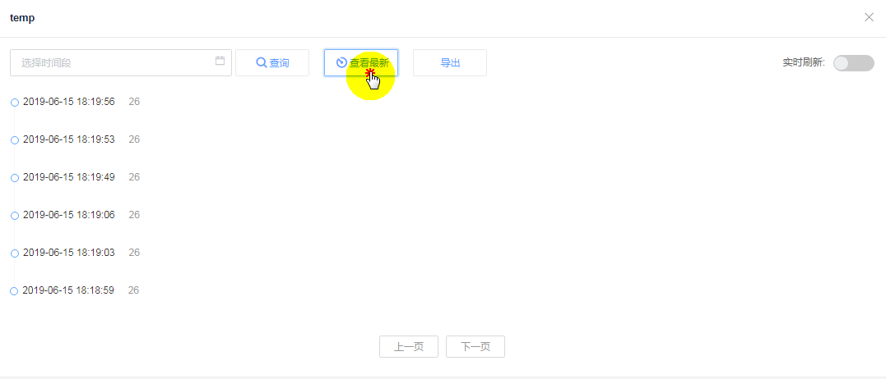

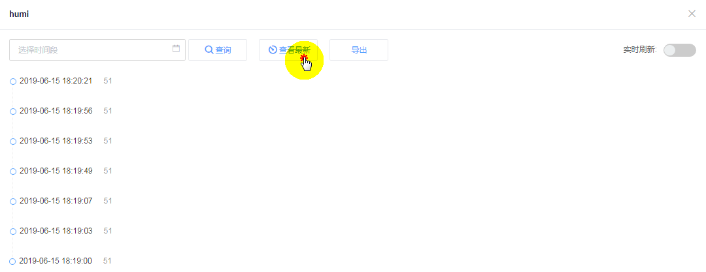

## 给你的数据做一个应用（图表展示）

选择应用管理，选择添加应用

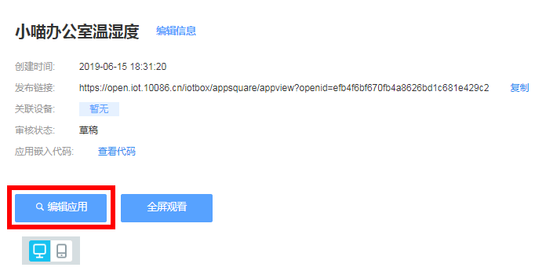

图表这里使用不难，需要自己花点时间去熟悉下操作

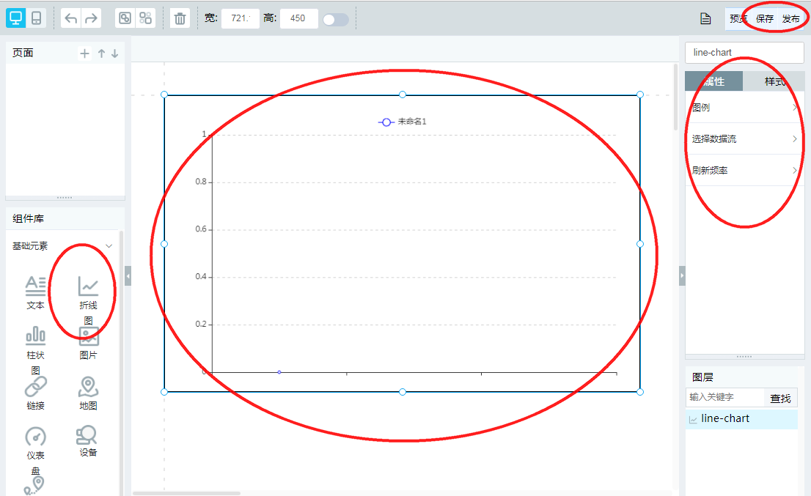

## 图标效果

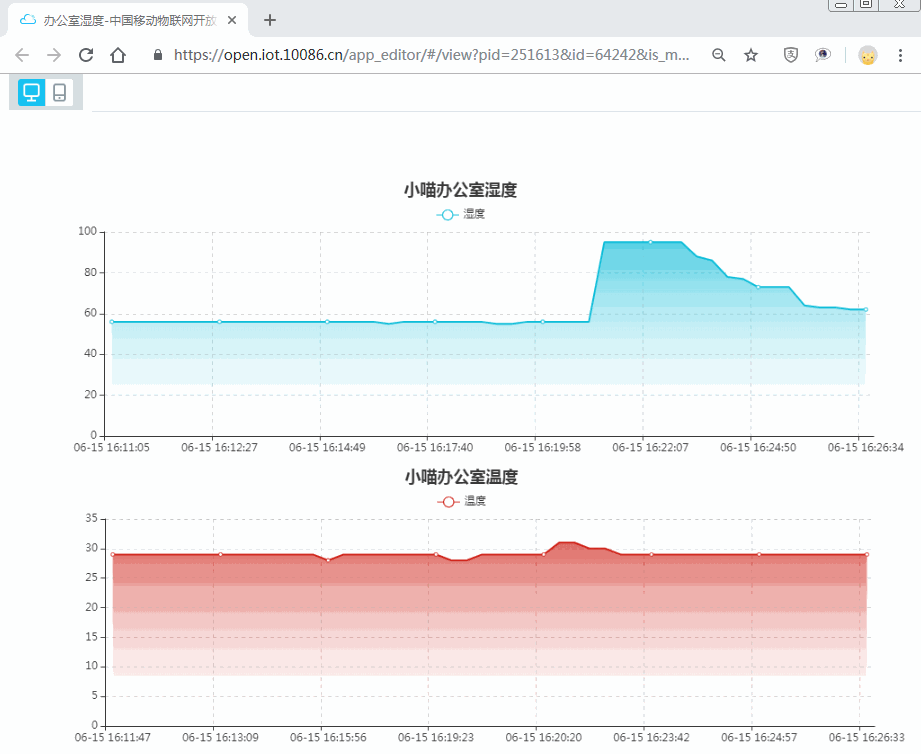
