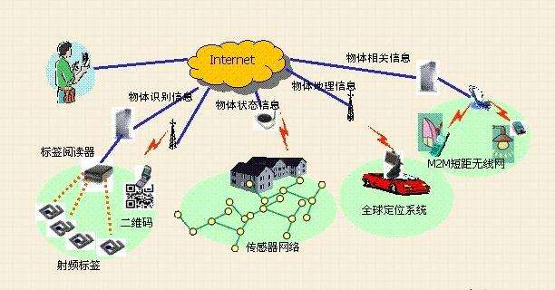

# 物联网

## 什么是物联网
在我们日程生活中，经常听到物联网，IoT这些新名词。实际物联网的英文缩写就是IoT（Internet of things）。物联网顾名思义就是物物相连的物联网。不光人能用手机上网，各种物体借助网络模块也能连上云端进行数据交换。后面为了叙述方便物联网直接称为IoT

## IoT跟我有什么关系
IoT在近几年频繁的提到，也慢慢走入到我们生活中。但是IoT在被提及这些概念前，这些技术很早被应用，特别是在于环境检测中，每个地方地点进行环境监测采样，然后通过网络，将数据统一传回大服务器。这就有了最基础的雏形了。

近年来也越来越多IoT的产品走进我们的生活，例如小米的米家，还有各种的天猫精灵等各种智能音响，可以利用这些产品来控制，家里的各种电器。似乎家里的电器如果不贴上物联网的标签，都不好意思卖个高价钱。

## 为什么要学习IoT
IoT作为一项新的技术出现，而且跟我们生活息息相关，作为一名合格的DIY或者创客教育布道师肯定要紧跟时代的潮流。特别在我们的一些特殊的DIY应用中，我们恰恰就要利用到IOT去服务我的作品。

这里举个栗子，在香港中小学创新比赛中，其中就有一组小朋友结合香港本土环境的情况，做了山泥倾泻的预警。利用Microbit安装在树上，利用Microbit的陀螺仪进行检测，再通过网络把数据传回到大服务器进行检测，可做到山泥倾泻预警。把实际技术应用到生活中。

所以你还迟疑是否要学习IoT？当你有真正的需求，大棚检测，环境检测，植物检测等等需要一些实时性检测与交互动作的，IoT就能帮到你

## 学习IoT难吗？我是零基础能学会么？
IoT的底层实现肯定是很难的，但是对于普通用户来说，不是人人都要成为程序猿架构师，他们只需要掌握应用层即可。

为了降级用户的应用难度，喵家推出IoT积木块编程，只有你有兴趣有耐心，跟着喵家一步步就可以实现。

## IoT推荐器材

连接网络模块：

[Kittenbot wifi](https://item.taobao.com/item.htm?spm=a1z10.3-c-s.w4002-17001215033.57.7294762eFcn1gB&id=551380787824)
先淘宝所卖的wifi模块暂时不是最新固件，如果大家不急这尝鲜，可以迟个把月等我们工厂生产那里最新固件模块回来。

如果急着尝鲜，可以自己买回去自己更新固件。更新固件也不难。
[详情教程帖子点我跳转](http://learn.kittenbot.cn/zh_CN/latest/electronics/wifi.html)

主控板：
推荐两种方案，用户可任选一种

[Microbit+Robotbit](https://item.taobao.com/item.htm?spm=a1z10.3-c-s.w4023-17001215032.2.572e762eH61Xia&id=559862615142)(wifi需要5V电压，所以Microbit需要配搭上Robotbit)

[Rosbot+18650电池座](https://item.taobao.com/item.htm?spm=a1z10.3-c-s.w4002-17001215033.254.2905762eeGv6vx&id=551011963085)