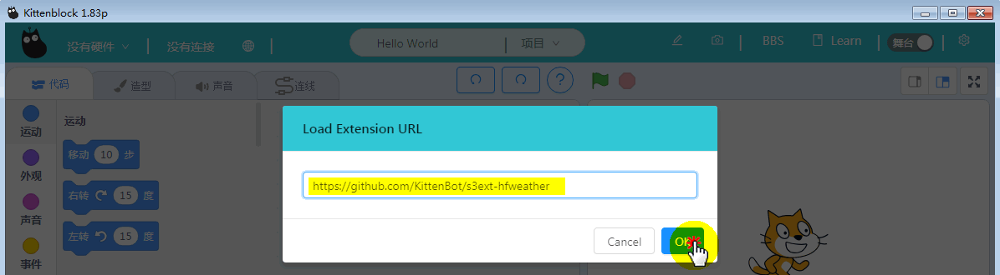
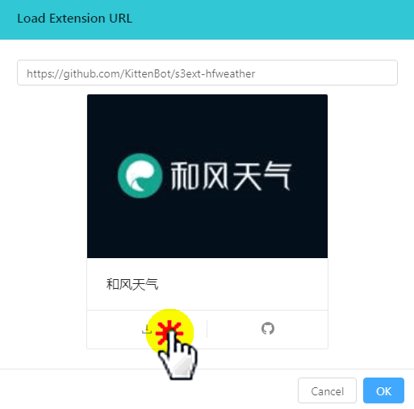
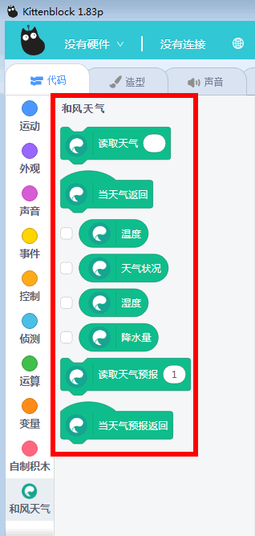

# 加载和风天气插件

此插件无需依赖硬件，纯软操作，只需要有通畅的网络即可

## 加载插件

### 打开软件

左下方，插件加载

点击加号，进行网络插件加载

### 输入和风插件地址

输入和风插件（此和风插件为小喵科技开发）

github链接：https://github.com/KittenBot/s3ext-hfweather

点击下载按钮，然后下载完毕后，软件会自动重启。

### 成功加载

软件重启后，重新选择插件加载

加载成功如下图：

## 快速上手

### 读取当天天气

这里我手动填写了“深圳”，意思是读取深圳当天的天气情况。

以下这个数值返回，使用方式一样，这几个数值返回也是我们平时比较关注的天气点

### 预测未来天气

所谓的预测，就是读取天气预报未来几天的天气情况。

后面的数值为，未来的第几天，对应可以查询天气情况和温度。

