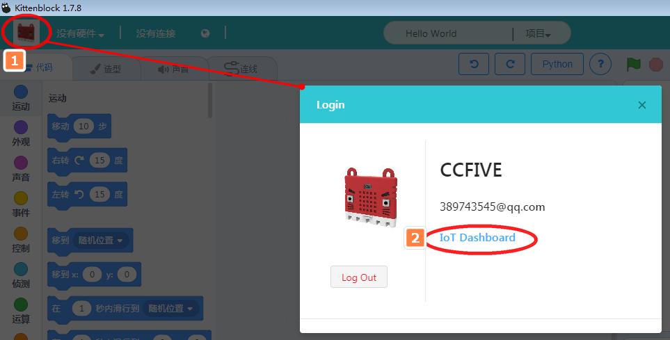
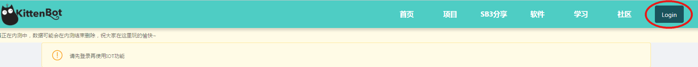
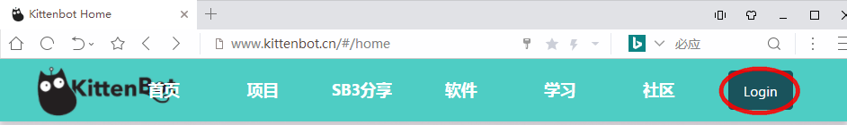
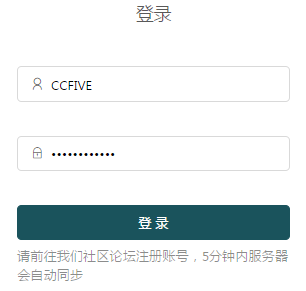
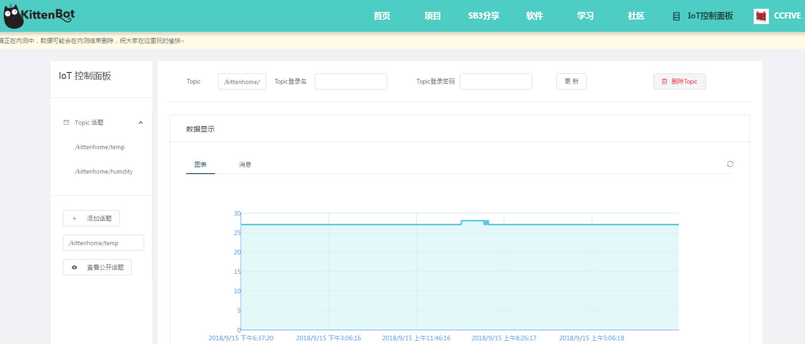
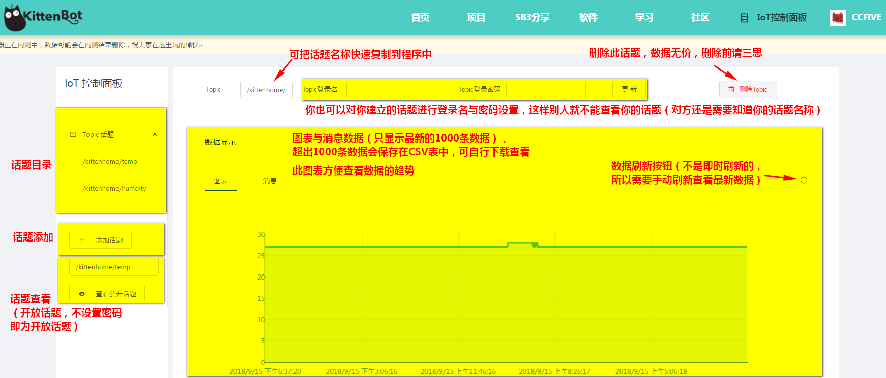

# 大服务器IoT控制面板
前面两节已经重点讲解了Microbit、Rosbot如何连接喵家wifi模块进行IoT，喵家IoT控制面板也粗略提及，本节重点讲解IoT控制面板，毕竟IoT的数据最终回寄到这个控制面板中，我们可以通过数据分析，对我们检测的物理量或者其他数据进行分析。

## 登录入口

### Kittenblock软件直接跳转

### 官网登录个人账号跳转

喵家官网：
www.kittenbot.cn  右上角有登录图标

输入你的账号密码，账号密码就是喵家论坛的账号密码（如果你没有请自行注册 bbs.kittenbot.cn）

登录后点击IoT控制面板

## IoT控制面板界面

## 界面具体介绍

