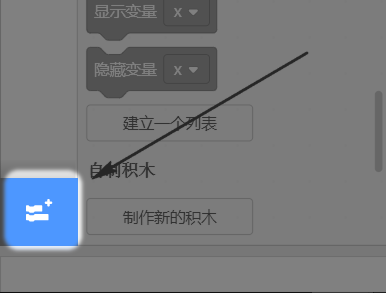
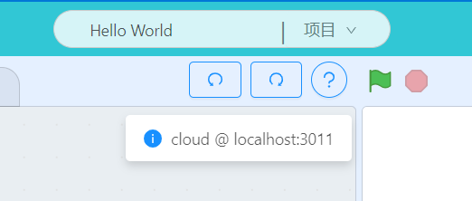
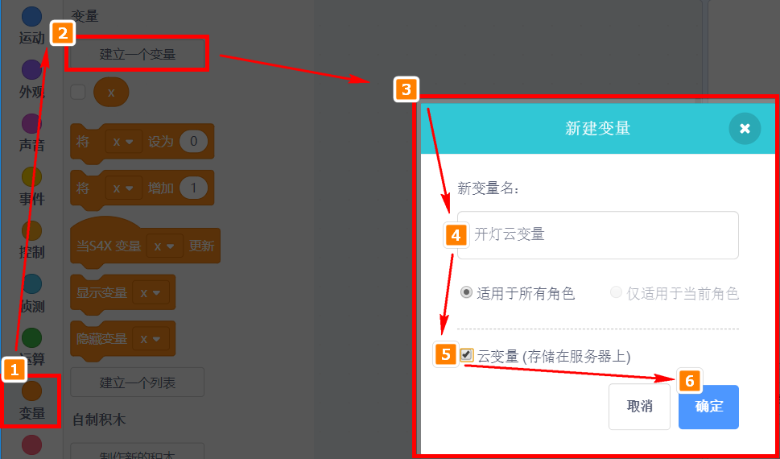
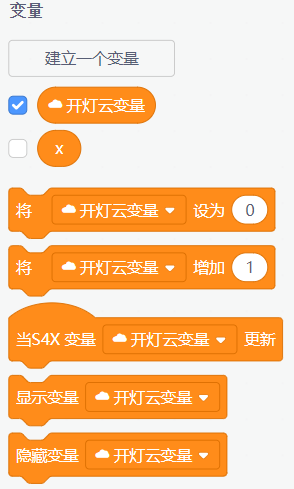
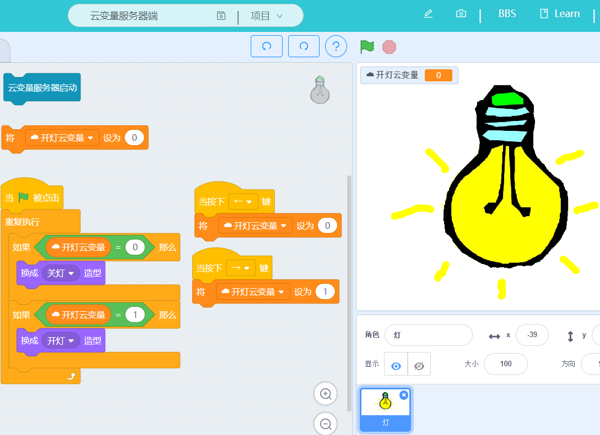
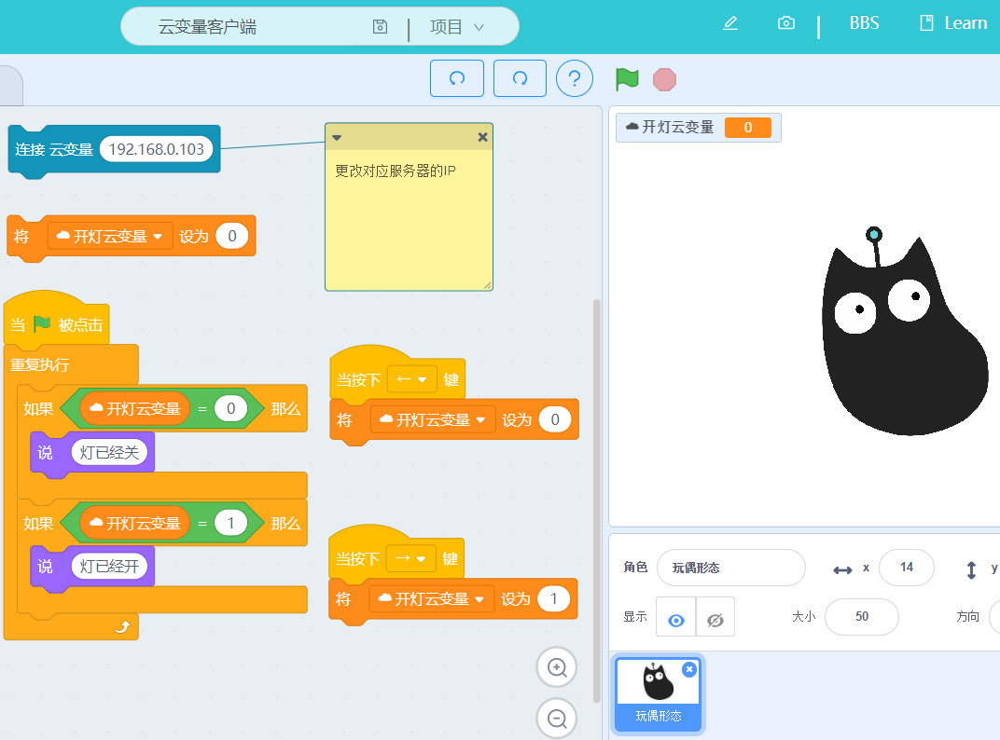

# 局域网云变量

## 引入

IOT本身是很简单的技术，但被很多公司和书神话，粉饰成技术好高大上的样子，IOT可以用一句话总结，它实质是一个云变量。

## 变量

变量这个相信大家都很熟悉，在scratch中变量分栏如图所示

我新建一个变量X，X初始化默认设为0，我们使用变量X来控制LED的状态，0为关，1为开。

只要我们更改这个变量后，对应LED就有反应。

所以对于IOT来说，只要我们把这个变量X变为云端变量X，所谓的云端只要大家连上云端服务器后，都能对这个变量X进行更改。这样我们就实现了物联网控制灯了！实质物联网就是这么简单！真正大师一句话就能解释明白了！滑稽脸。

## 云变量

如果大家有接触过原生的Scratch，就知道它里面实质有个一个云变量，对应Scratch的云变量使用，你需要注册Scrach的账号，众所周知，我们访问MIT网站速度都是比较慢的。所以喵家推出了黑科技，局域网云变量。

在我们课堂的教学实验中，很多时候我们不需要连接到外网去。局域网既快捷又稳定，保证课堂效果，先带学生入门简单的物联网概念后，再在最终的项目，使用wifi模块连接外网实现真正的IOT作品，循序渐进会使课堂效果更好。

## 建立局域网云变量服务器

- 新建程序，加载IOT插件

选择IOT插件

IOT分栏中，这两个积木块跟云变量有关系

积木详解：

- 建立局域网云变量服务器

如果我是电脑A，我就建立服务器

电脑B或者其它电脑这时候，作为客户端，可以连接电脑A的IP（这个IP电脑A积木块显示的IP）（连接前，电脑A的服务器应先建起来）

电脑A点击建立云端服务器后，软件提示“云端服务器已经建立”信息反馈

- 新建云变量

**注意：只有建立的服务器或者连接了服务器，才能新建云变量！**

局域网云变量已经成功建立。

服务器和客户端所建立的云变量名字要相同，否则他们之间信息就不通（废话）

## 实战——云变量点灯

要求：两台电脑以上配合（电脑需要在同一个局域网上）

程序简介：电脑A作为服务器，电脑B作为客户端。电脑A编写一个判断云变量的亮灯程序，电脑B编写控制云变量变化的程序

### 电脑A程序（服务器）

服务器端编写这样的程序，自己按下箭头左右键可以控制云变量

### 电脑B程序（客户端）

客户端这边，记得更改你连接服务器的IP，也是通过左右箭头更改云端变量，这边更改云变量后，服务器端的灯泡就会有反应。

