# 米家智能家居

## 简介

科技改变生活，越来越多用户的家里出现了智能家居，突然有一天有个老师突发奇想，既然Kittenblock这么强大，能不能直接控制米家的智能家居？不需要改装什么继电器排插，直接控制现有的通用智能家居产品，这样的物联网控制才是真实有意义的，而且趣味性强。普通家长可以非常直观看到小孩学编程的效果，从而支持小孩学习编程。

喵家向来对黑科技从不缺席，对于大众普遍有求必应。喵大仙在百忙之中抽了点时间出来将这黑科技做了出来。

## 硬件

以下教程是针对米家的这一套智能家居套装来做的。淘宝有售，喵家淘宝暂无，价格300内搞定

## 准备工作

米家套装买回来后，根据配套的说明书，入网，安装米家APP，能用APP实现这套智能家居控制检测，这样准备工作就完成了。

## Kittenblock控制米家智能家居原理

简单理解就是Kittenblock代替手机APP对米家网关进行在线控制

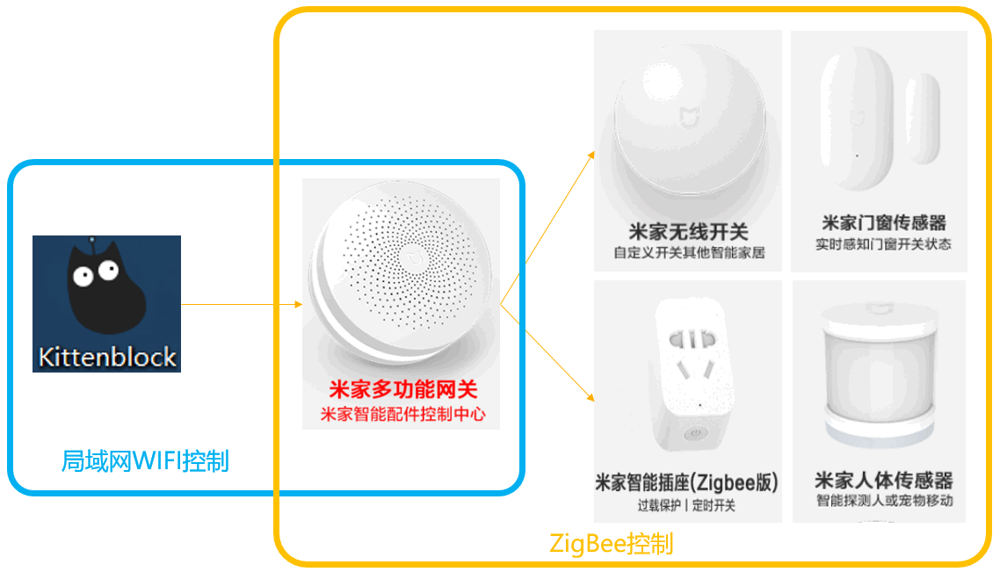

## 米家插件加载

即将在Kittenblock1.8.5a 发布，如果想要提前体验的用户可以单独找CC喵领取插件补充包

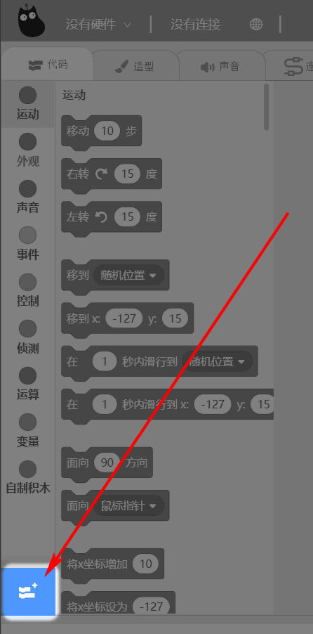

## 插件成功加载

暂时增加了这一部分的米家智能家居，如果有其他的需求，请各位喵粉在喵家论坛—“物联网IOT”子论坛 发帖建议，谢谢。子论坛地址：https://bbs.kittenbot.cn/forum.php?mod=forumdisplay&fid=64

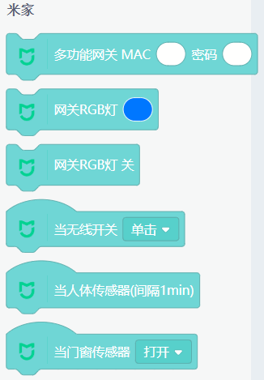

## 插件使用前准备

打开你的米家APP，根据下图的操作，记录你的MAC地址 和密码

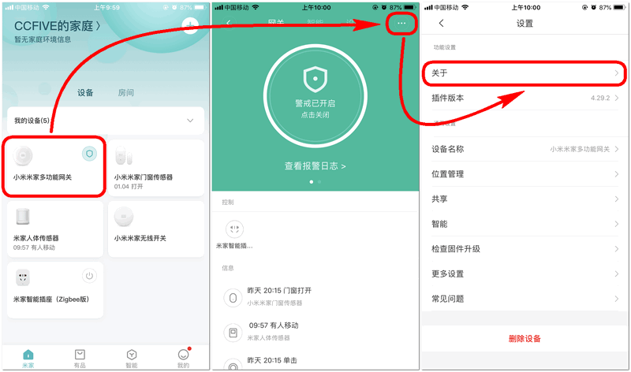

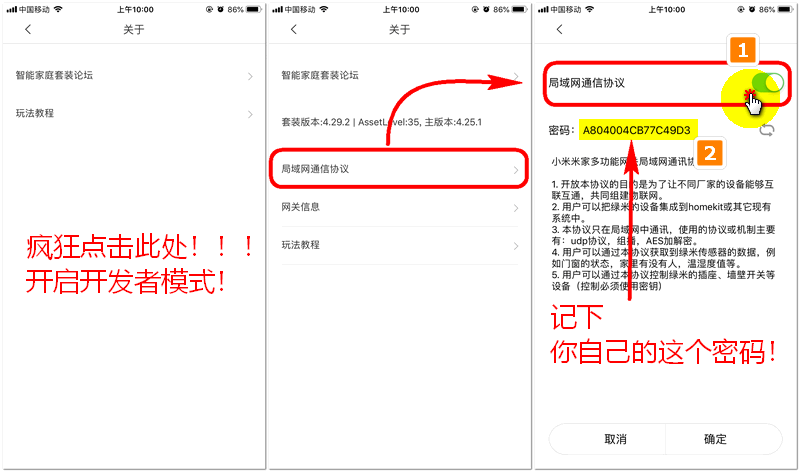

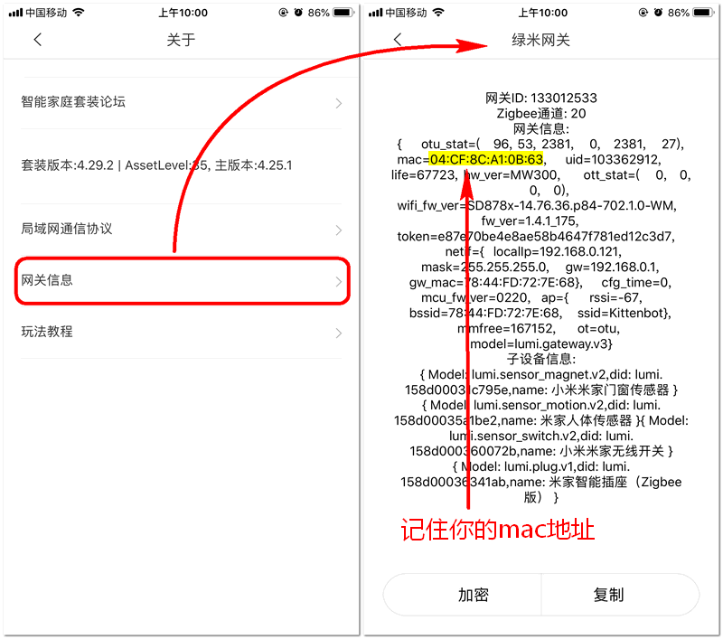

## 开始编程

### 初始化连接

从上面的步骤得知网关的MAC地址与密码。

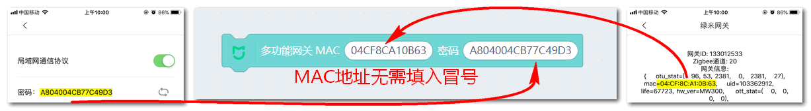

填入后，点击运行，Kittenblock即与米家网关进行连接，上线成功有提示。

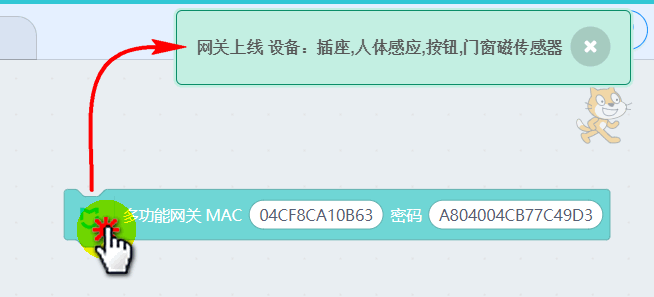

### 控制网关RGB灯

选择自己对应喜欢的颜色

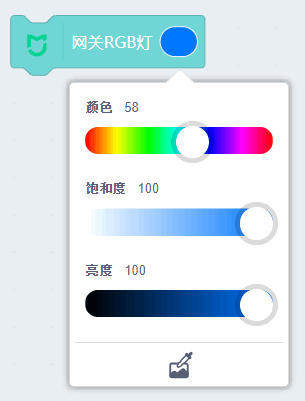

对应亮起蓝、红、与关灯的状态，如下图所示：

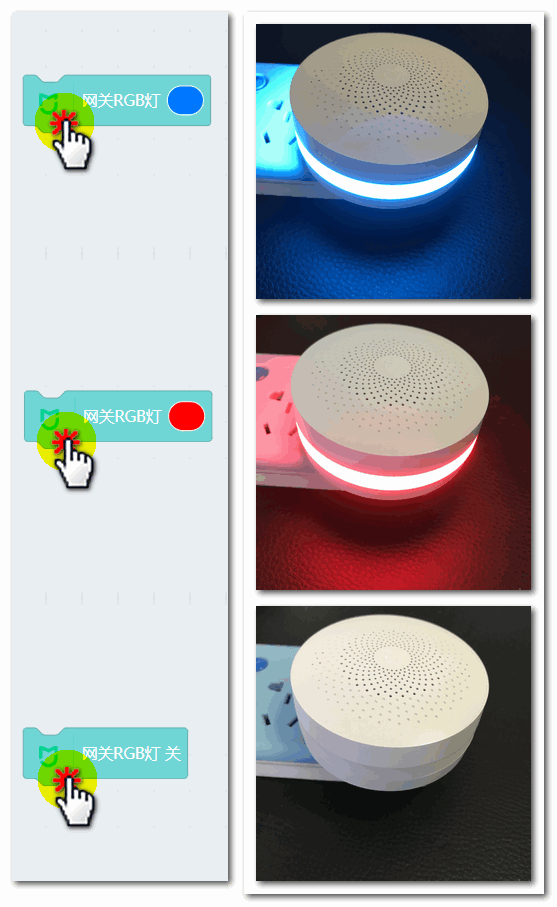

### 无线开关按键检测

无线开关有四种触发类型。

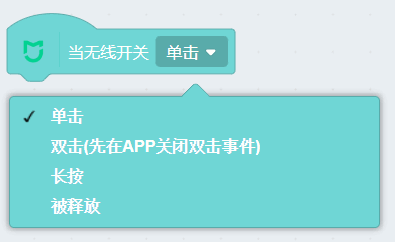

双击事件是网关复用事件，因此 如果你编程如果要用，请现在APP上选择无线开关，进行设置 关闭双击的触发事件。如图所示：

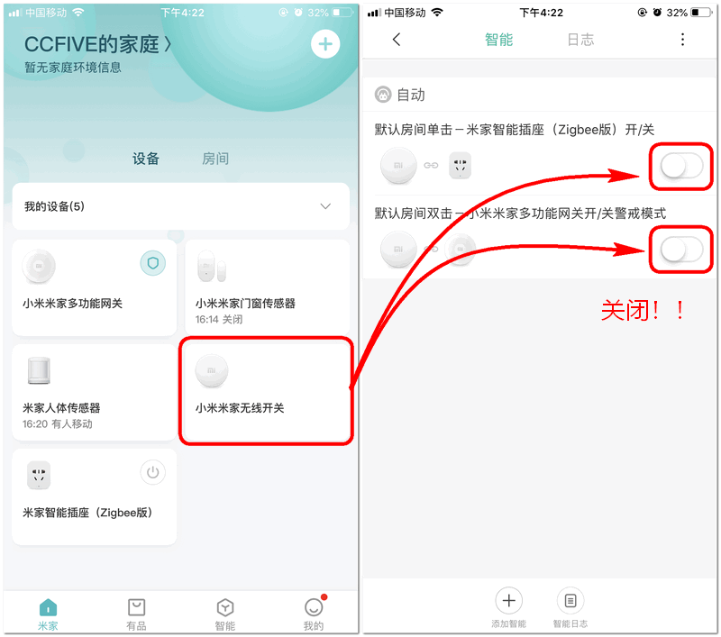

编程效果演示，当无线开关被按下时，小喵就会旋转一圈。

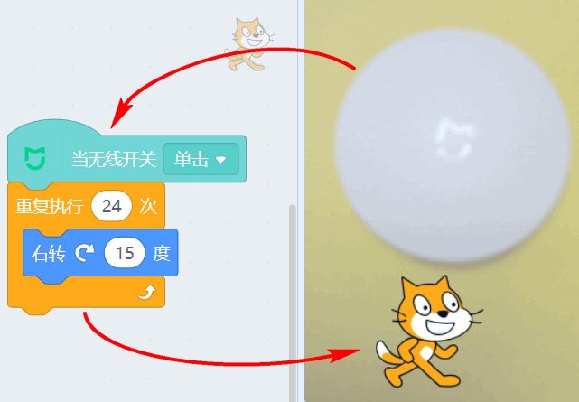

### 人体红外检测

人体检测使用需要注意！米家这个传感器为了低功耗，是1分钟检测一次！换句话说你触发后的一分钟内，这个传感器就休眠不在工作了。因此如果你不用计时器进行计时提醒，你会感觉这个传感器不灵敏，但实际不是！

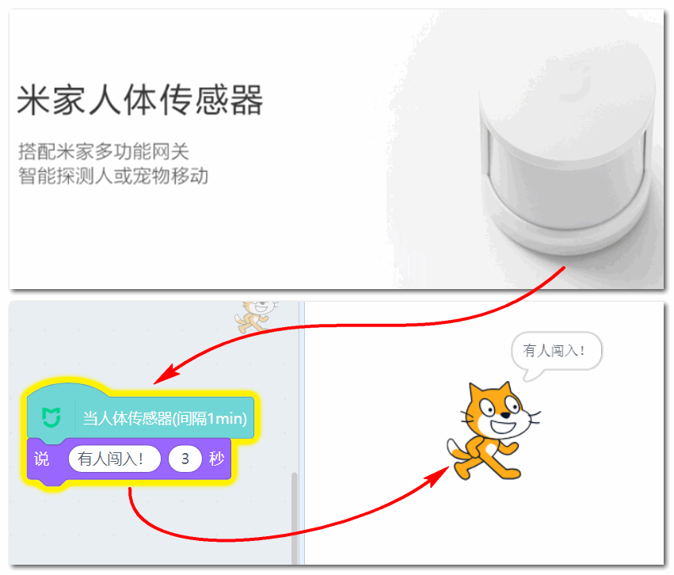

因此我这里写了一个带计时提醒的程序，当sec＞60后，传感器就可被触发。触发后sec就会清零重新计算。

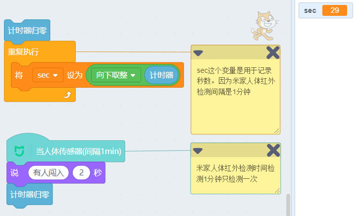

### 门窗传感器

门窗传感器有两种触发条件，所谓的打开与关闭，指定这两个一大一小的传感器，靠近与分离的时候。

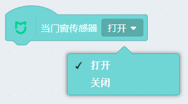

这里写了一个简单的触发事件程序：

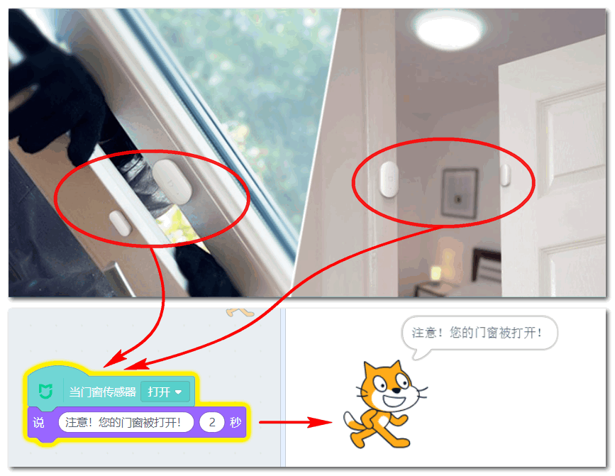

## 示例程序

为了帮助大家快速上手，这里提供一个我写好测过过的程序给大家使用，戳我下载

## 常见问题与解答

问：我能用Kittenblock来控制小爱音箱吗？

答：展示不能，能控制的智能家居一定是通过网关ZigBee与其相连的

问：我想用Kittenblock红外控制电视或者空调

答：请购买相关可与米家网关zigbee连接控制的 红外控制器

问：我能不能在插件中添加我想要的传感器

答：编程太复杂，普通用户无法完成。如果有你有想添加的传感器（前提可以被小米网关zigbee连接控制的）可以在论坛留言告诉我们

问：后续喵家淘宝会上架米家智能家居吗？

答：暂无计划，大家请在其他店先购买。

问：我能不能Kittenblock远程控制米家智能家居，假设我在学校打开Kittenblock能否控制家里的？

答：Kittenblock控制米家智能家居是建立在局域网中。如果你需要远程控制，可以有取巧的方法。家里的一台电脑Kittenblock进行中转。

工作流程：

学校的Kittenblock与家里的Kittenblock 物联网连接（如喵家的IOT），家里的Kittenblock再与米家智能家居局域网相连。这样通过一个中介就可以实现Kittenblock外网控制米家智能家居。

问：问什么Kittenblock不能wifi直接连接米家的wifi类的传感器

答：米家wifi类的传感器类对一般开发者不开发。也没有对应的接口协议。因此喵家暂无法实现。

问：能不能通过米家智能家居反向控制喵家的机器人套件

答：可以！可以利用Kittenblock的在线控制特性，将米家智能家居反馈的信号，作为逻辑判断，从而控制喵家机器人套件等。正向控制与反向控制都是一样的。剩下就看大家的脑洞有多大了。