# 让Microbit加入IoT

## IoT协议MQTT定义
MQTT是IBM（对，就是那个弄电脑那个）针对物联网实现的一套通讯协议。MQTT全称不用记，太长反正我也是记不住。只需要记住它是用在IoT上的协议就行了。包括小米呀很多物联网公司都是用这套协议去通讯。
MQTT核心采用订阅/发布模式，为推送而生。

## MQTT物理模型：

1.首先物联网肯定有一台服务器。不然那些要联网的设备把接收到的数据发给谁呢？服务器的作用就是接收数据，处理数据，分发数据

2.多个联网的设备。它们的作用就是给服务器发送数据，或者接受服务器的数据。

## MQTT工作过程：

1.多台联网的设备首先连上wifi网络，并且要连上指定的服务器（假设服务器已经有了）

2.设备需要订阅话题，只有订阅此话题后，设备才能向这个话题发送数据，或者一旦这个话题有消息更新，此设备可以接收更新的数据。这样拥有相同话题的设备他们之间就可以实现数据共通了。通讯过程由服务器来保障，这个过程我们就不用管了。

如果这个过程你不理解，你就想想你订阅微信公众号，假如你和小明一起订阅了同一个微信公众号（假设你俩之间互不认识，不是好友），你们可以在微信公众号下面的留言板进行聊天（笑Cry）这样你们就可以相互通讯了。

## 让Microbit加入Iot

服务器你将直接用喵家的服务器

联网设备就是你的Microbit+wifi模块

### 注册喵星云IoT服务器账号，并创建话题

1.登录www.kittenbot.cn/bbs 喵家论坛注册一个账号。
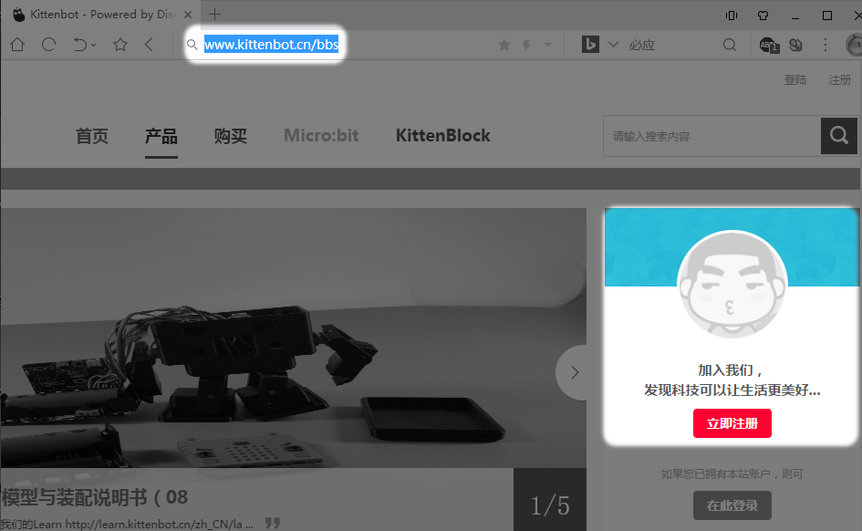

2.十分钟后（所以你提前拥有喵家账号是有好处的），用你的账号密码登录
www.kittenbot.cn
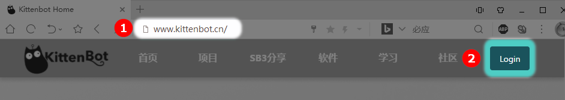

3.选择IoT控制面板
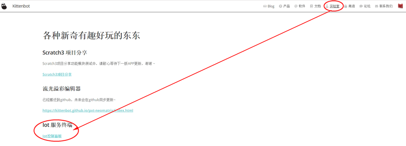

4.这就是IoT控制面板主界面，我们新建一个话题
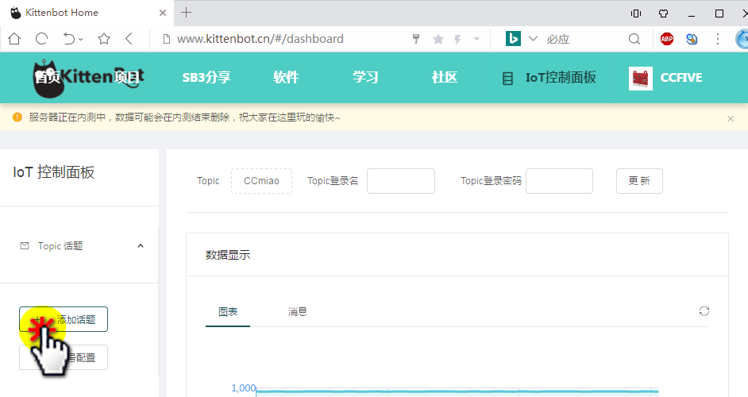

5.输入话题名称，格式一般为/+英文，例如/CCFIVE,记住话题是全服务器唯一的，如果申请不成功，有可能你申请的话题已经被其他人用了，请更换另外一个。

6.话题成功创建
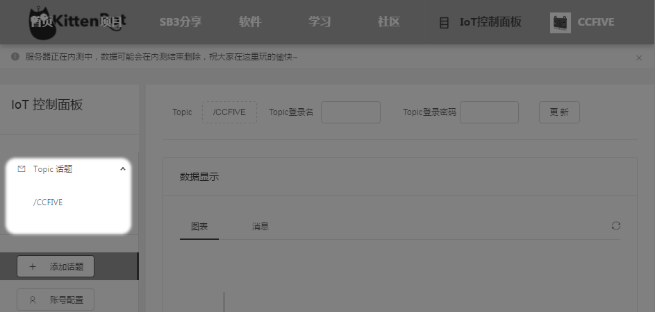

### 电路板连线

材料准备：

- Microbit+Robotbit
- kittenbot wifi（2.8固件），如果你是早期购买我们wifi模块的用户，可以自行更新固件，[请查看wifi固件更新教程](http://learn.kittenbot.cn/zh_CN/latest/electronics/wifi.html)

新手按照图示接线，因为这个接法是跟下面程序所对应的。

wifi模块->Robotbit:

RX->P1

Tx->P2

GND->GND

5V->5V

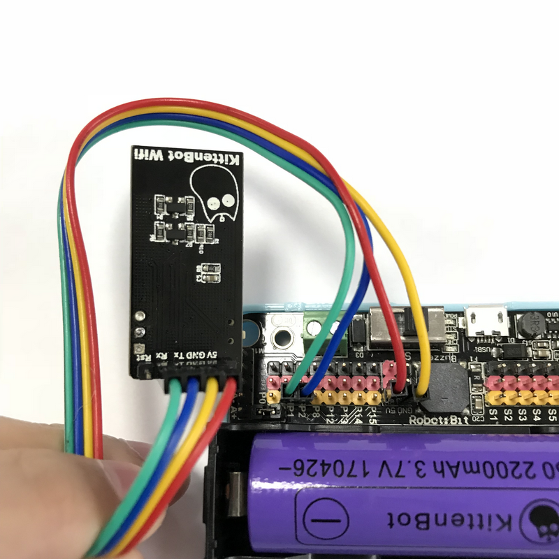

Microbit插上USB线，准备进行编程
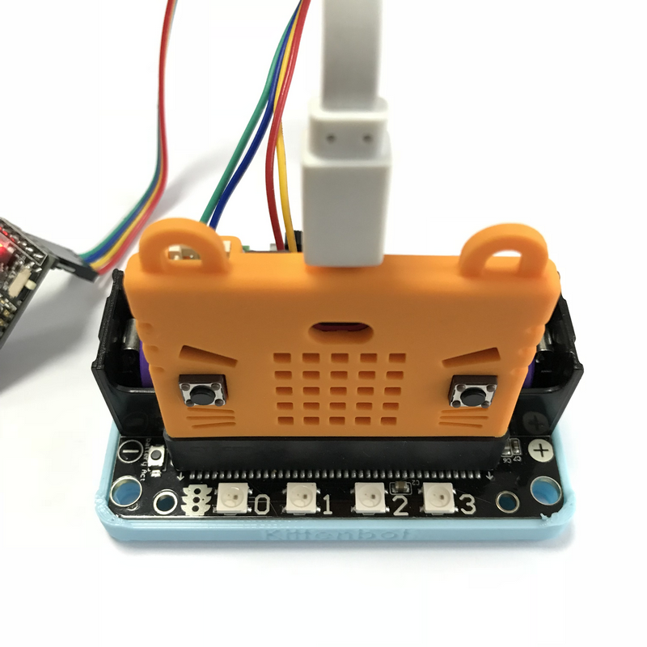

Robotbit上的电源开关记得打开

Robotbit上的电源开关记得打开

Robotbit上的电源开关记得打开

电源开关打开后，wifi模块的电源指示灯红灯会亮。

并且确保18650电池电量充足，因为wifi模块需要的电流比较大，电量少的时候，wifi模块会工作不正常。

### 编程准备

- 首先你Microbit需要入门，知道一些Microbit的基本操作，如果还没入门的朋友，请先看[喵家网易云课堂的Microbit教程](https://study.163.com/course/courseMain.htm?courseId=1005485001&share=2&shareId=400000000501010)

- 浏览器中打开Makecode最新版本

浏览器中打开Makecode最新版本

浏览器中打开Makecode最新版本

复制粘贴网址：
[https://makecode.microbit.org/alpha#editor](https://makecode.microbit.org/alpha#editor)
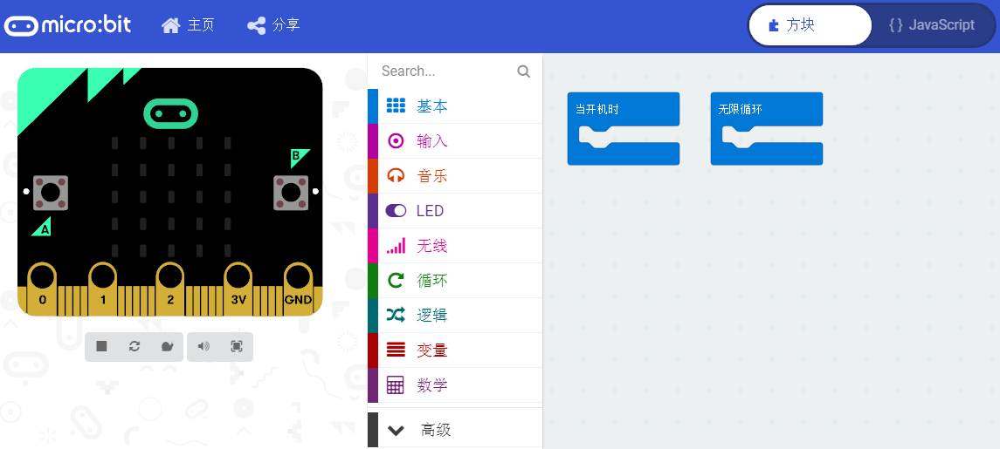

- 加载喵家wifi积木块插件
https://github.com/KittenBot/pxt-kittenwifi

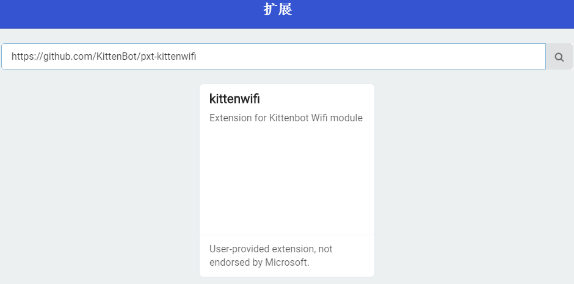

### 积木块介绍

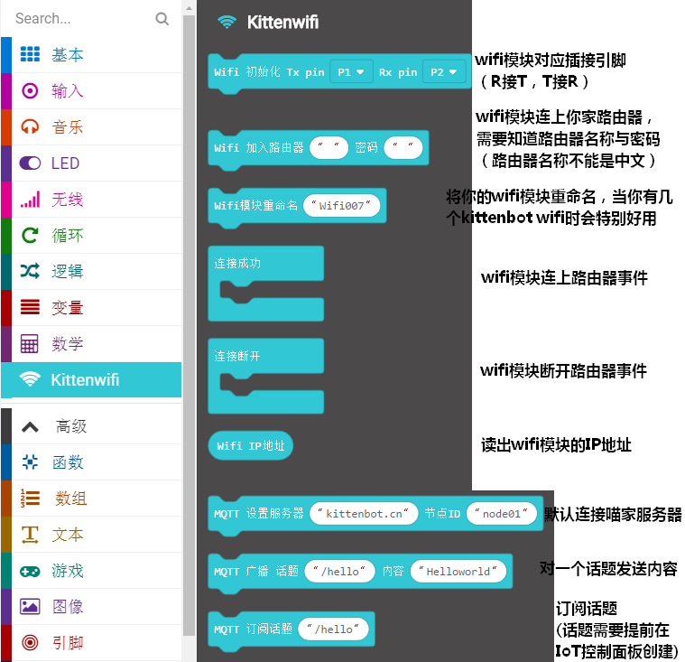

### 程序示例1——向特定话题广播消息
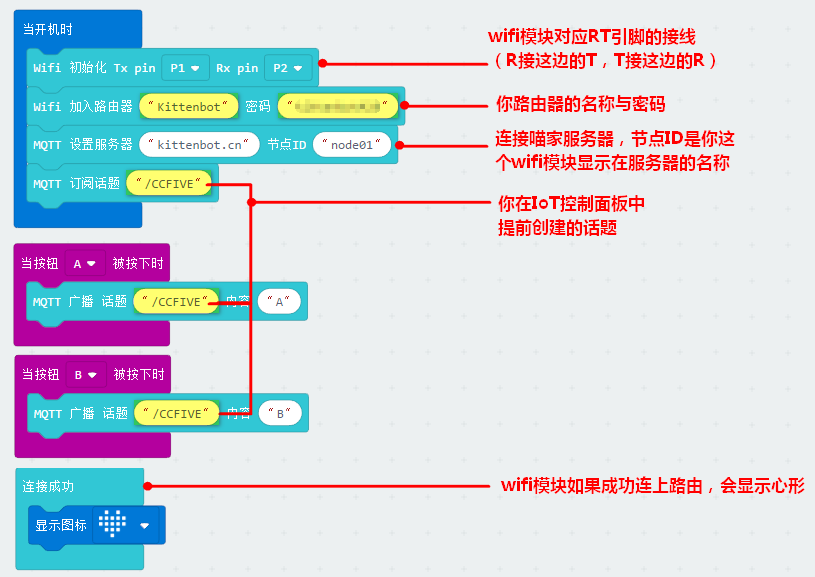

黄色是你必须更改的内容（因为我的路由器wifi名字、密码和你家的不一样。另外我们定义的话题名称也不一样）

下载到Microbit上，等待心形出现（这个过程时间长久跟你的网络环境有关，如果你网络环境好，一般十多秒就可以连上了）（如果你重新下载了程序或者在下载程序后才插上wifi模块或打开电源。你需要等待一下再按下microbit复位键让程序重新运行）
这时候可以随意按下，A键 或者 B键。

登录[喵家的IoT控制面板](http://www.kittenbot.cn/vvv/#/dashboard)，就可以看到对应话题收到的消息

### 程序示例2——监听特定话题消息
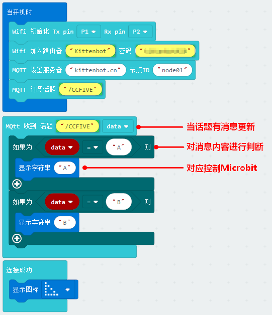

黄色是你必须更改的内容（因为我的路由器wifi名字、密码和你家的不一样。另外我们定义的话题名称也不一样）

下载到Microbit上，等待三角形出现（这个过程时间长久跟你的网络环境有关，如果你网络环境好，一般十多秒就可以连上了）

这时候你登录[喵家的IoT控制面板](http://www.kittenbot.cn/vvv/#/dashboard)，可以向话题发送A或者B，观察Microbit点阵显示。
或者你有另外一套Microbit（烧录的程序示例1）+Robotbit+wifi模块，你可以按A、B按键，观察这块Microbit点阵显示。

### IoT网页调试

在喵星云IoT控制面板，最下方有个调试窗口，连接后，就可以对话题发送信息。这时候如果话题有内容更新，wifi模块也会检测到的。
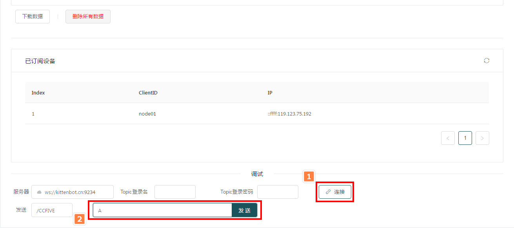

## IoT常见问题与解答

### wifi模块好像有点发烫，甚至烫手，这个现象正常吗？

wifi模块功耗都比较大，只要你wifi模块没有接错线，不用担心wifi发热。不会发热导致烫坏的，表面的金属壳就用用来散热的（可以参考家里路由器外壳也是发烫的）。

### wifi模块怎么更新到2.8固件？

请参考[wifi固件更新帖子](http://learn.kittenbot.cn/zh_CN/latest/electronics/wifi.html)

### wifi模块更新好难呀，你能帮我更新吗？

如果看了帖子实在不会更新的友友，可以寄回喵家这边，喵家免费帮你更新固件。但是你需要出来回的运费哦

### 我用别家的wifi模块可以实现喵家IoT吗？

不行，喵家这个Microbit所对应的wifi IoT积木块仅限于喵家的wifi模块

### 我已经根据你的帖子操作了，但是实验不成功？

实验不成功有多方面的原因，需要逐一排查

wifi模块接线接错了

wifi模块不是2.8最新固件

Robotbit板子上的电源没有开

18650电池没电了

在IoT控制面板注册的话题与程序所对应的话题名称不一致

路由器名称与密码输错了(严格区分大小写)

路由器名称只能是英文字符串（不能含有中文）

路由器名称不能有空格

_希望重新再看一遍帖子检查下步骤，如果还是解决不了，到喵家Q群求助，配上你的高清接线图，程序截图，或者实验小视频，以便喵家技术人员帮你快速解答。_

