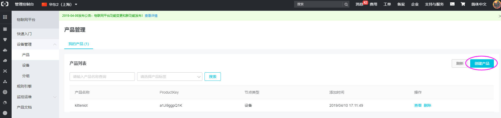
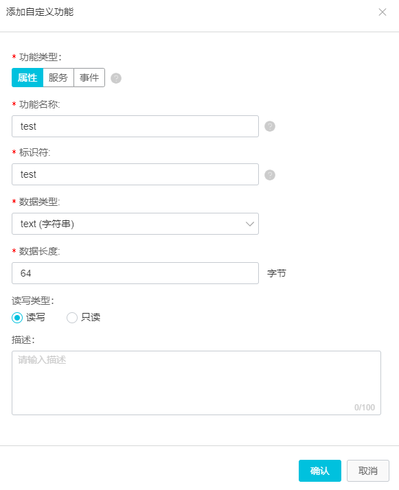
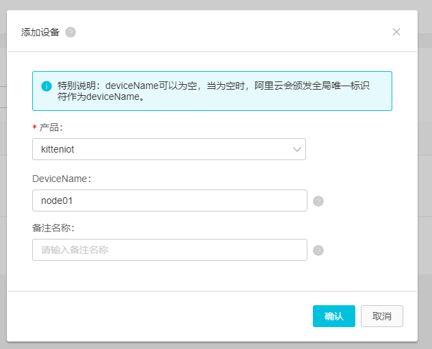
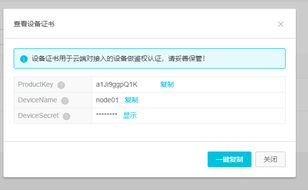
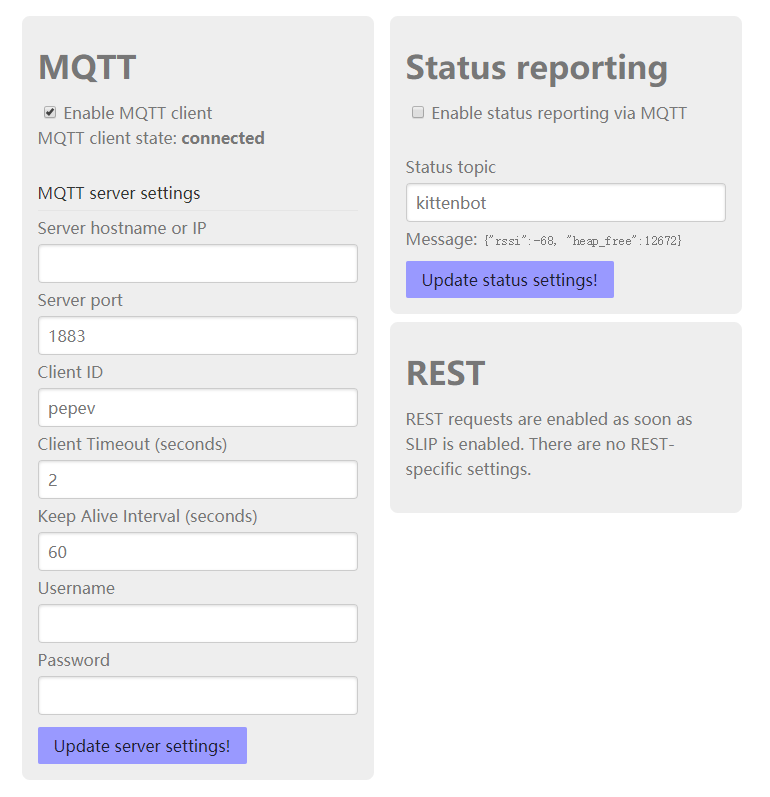
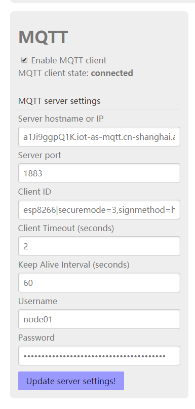

# 阿里云IOT接入指南

首先注册[阿里云](aliyun.com)的账号， 并且开通互联网平台。

在阿里云的物联网控制台，新建一个产品：

产品配置默认就行了，其他随便写写~

之后新建一个自定义功能

功能内容如下，测试中我们直接使用纯字符串进行通信。

之后我们在左侧找到`设备`分栏，我们再来创建一个新的设备，产品选择我们刚刚新建的产品。

设备建立完成后，系统会分配一组key和secret，大家先用记事本保持好，等下会用到~

## wifi 模块Mqtt参数配置

阿里云的鉴权过程和配置都比较繁琐，这里建议大家直接在wifi模块后台网页进行配置。

首先保证你的wifi模块已经加入了局域网，不知道怎么让wifi模块加局域网的可以参考learn上其他教程，这里不再详述了。

***注意：wifi模块加入局域网和mqtt服务器只需要设置一次后或自动存储在wifi模块配置中，没有更改必要的话不要随意在makecode或其他程序中加入加入wifi网络或者mqtt配置的积木块，否则可能导致配置丢失全部要从头来过。***

如果你的wifi模块成功进入了你的局域网，kittenblock可以自动搜索到wifi模块的ip地址，或者在路由器中查看也行。随便在任意浏览器中输入wifi模块的ip地址，并检查下你的wifi模块固件是不是2.8或以上。

之后在左侧导航栏点击 `REST/MQTT`进入mqtt配置页面：

首先将`Enable MQTT client` 打上勾

之后我们需要为wifi模块生产独立的秘钥，请大家下载这个压缩包：

https://files.alicdn.com/tpsservice/471c155376d6a88a29c9ad66784e94f0.zip?spm=a2c4g.11186623.2.17.61f6619bTy4BJo&file=471c155376d6a88a29c9ad66784e94f0.zip

解压后双击 `sign.html` 打开网页页面，在第一行中填入刚刚我们申请的设备参数

之后在第二行timestamp我们填入：`123`

clientId填入：`esp8266`

这两行的目的只是为了给阿里云服务器提供秘钥鉴权的素材，对于一般maker的项目并没有特别大的意义。

最后生成的password保存下来，等下需要用到~

回到我们wifi模块的mqtt配置页面：

在server host中填入：`PRODUCT_KEY.iot-as-mqtt.REGION_ID.aliyuncs.com"`， 其中`PRODUCT_KEY` 就是刚刚生成的产品key，`REGION_ID`是你的阿里云iot服务器所在地址，例如我的i就是在上海`cn-shanghai`。 那么完整的host应该如下：

`a1Ji9ggpQ1K.iot-as-mqtt.cn-shanghai.aliyuncs.com`

之后client ID就是我们刚刚用于生成秘钥的client ID：

`esp8266|securemode=3,timestamp=1234567890,signmethod=hmacsha1|`

User name那一项填写：`Device_Name&Product_KEY`， 例如：

`node01&a1Ji9ggpQ1K`

最关键一步就是生产秘钥了

如果一切正确大家可以看到mqtt显示connected。

