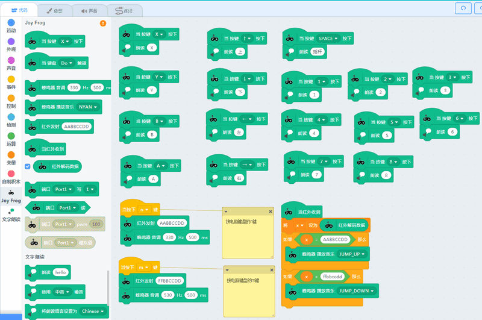

## 青蛙手柄简介

## 简介

青蛙手柄是小喵科技推出一款简单易用兼容Makecode编程的Scratch测控手柄。

它简单易用，插在电脑上即可自动识别成一个HID输入设备。此过程无需手动安装驱动。在不打开任何的图形化编程软件，它可以直接作为键盘的部分按键输入。如：手柄上的摇杆可以控制光标上下左右移动，摇杆按键为空格按键输入，手柄上的按键XYAB对应键盘XYAB，金属手数字触片分别对应键盘的1~8按键。

### 青蛙手柄在Kittenblock中编程

其中一个有趣的特色就是作为Scratch测控板来进行使用。青蛙手柄通过摇杆可以控制舞台角色的移动，青蛙手柄的按键可进行编程，可以结合程序进行编程。青蛙手柄上还有一个特色的功能——金手指，可以与Scratch的音乐模块，金手指通过鳄鱼夹可以与水果进行相连。这样我们就很简单做出水果乐器了。Scratch的音乐模块有18种敲击乐器，有21种乐器，足以让学生们充分发挥他们大脑洞与艺术细胞。

另外青蛙手柄，有2个PH2.0 3PIN接口，可以接市面上常规3PIN传感器，让用户也能把手上的3PIN模块用起来。有2个PH2.0 4PIN接口，可以插件小喵科技家的能量魔块，打通能量魔块的特色魔块，可以让DIY更加丰富。

板上带有红外发射管和红外接收管，板子已内置自动红外解码NEC，可以解码市面上常规遥控器。并且把解码的数据已

### 青蛙手柄在Kittenblock中

## 技术详细参数

尺寸：128mmx80mmx35mm，整体外形呈一个青蛙形状，后续可以配套青蛙硅胶套进行安装

主控：GD32F350C8T6，flash64kb，SRAM8kb，主频108MHZ

板上编程资源：两轴摇杆；4个按键；红外发射与红外接收管，可自动解标准NEC红外码；8个金手指触片，可配套鳄鱼夹进行使用；蜂鸣器，板载带有蜂鸣器与音频口的切换开关。

接口：Microbit40PIN卧式接口；GVAB 4PIN PH2.0接口x2；GVS 3PIN PH2.0接口x2；3.5音频接口；标准NRF24L01 8PIN2.4G无线接口
接口电压：3.3V

另外板上还有两个按键用于给主控芯片进入烧写底层固件模式，带电源指示灯,工作状态指示灯

插入电脑后可作为HID输入设备，同时也支持CDC串口设别

电源接口:MicroUSB
输入电压：5V

支持软件：Kittenblock、Makecode

