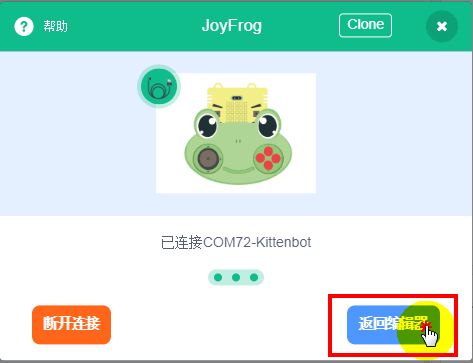

## 青蛙手柄驱动安装

## 插上USB

插好，蜂鸣器会发出一个短曲。证明USB成功枚举(不同电脑枚举的速度不太一样，有些电脑枚举特别快，枚举时间不同属于正常现象)

稳定后，中间的蓝灯常亮，右侧的红色电源灯常亮。硬件为正常

## 安装驱动

实际安装很简单，只是为了手把手让大家跟着做，所以截图比较详细，不要害怕！你可以的！

### 下载inf驱动配置文件

下载地址：

### 驱动安装选择

右键我的电脑图标——管理——设备管理器

### 驱动路径选择

恭喜，安装完成！如果你发现安装不成功，请在再多看仔细看看操作，一般是自己操作有误导致的。

## Kittenblock中连接操作

### 选择硬件

### 选择串口

## 青蛙手柄编程快速开始

第一次使用，可以直接打开我们提供的功能测试程序。

默认你已经选好硬件与选择好串口了

你现在可以操作手柄，对应电脑会朗读你操作的摇杆方向或者按键的键名回来

按下电脑键盘的“n”与“m”对应测试红外发射与接收，正确的话蜂鸣器会响出对应的音乐

## 常见问题与解答

### 我的青蛙手柄插上USB后，电脑弹出无法识别设备的弹框

一般是USB数据线导致的，因为青蛙手柄其中有个特性是让电脑识别成键盘设备，所以通讯USB枚举特别严格，所以要求数据线比较好。建议推荐小喵家的1米USB数据线，我们已经做个测试适配。

如果你已经用了是小喵家的USB数据线了，插上去还是不行，建议换一个USB口试一试（建议先把青蛙手柄这端的USB口接好后，再插电脑端那边，这样枚举成功率会更高）

如果还不行，可以按住板子左边的RESET按键，按住不放，再插上USB口，之后再放RESET键。一般都会成功的。

### 我在Kittenblock中，串口感觉突然断掉后，重新连接，提示无法连接

这个时候你需要，先断开串口，拔下青蛙手柄的USB后，再重新插上USB手柄，再重新选择串口连接。这时候肯定能连接上

### 我想青蛙手柄离线下载

青蛙手柄作为一个Scratch的测控板定位和Microbit的扩展板定位。在Scratch中脱离了电脑，青蛙手柄就不能执行程序了，你可以理解为青蛙手柄是一个高级的电脑键盘，所以你就自然知道键盘脱离了电脑就用不起来。

如果你像脱离电脑进行使用青蛙手柄，请配套Microbit主控板，Microbit主控板对应的青蛙手柄插件在后续会上线，现在请大家暂时当Scratch测控板进行使用。敬请期待~

