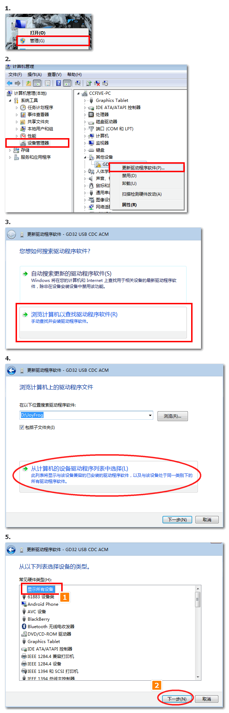

# 青蛙手柄驱动安装

针对与Kittenblock中的串口通讯，所以需要提前安装一个串口驱动，如果不安装驱动只能当做一个键盘外设与Kittenblock进行交互（红外功能与3PIN接口无法进行通讯）

## 插上USB

插好，蜂鸣器会发出一个短曲。证明USB成功枚举(不同电脑枚举的速度不太一样，有些电脑枚举特别快，枚举时间不同属于正常现象)

稳定后，中间的蓝灯常亮，右侧的红色电源灯常亮。硬件为正常

## 安装驱动

实际安装很简单，只是为了手把手让大家跟着做，所以截图比较详细，不要害怕！你可以的！

请对照图片一步步进行操作，不要跳过任何的一步。

### 下载inf驱动配置文件

下载地址：

### 驱动安装选择

右键我的电脑图标——管理——设备管理器

### 驱动路径选择

恭喜，安装完成！如果你发现安装不成功，请在再多看仔细看看操作，一般是自己操作有误导致的。

