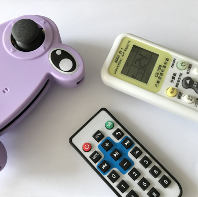
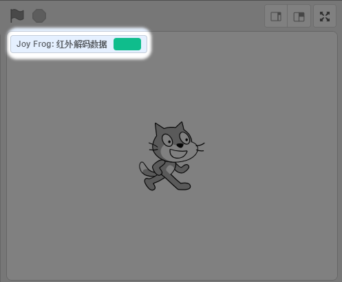

# 红外解码内容积木块

## 成功加载青蛙手柄分栏，并连接上

如下图，出现绿色的勾勾图标，就证明串口已经正确连接上了

## 红外解码内容积木块

光接收数据是不行的，我们需要接接收的数据的进行判断。例如家里的遥控器都是很多个按键，每个按键对应不同的红外编码，对应触发不同的事件（例如电视喇叭声音变大，或者换台等等）

一般我们会将红外解码数据前面的勾勾勾上，这样就可以在舞台左上角可以看到，即时接收回来的红外数据

