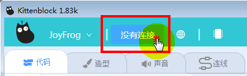
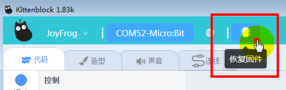
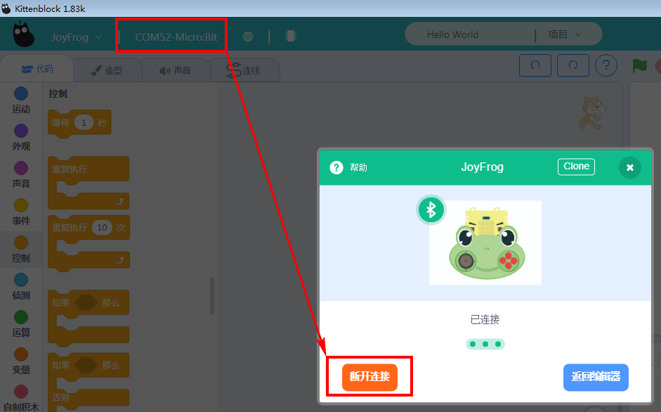
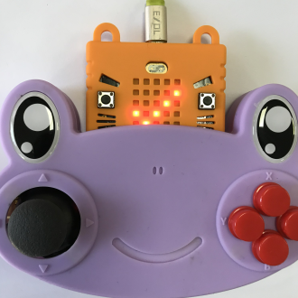

# 青蛙手柄与Kittenblock蓝牙通讯

青蛙手柄作为Scatch的测控板，有时候拖着线用还是感觉不是很爽。

所以喵家这边做了,借助Microbit的蓝牙，可以跟Kittenblock进行蓝牙通讯交互（PC端需要有喵家的蓝牙适配器）

## 实验条件

### 喵家蓝牙USB设配器x1（并且需要提前安装对应的蓝牙驱动）

如何安装蓝牙USB驱动，具体参考：
http://learn.kittenbot.cn/zh_CN/latest/electronics/USB%E8%93%9D%E7%89%99%E9%80%82%E9%85%8D%E5%99%A8.html

### Microbit板子x1

## Step1

Microbit插到青蛙手柄上，USB线插到Microbit上

## Step2

**这个步骤，主要是给Microbit下载一个跟青蛙手柄线相关的蓝牙的通讯固件**

软件选择JoyFrog，选择串口

选择Micorbit板子

选择完串口后，点击恢复固件

## Step3

恢复固件后，可以看到Microbit的点阵屏流过一串字符串号。这个字符串，就是蓝牙的识别名字

这时候点开串口连接，先断开原来的Microbit连接，现在我们打算用蓝牙无线连接。

重新点击串口连接，这时候可以看到一个Microbit的蓝牙【zizet】，跟我的microbit点阵显示的是一样的，就是你所要控制的那个了。

成功连接：

成功连接后，实物显示一个勾勾

到这里，蓝牙连接已经OK了，剩下的操作和与USB数据线操作的一样。

你可以通过2节7号电池盒给青蛙手柄供电，这样你就不用连着数据线那么麻烦了
