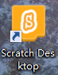
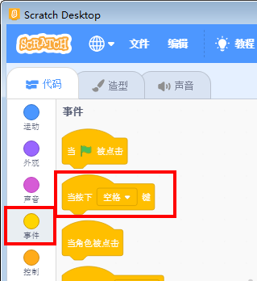
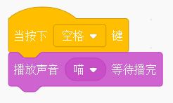
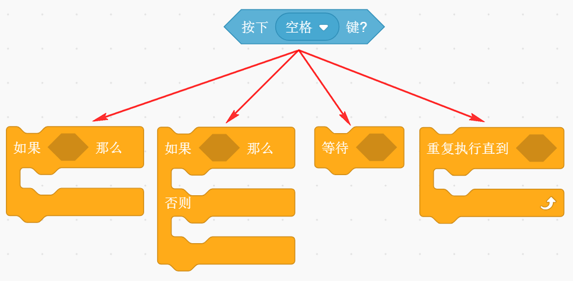

# 呱比特在Scratch使用

呱比特手柄有个特性，只要一插到电脑上，就会自动识别成一个键盘设备。这个过程无需安装驱动（除非你的电脑系统精简得很厉害）。

所以呱比特可以在原生Scratch上使用，或者可以在基于Scratch上开发的软件（Kittenblock、mBlock、Mind+等软件）上使用。在Scratch软件上以键盘的形式进行使用。

呱比特插上USB的一瞬间，如果成功识别成键盘形式，它会自动发出一个滴~滴~滴~滴滴的短曲。表明它自己成功枚举了。

## 插上呱比特手柄

如果只是呱比特上按键与Scratch交互，除呱比特外，无需其他硬件了。

## 呱比特按键映射

呱比特的按键与真实键盘按键的映射关系

## Scratch交互

### 打开Scratch

Scratch可以用离线的安装版本，或者在线版本，或者是其他变种的Scratch

### Scratch中与键盘相关的积木块

对于呱比特能触发的几个按键分别是：

- 空格键

- 方向箭上下左右（4个）

- 按键xyab（4个）

- 数字键1~8

## Scratch按键帽子方块详解

这种长得想帽子的积木，是属于事件模块。

所谓事件模块——当某些条件触发后，就会执行此积木以下的积木群。

## 按键帽子方块举例

当按键呱比特的摇杆后，舞台小猫就会说你好~

当按键呱比特的摇杆后，Scratch就会发出喵~的声音

## Scratch按键尖角方块详解

尖角方块只会返回布尔逻辑值，如，真假

它的一般有以下的配搭。

## 按键尖角方块举例

一般会绿旗子积木块和重复执行积木块

## 按键帽子方块和按键尖角方块如何选用？

其实很多时候，用这两个不同的方块都能实现同样的效果，具体看个人的喜好。

对于初学者入门，我建议多用帽子事件方块，这种事件方块可以理解为多线程（实质它是伪多线程）

## 实战——摇杆控制小喵运动

摇杆上下左右，遥控舞台小猫运动

