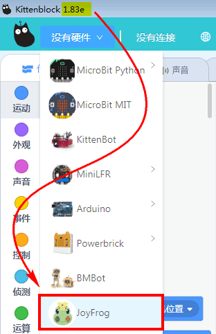
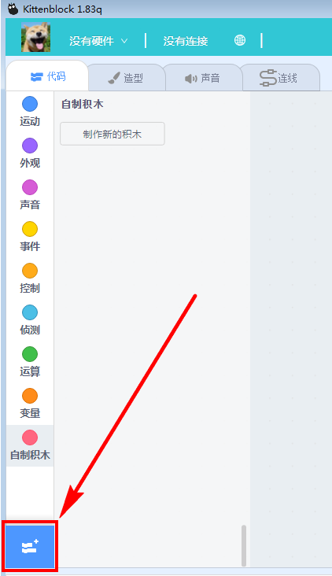
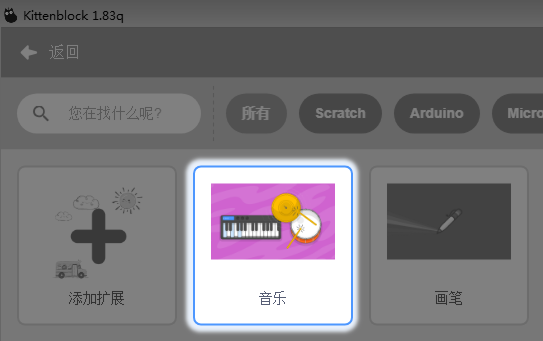
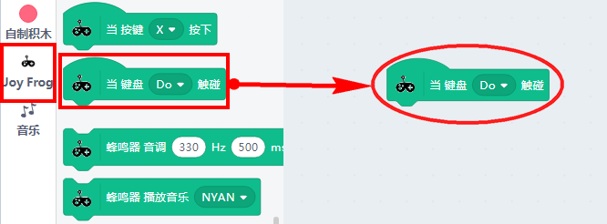
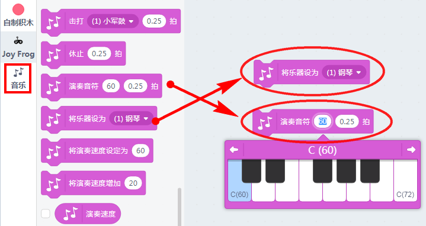
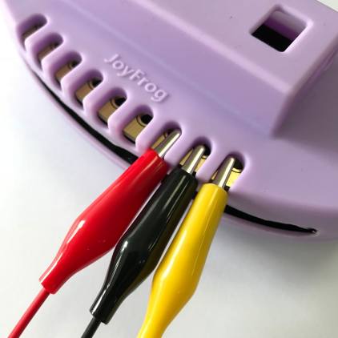
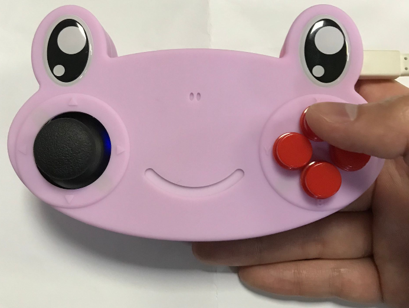
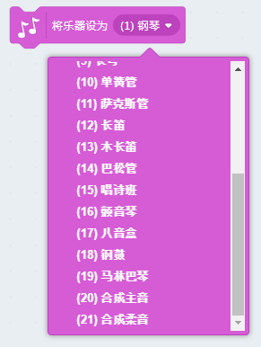
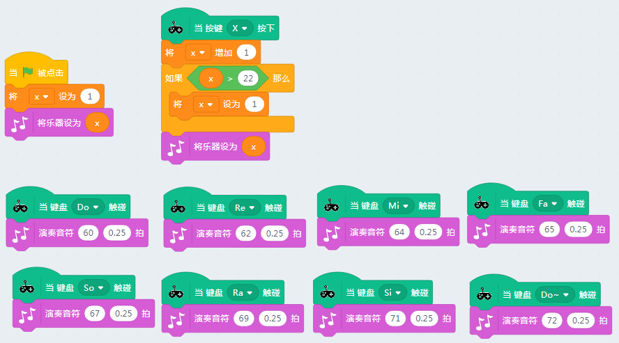

# 呱比特项目实战——Scratch水果琴/香蕉琴（Kittenblock为例）

## 项目介绍

Scratch上有一个音乐的插件。

音乐插件中有18种敲击乐，有21种乐器。通过呱比特金手指连接水果，这样就可以演奏不同的乐器。

## 软件

- Kittenblock
- 其他Scratch的变种软件（mBlock5或者Mind+）

## 器材准备

- 电脑与数据线
- 呱比特
- 鳄鱼夹线 X 8 根
- 8个水果（我一般使用香蕉，实验完后，还可以吃，滑稽脸~）

## 项目原理

金手指触发原理：金手指初始状态是高电平，当导电物体与触摸金手指时由于导体本身阻值比内部电阻小很多电阻分压原理，某个金手指电平被拉低，主板检查到电平变化就会触发对应的键值。

## 项目操作

### 插上呱比特

### 打开软件

以下软件操作以Kittenblock为例

硬件选择JoyFrog

如果是原生Scratch软件，是无需选择硬件的。

### 把音乐插件加载

### 编程

编写钢琴香蕉琴

### 鳄鱼夹与水果连接

还没夹上水果时也可以进行测试下。鳄鱼夹有两半，但是只有一半是带连接线的，所以触摸的时候，需要注意下触摸方式

夹上香蕉（或者其他水果）后，直接触摸水果即可。

## 程序改进

Scratch中的乐器多达21种，所以程序改进，我希望是按下按键X，对乐器进行切换。

程序如下：

