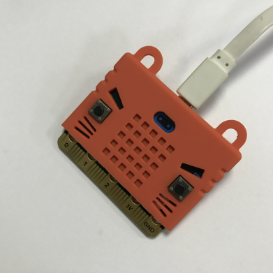
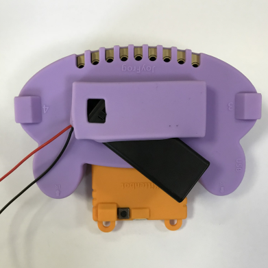

# 呱比特项目实战——离线Microbit香蕉琴（Makecode）

## 项目介绍

通过Scratch可以做出各种乐器的水果琴，非常好玩，但是唯一一个不足就是，它必须要连着电脑才能玩。如果没有电脑，这个香蕉琴再也不能发声了。

所以通过把**Microbit**插到呱比特上，就可以实现离线的香蕉琴，完全脱离电脑

## 软件

- Makecode

## 器材准备

- Microbit
- 两节7号电池盒及两节电池
- 呱比特
- 鳄鱼夹线 X 8 根
- 8个水果（我一般使用香蕉，实验完后，还可以吃，滑稽脸~）
- 带音频口的移动音箱（喵家有售）
- 3.5公对公音频线

## 项目原理

金手指触发原理：金手指初始状态是高电平，当导电物体与触摸金手指时由于导体本身阻值比内部电阻小很多电阻分压原理，某个金手指电平被拉低，主板检查到电平变化就会触发对应的键值。

对应Microbit检测到，然后控制P0口发出不同的音调。P0口可以用内置的蜂鸣器（声音会比较小），拨动切换开关，切换到音频口控制（推荐）

## 项目操作

### Microbit插好数据线

### 编写程序

[Makecode需要加载呱比特插件。如果对此操作不熟悉可以看这个帖子](http://learn.kittenbot.cn/zh_CN/latest/JoyFrog/c09.html)

编写程序，如下图所示：

### 下载保存

记得下载保存到Microbit的盘符上，如果不知道怎么下载，可以回去看Microbit网易云课堂的入门基础视频

### Microbit插到呱比特上

把Microbit插到呱比特上

### 呱比特安装电池盒

电池盒里面已经安装好2节7号电池，并且**电源开关**已经打开

### 呱比特金手指夹好鳄鱼夹

### 鳄鱼夹夹好水果

### 打开音频切换开关

音频切换开关的作用就是，本来是蜂鸣器响，现在变成音频口控制音响发出响声

### 插上音箱

### 试玩

