# AI视觉自动捕虫机

围绕**micro:bit全球青少年创意大赛**，将创造力和技术结合起来，为可持续发展第14项目标（水下生物）或可持续发展第15项目标（陆地生物）提供解决方案，猪笼草队做了一个AI视觉自动捕虫机，通过机械的方式进行除虫，减少农药的使用，保护生态环境。

## 项目简介

### 现状
农药能防治病、虫、草害，如果使用得当，可保证作物的增产，但它是一类危害性很大的土壤污染物，施用不当，会引起土壤污染。农作物从土壤中吸收农药，在根、茎、叶、果实和种子中积累，通过食物、饲料危害人体和牲畜的健康。随着人们的环保与健康意识的提高，保证我们的食品安全，应该减少农药的使用。

近些年随着物联网、人工智能、大数据的等技术的突飞猛进，结合全行业对产业升级的号召，我们在思考如何运用先有的技术解决一些农业领域遇到的问题，在探讨过程中我们发现农作物的虫害问题导致我们对农药的过度依赖，严重污染环境，以及我们的食品安全问题，解决农药滥用问题迫在眉睫。

本次项目基于microbit以及Robotbit扩展板的图像识别除虫装置

本次作品旨在呼吁人类重新关注被人类忽视的大自然环境，大到植树造林，小到垃圾分类。通过物理除虫的方式，降低农药的使用量，减少对水源、土壤、空气、海洋的污染，以及滥用农药导致日益突出的食品安全问题。

本次项目利用基于microbit以及Robotbit扩展板，通过图像识别传感器结合机械传动装置，自动识别在固定区域内农作物上的害虫，进行一系列的自动化除虫作业，达到物理除虫，减少农药使用的目的。

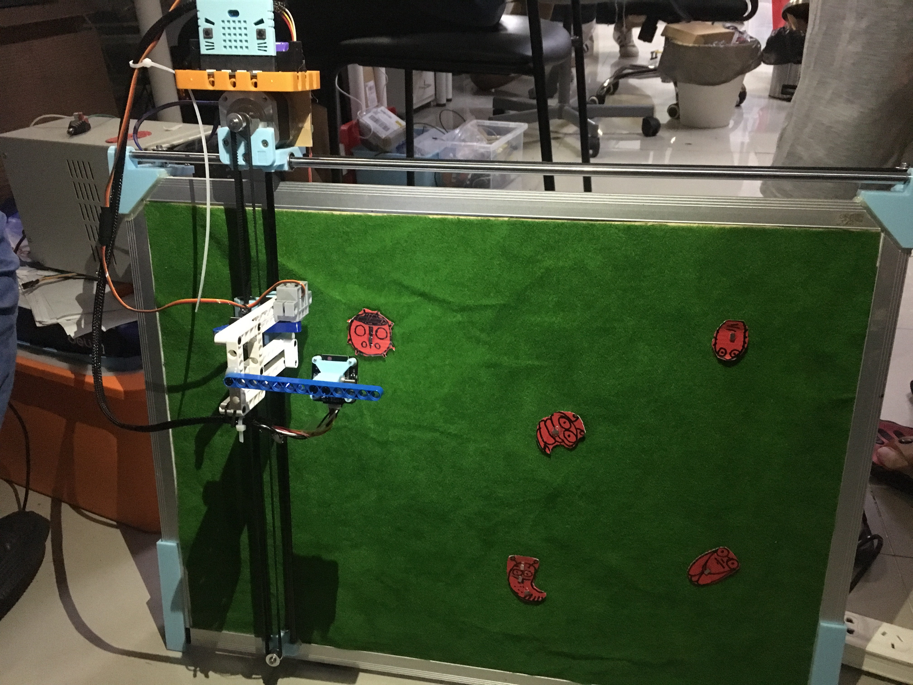

## 项目适合人群

本项目适合于有基础的中小学生，要有求有Microbit编程基础

高中以及大学生

## 项目难度

机械搭建：五颗星（需要设计三维，cnc结构搭建）

电子接线：三颗星（需要电路搭建，驱动方案的选型）

软件编程：五颗星（需要在makecode编程）

## 材料准备

- Microbit
- Robotbit扩展板
- MU视觉传感器
- CNC Shield
- DRV8833电机驱动模块
- 12V/10A适配器
- 60x45cm白板
- 碳纤维管
- 直线轴承
- 惰轮
- 3D打印机皮带轮
- 3D打印机光轴
- 3D打印机同步带
- 3D打印机尼龙网管
- 3D打印结构件
- 24号线若干
- 乐高件若干
- 螺丝若干

## 工具准备

- 3D打印机一台
- 电钻
- 锯子
- 螺丝刀
- 电烙铁、焊锡
- 热熔胶枪
- 万用表
- 数字电源

## 软件准备

- makecode

## 项目原理

首先通过计算确定固定位置的坐标需要的步进电机脉冲数，将每个定点的坐标数据通过数组的方式存储到mcirobit里面，通过坐标轮询的方法，使用mu视觉传感器识别指定目标害虫的坐标，将数据回传microbit，microbit接收到坐标数据后，控制步进电机到达目标区域后再控制舵机通过传动装置将害虫吸附清理出农作物区域。

简单总结一句：通过视觉传感器，在农作物作业区域内识别目标害虫，进行除虫作业，减少农药喷洒，保护环境

## 制作过程——机械搭建

因为是24小时比赛，机械设计合计6~7个小时，打印10个结构件，合计用时14个小时，肝了一夜...

   1.安装电机，电机使用42步进电机，主要考虑到速度与价格。用Microbit信号驱动A4988步进电机驱动模块，再驱动42步进电机，步进电机的电压是12V，因此需要额外供电。注意共地。

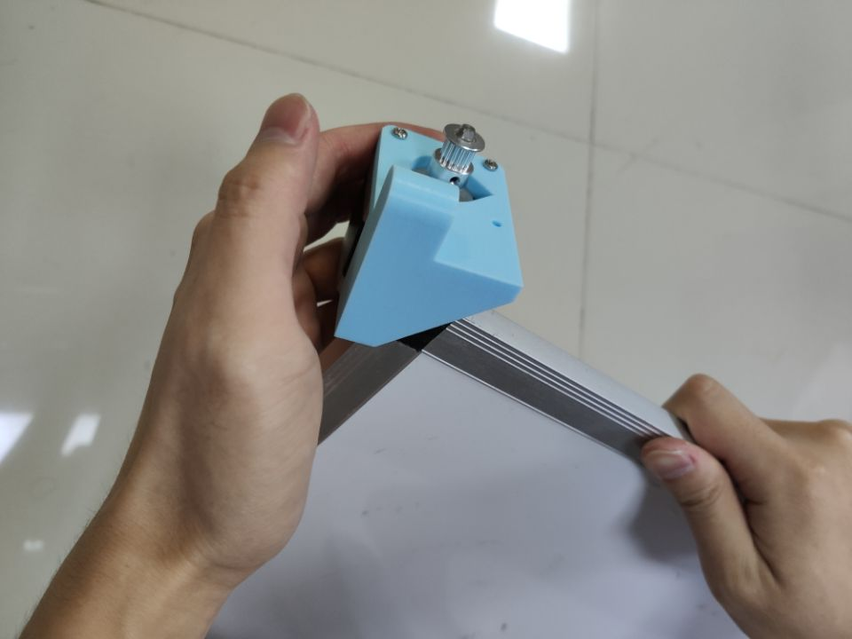

 2.安装X轴块的轴承

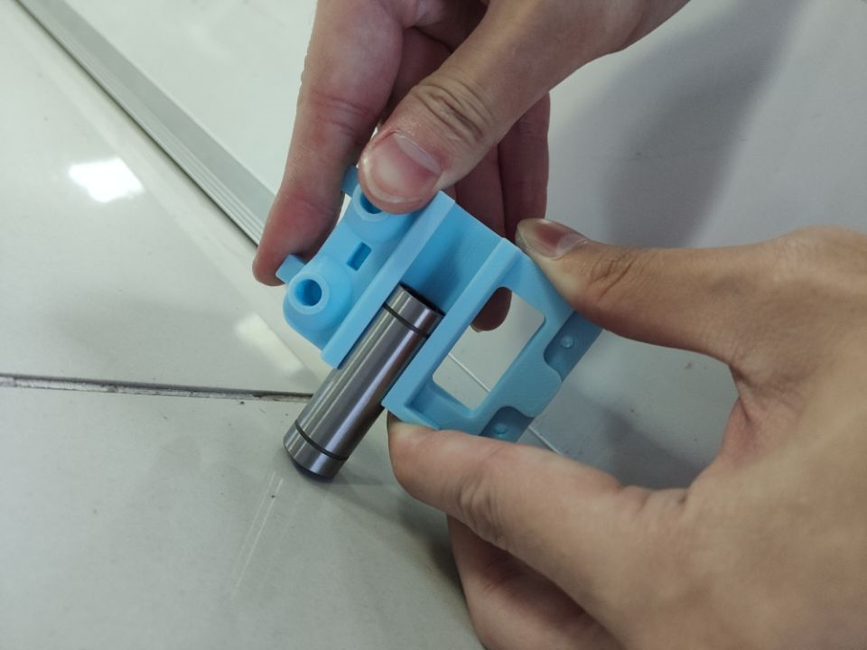

3. 安装光轴

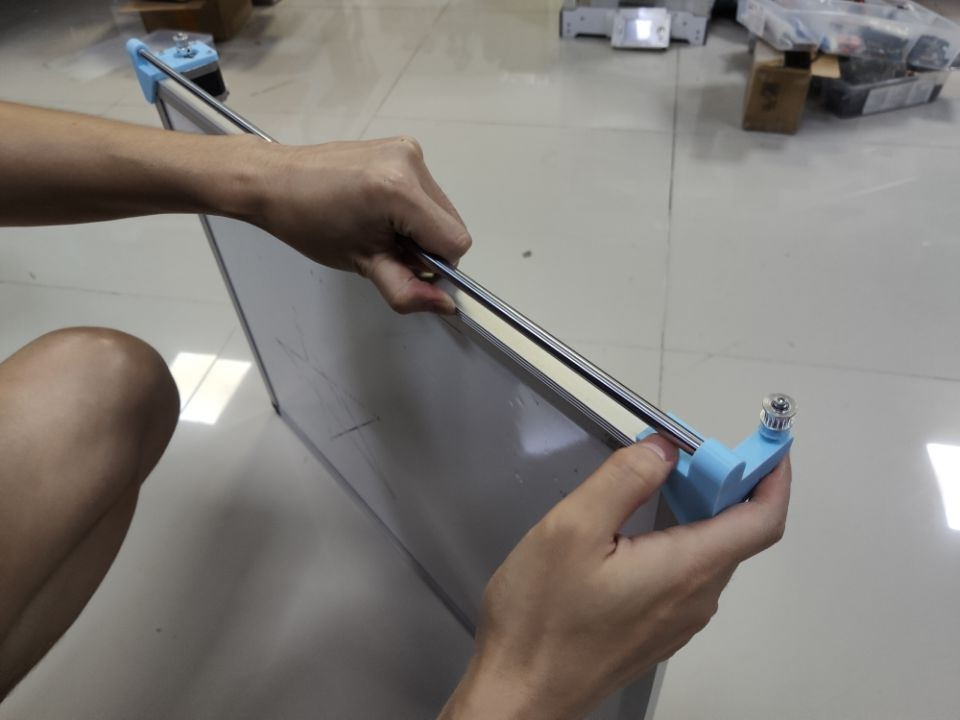

4. 调整x轴的惰轮

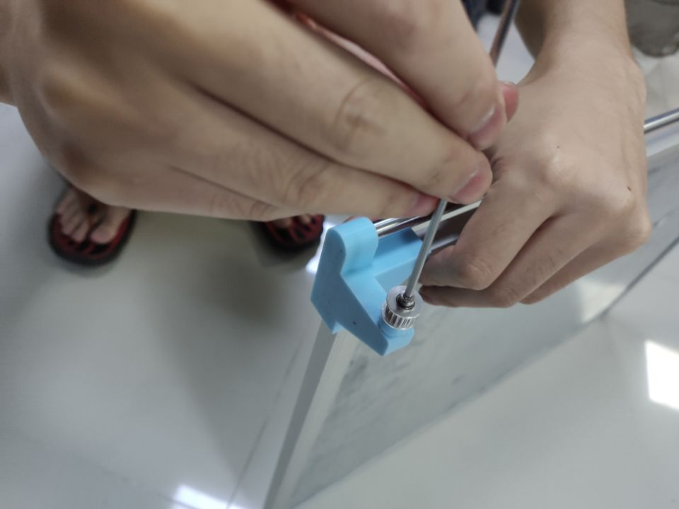

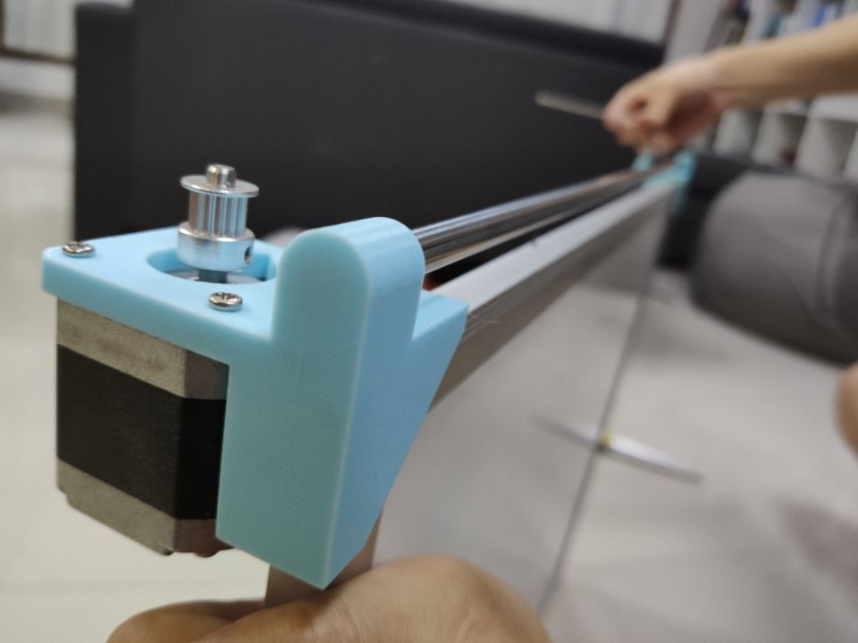

剩下的机械搭建图，由于凌晨3点多，拍摄的同事睡着了，没拍。他睡醒后已经是完成度非常高的机械机构了....

## 制作过程——电子接线

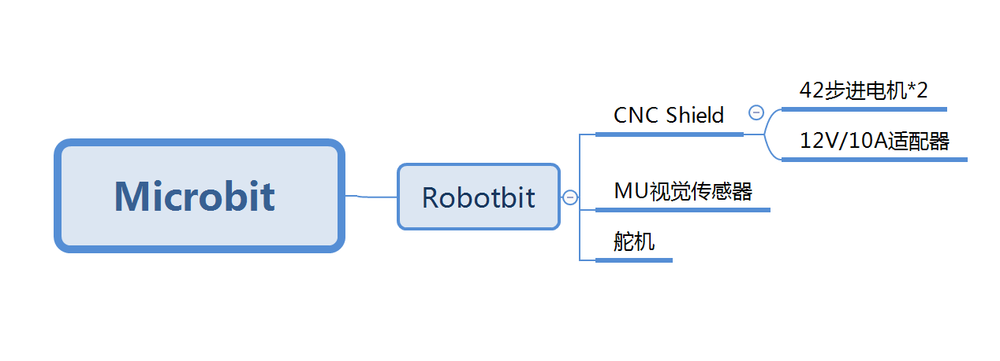

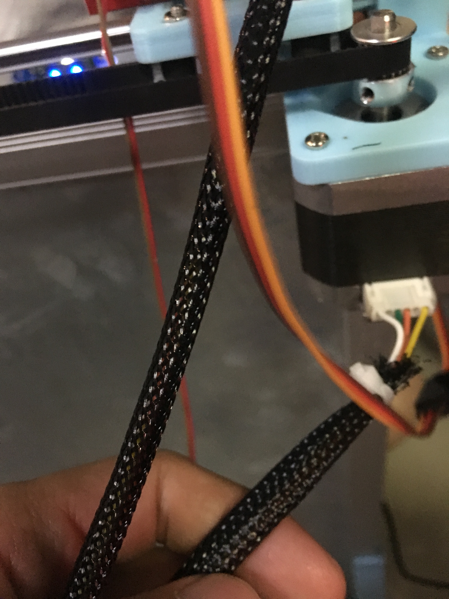

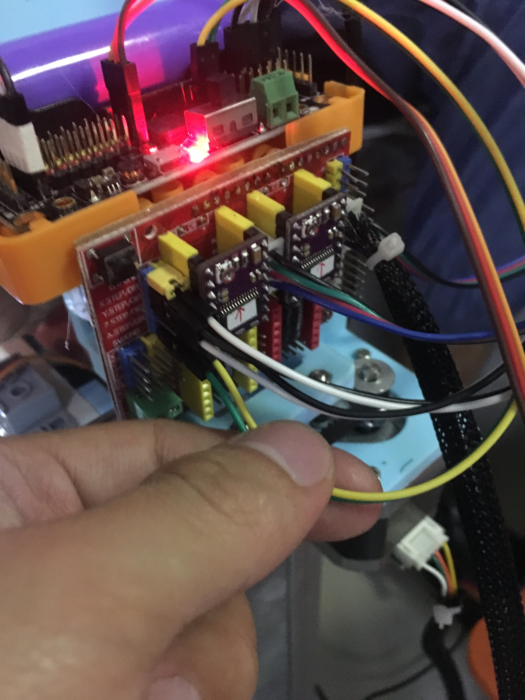

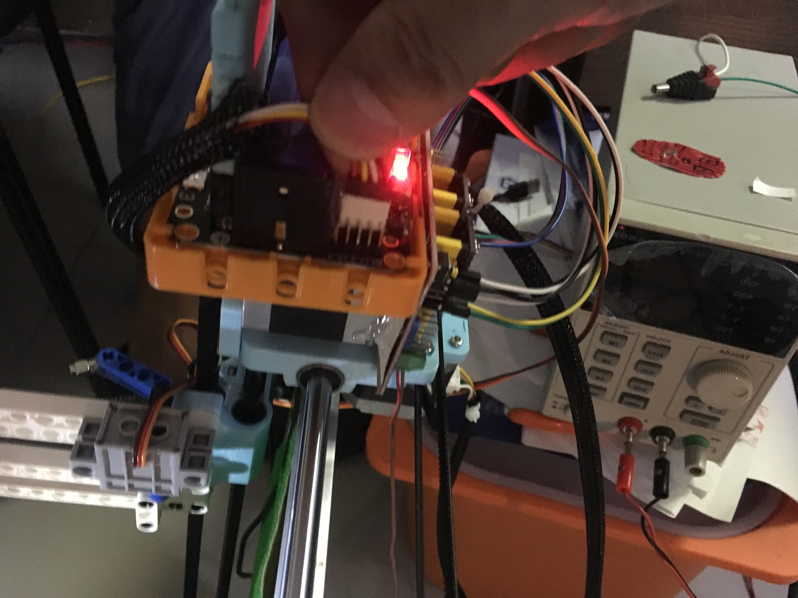

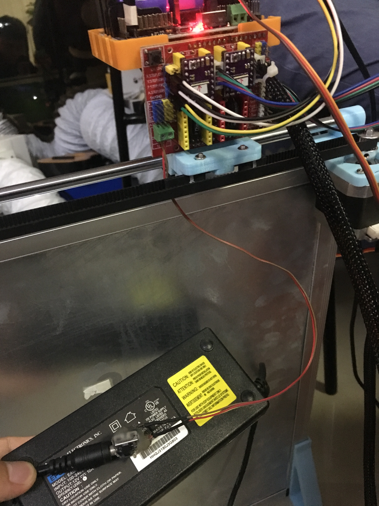

## 制作过程——软件编写与调试

程序由于太大也不好截图，这里给大家讲讲程序的算法框架就好。

软件编程思路：

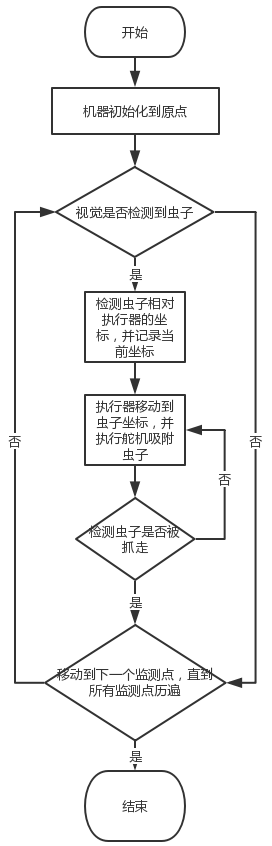

通过实物测试，每个监测点的坐标值大概如下：

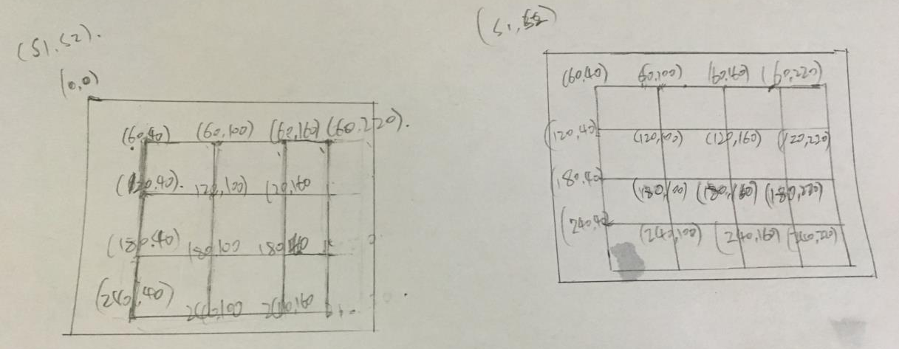

实际调试过程

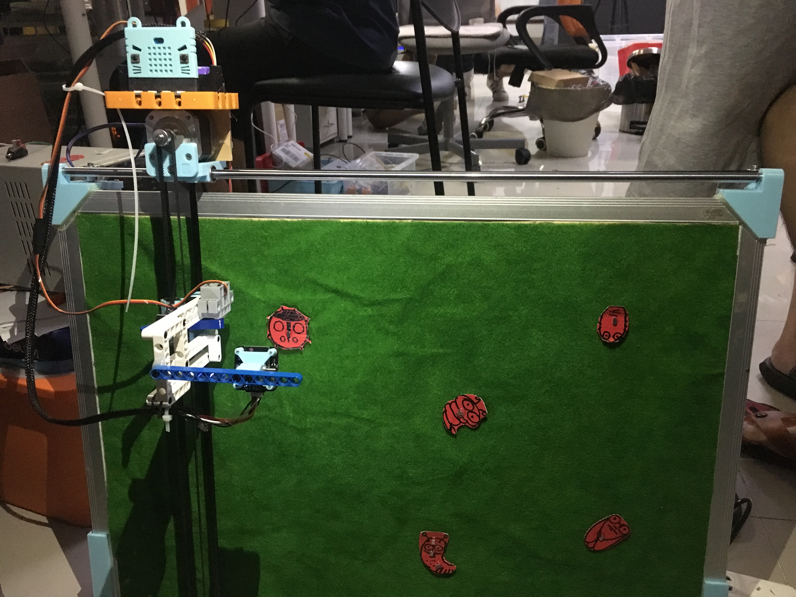

在实际调试过程中，我们发现环境光对摄像头识别影响比较大，因此我们额外增加了补光灯。

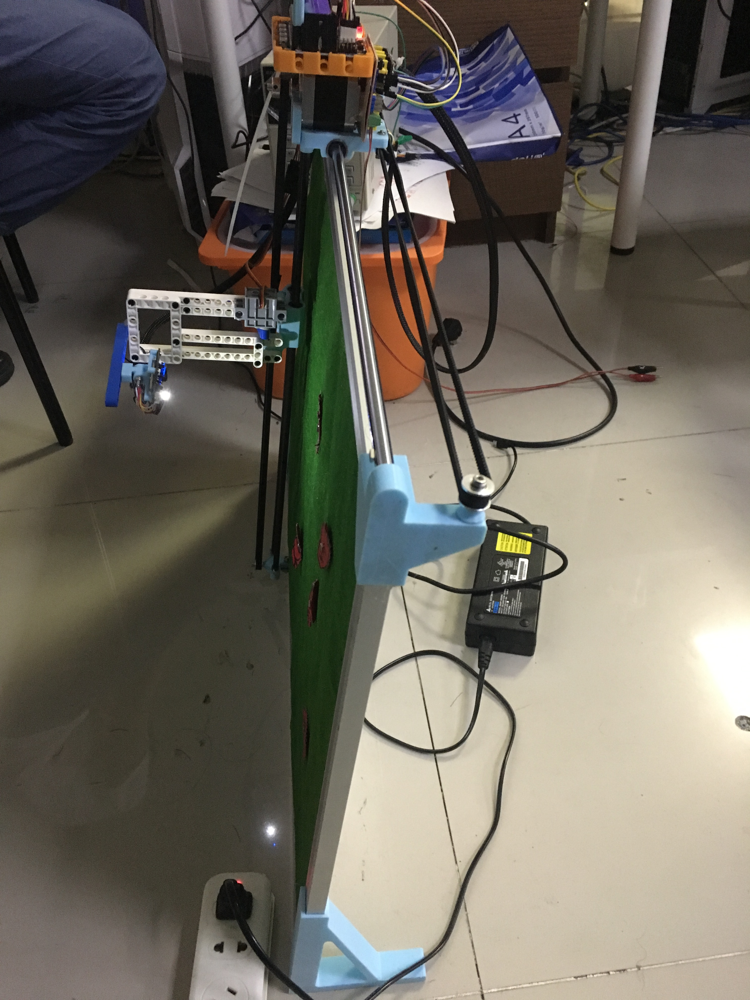

## 项目展示视频

https://www.bilibili.com/video/av73724770/?p=2

## 总结

本次项目难点在于如何锁定害虫的坐标，以及确定害虫坐标后精确的捕捉害虫。

本次项目的的不足在于：

如果应用到实际，识别害虫是一个难点，因为害虫的种类形状，都需要进行大量图片数据进行训练。

抓虫装置的机构要重新设计（现实生活中不可能用磁铁吸附虫子），必须是一个灵巧的机械手装置进行抓取。

通过本次项目，学习了Microbit通过A4988控制42步进电机。也学会了结合视觉模块的应用，感谢同事hogan程序肝了26小时（滑稽脸），最终得以实现比较好的效果。

