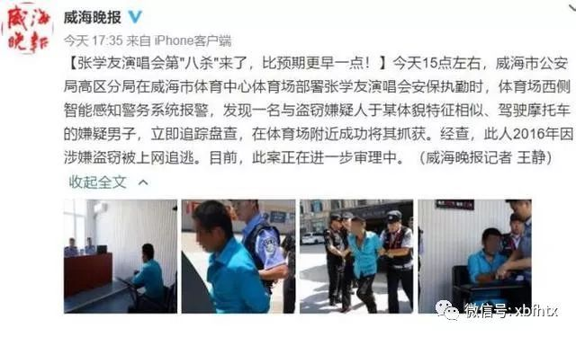
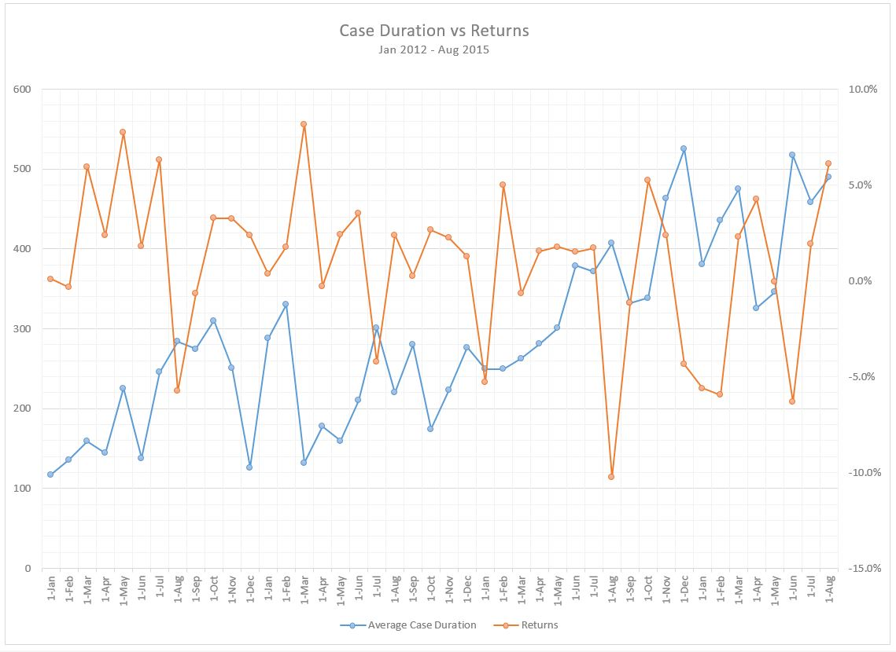
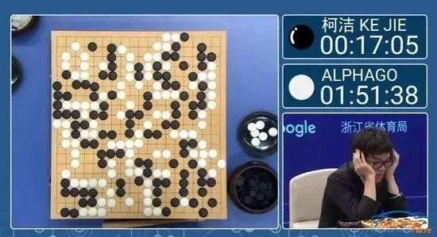

# Tensorflow 简介

## 前言——人工智能

说到TensorFlow首先要提及的概念就是人工智能，人工智能也是近年来的一个热词，各种商家开始在自己的产品上贴上人工智能，大众科普人工智能从接触生活的“人工智能”AI产品开始，在某些方面这种AI产品确实很智能，但在另外一方面这种产品显得特别蠢，大家就会有错觉原来人工智能也就这样。其实大家平时接触到的AI产品，大部分都是弱人工智能。弱不是指弱智，是指机器只在擅长的领域表现得很智能，在另外的领域就会一窍不通。受限于成本，计算能力，算法，产品项目周期等综合因素的限制，弱人工智能的产品应该是广泛的存在。毕竟消费者没有必要为自己不需要的功能多花钱，所以作为一名消费者我们也要宽点心，不要误信商家的人工智能无所不能，作为一名普通的用户，我们被动式去接受人工智能也就是冰山一角。

人工智能下个定义——人工智能是指机器拥有人类的认知能力。

## 人工智能跟我有什么关系

任何一项新的技术的出现，大家都会有疑问，这项新技术的出现对我有什么用，毕竟人有惰性，如果用处不大跟自己没有什么关系。那就不去了解不去学。对于还在学习阶段中的青少年，这是时代给予你们机遇！人工智能肯定是未来的风口，甚至引领第四次工业革命，促进全人类效率的提升。对于老师和家长，你们有义务去带领孩子们去接触这个新世界。让孩子日后在激烈的竞争中掌握多一门技能。对于各行各业的劳动者，也可以尽量去了解人工智能，虽然不可能每个人成为人工智能架构师，但是各行各业可以作为人工智能的需求方，充分了解人工智能这项技术后，考虑如何将本行业结合人工智能技术，解放劳动力，取得行业制高点。

## 人工智能在生活中应用

很多人有个误区，误以为做人工智能领域，一定是做出像具有人思考能力，情感能力，运动能力的机器人。实际人工智能有可能就是一台电脑，有一个数据输入接口，和一个数据输出接口。人工智能已经慢慢走近我们的生活，在安防行业、医疗行业、金融行业等都有应用。

### 逃犯克星张学友

歌神，每次的演唱会上都能抓到逃犯，得益于人工智能的人脸识别。如果这项工作交人去工作那几乎是不可能成的任务，在茫茫人海中，寻找出众多的特定的人，而且这些特定的人有可能发型，或可能化妆，有可能戴眼镜，或者带口罩等。而且人眼观察也就是一瞬间扫过，找出特定人的成功率非常0低。有了人工智能的辅助，大大增强监控的准确性。

### 帮助诊断癌症
通过人工智能的图形分析，可以加快某些疾病的诊断，辅助医生诊断，降低医生工作压力，也可为病人赢得更多的治疗时间。

### 各种数据预测

如股票，天气等，在繁杂看似无规律的数据中，找出规律与初始，与我们生活密切相关。

## TensorFlow是灵魂

人工智能是个好东西，但是如何将人类的认知能力赋予给机器，是人类一直在努力的方向。当你在路上看到一条狗和一只猫，你能轻易分别出来，但是你应该如何告诉机器，教他们如何区分，这是一条狗，这是一只猫。

每种区分写一种算法？世界上成千上万的物体？那需要多少算法？显然这个是不现实的问题。聪明的人类尝试想出有没有一种算法，能作为通用接法，如果针对特殊的，稍微改下参数，就可以是适应特殊的需求。

这里裂墙推荐TensorFlow，没听说过？下棋那个阿尔法狗的灵魂框架。

TensorFlow是由Google开发的一个基于深度学习神经网络的通用化机器学习系统。 大家经常可以听说机器干掉某个象棋大师，机器又干掉了某些电子游戏世界冠军等等的类似新闻，背后的幕后黑手都是TensorFlow和基于这个系统的各种模型和训练数据。

不要怕，TensorFlow本质上是一个工具，只要跟着喵家一步步来，肯定会对其有所了解，可以入门人工智能。

## Kittenblock的TensorFlow引擎

Google在2018上半年发布了使用js实现轻量版本的TensorFlow，经过半年的迭代优化而且生态圈的案例和资料越来越丰富。
Kittenblock在1.79版本更新也集成了TensorFlowjs引擎，并且将其重新进行整合使她更加适合图形化编程和入门。 即使完全没有编程基础，也能够让你在最短的时间内构造自己的机器学习模型，并且能够解决一些实际问题。
无论看多少相关的理论和书籍都没有自己真真切切地动手实践一下理解的深刻。

关于基本的机器学习或人工智能的综述，大家可以参考下[人工智能基础（高中版）](https://baike.baidu.com/item/%E4%BA%BA%E5%B7%A5%E6%99%BA%E8%83%BD%E5%9F%BA%E7%A1%80%EF%BC%88%E9%AB%98%E4%B8%AD%E7%89%88%EF%BC%89)这本书，里面形象地讲解了一些机器学习的理论和概念。对学习人工智能特别有帮助。对初中以上的，应该都能理解（部分高数计算除外），我们在Kittenblock内也完整实现了这本教程中察异辨花、手写数字识别和识图认物等几个例子, 在这个教程系列中我们也会穿插讲解一些基本原理和实现方法。

### 注意

由于我们的TensorFlow引擎才刚刚移植到Kittenblock中，难免有各种bug或者内存泄漏的情况，大家如果碰到bug或者有任何建议都可以在我们QQ群 568084773，我们的[论坛](https://bbs.kittenbot.cn),或者直接在我们的Kittenblock软件内报告bug。

* 由于TensorFlow使用了GPU进行计算，请确保你的电脑配置还过的去，部分太老的电脑或者集成显卡的电脑可能因为资源限制会有部分例子无法正常完成。
* 其实TensorFlow移植的早在Google发布tfjs第二天我们就列入开发计划了，但是因为我们团队实在太小了，各种项目花式优先级排序才拖了这么久。另外在重申一下正确提需求方式是要不停地骚扰我们的产品经理CC喵，而且是要组团骚扰，念叨地多了就自然落地了。