# TensorFlow快速开始(程序包集合)

请先下载Kittenblock1.79或以上版本，点击左下角的扩展插件之后可以在列表中找到TensorFlow的插件。

加载插件之后我们会看到TensorFlow有茫茫多的方块，不要害怕我们会在接下来的教程中讲解每个方块的作用。

其实TensorFlow有更多的功能我们都没有将其图形化，这里的方块其实只是完整的TensorFlow引擎的冰山一角，但是足够完成我们平时的大多数需求了。更多的功能请参考我们后续的TensorFlow转JavaScript功能的教程。

## 过程大纲

实际程序如图所示，对程序陌生没有关系，下面我们会分开一步一步进行讲解每一个部分的功能作用。

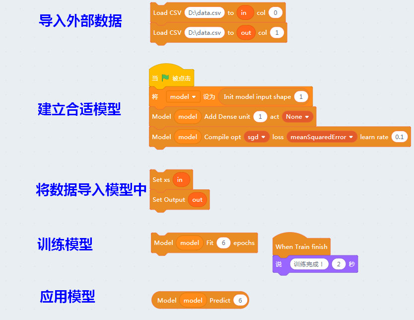

## 数据的导入

说到机器学习，我们第一步就是要给机器准备好标定过的数据。实际上大部分大数据的工作也是抓取和标定数据， 当然实际工作中的数据是海量的也不可能在个人电脑中完成所有计算。Kittenblock将数据导入流程做了大大的简化，可以直接导入csv文件和图片文件夹。当然这些简化带来的缺点就是效率的降低，但是可以让每一个人都看到数据长的是什么样子。

Kittenblock内的数据保存使用了Scratch的列表变量（list）完成，因此在导入任何数据之前请先建立对应的列表变量。

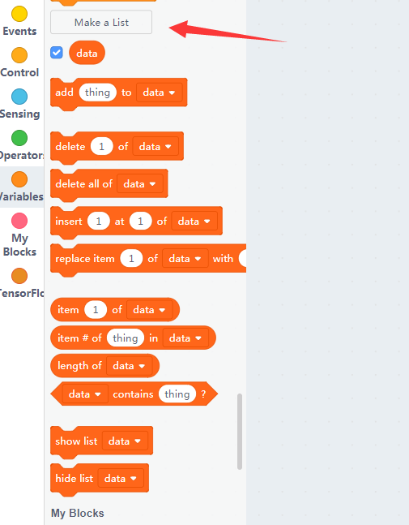

之后我们来看看对应的数据导入方块：

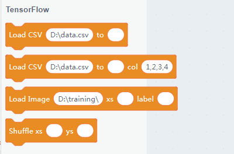

其中前两个是导入CSV数据，第三个方块是导入图片文件夹，第四个是数据混淆（或者简称洗牌）。
目前就4个导入数据的方块，后面会加入更加丰富的数据导入方法。

这里做测试我们在D盘根目录下建立data.csv文件，里面的内容如下（注意要用英文的逗号）：

	1,2
	2,4
	3,6
	4,8
	5,10

我这里使用excel建立的，填写好内容后，另存为data.csv的文件,并且**记住这个文件的位置**。

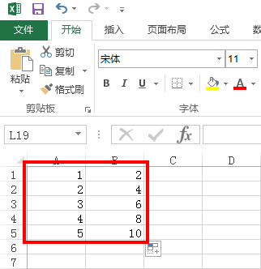

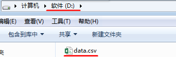

**作为我们普通人，一眼就可以看出，第二列的数字都是第一列的两倍。**

那我们如何让机器也能看出这个规律呢？跟着我们一步步操作

新建两个列表变量，分别叫**in**和**out**（如下图操作），准备用来分别储存刚才那两列的数据（通过这种方法，以表格的形式快速把数据导入到Kittenblock中，方便快捷，而且后续数据比较好维护，专业工具做专业的事情）

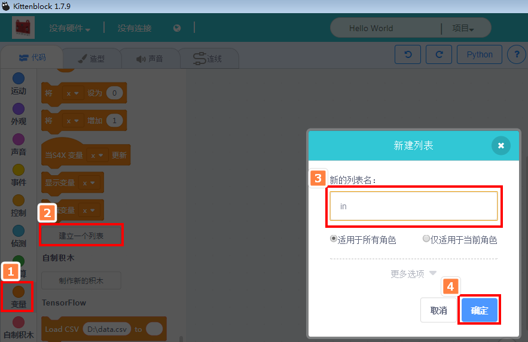

这样就建里了两个空的列表变量，下一步我们往列表中导入数据

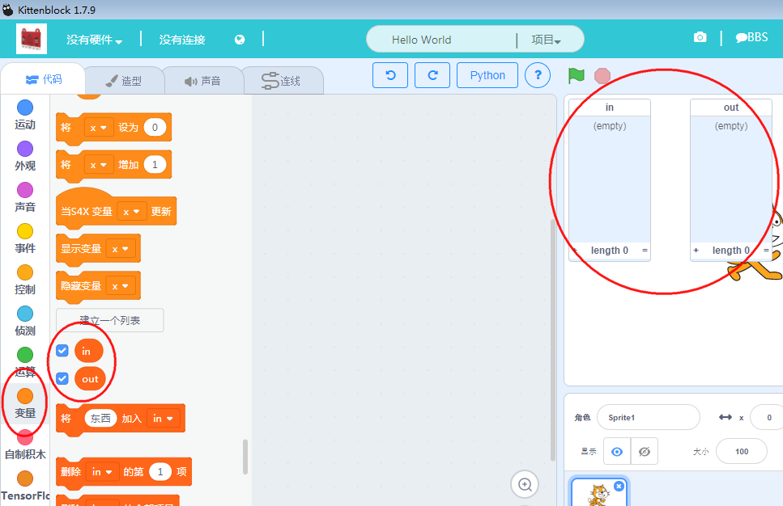

拖入如下方块，积木块的意思是将“D:/data.csv”这个文件的第0列（col0）导入到列表in中（就是这么特别从0列开始算起）...

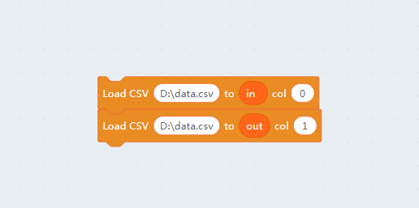

**点击方块**，相当于把这两个方块的命令执行一次，然后就看到两个列表已经导入了data.csv的数据了

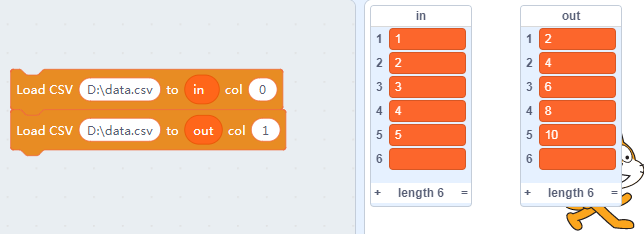

但是我们看到，**实际我们想导入5行数据**，这里居然有6行（应该是excel的一个bug，默认自己去补一个空行），这里我们手动删除下。

鼠标指针移动到6行那里（如图所示），点击下出现一个叉，再点击一下叉，就可以删除这个数据了。

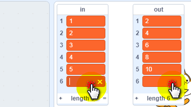

最终我们想要的结果：

导入后的数据会存在列表变量中，当我们保存项目时候，也会保存这些数据。
但是通过这些数据建立的模型却不属于scratch3的内容，需要另外保存或导入，我们会在后续介绍。

至于图像的导入和洗牌的作用我们会在后续的例子中介绍（不要害怕，我们会循序渐进）。

## 第一个机器学习模型

数据有了，接下来建立学习模型。

因为Kittenblock的TensorFlow引擎支持多个模型同时存在，我们需要先定义一个变量指向这个模型。

**注意这个变量只保存模型的名字，模型实体储存在TensorFlow的引擎中。保存sb3的时候也仅仅只是保存这个模型的名字，下次打开程序的时候还是需要重新初始化这个模型**

这里直接新建一个叫**model**的变量。

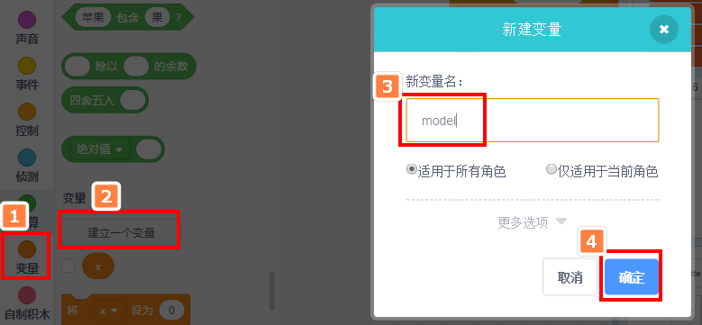

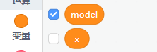

之后新建一个模型并赋给这个变量，后续我们所有对应的模型操作均需要指定模型名字。

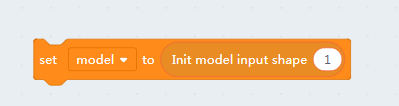

其中input shape是模型的输入矩阵尺寸，我们的数据每次只输入一个数据，并且每次只输出一个数据，因此这里直接填1就行了。

大家常常听说神经网络，这里我们就要给我们的模型添加神经网络了。作为入门我们只用一层的神经网络，并且这一层中只有一个神经元。

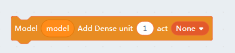

注意这是一个Denselayer类型的层，也叫全连接层。因为这个模型太简单了，我们会在下一章更加直观的看到它的形式。其中unit参数就是它的神经元数目，act是激活函数类型。

我们模型建立就到这里完成了，但是记住建立完模型后一定要编译模型，就跟我们写完代码要编译程序一样的道理。只有编译后的模型才生效并且可以用于训练，并且TensorFlow引擎会自动检察模型有没有错误。

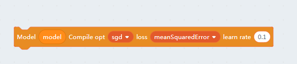

其中opt是Optimizer的简称，指的是模型训练中使用的优化器，loss是损失函数类型，最后一个参数是学习速率。这三个参数（特别是最后一个）设置的好坏将取决于你的模型是否能够收敛。

完整的模型建立方块如下

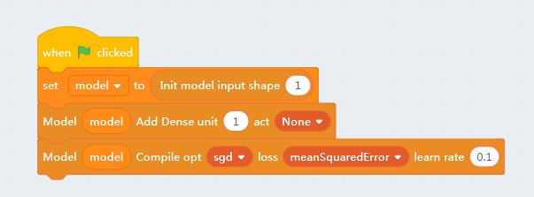

## 将数据交给模型并且开始训练

注意我们将数据保存为scratch3的list变量中，但是TensorFlow引擎并不知道也不能直接访问这些变量，我们需要手动将数据指定给模型。在训练模型之前我们还需要将数据交给TensorFlow引擎。

大家看其他资料或代码的时候也经常会发现将输入命名为xs输出命名为ys，大家只要记住xs表示输入数据，ys表示对应的输出数据或者标签就行了。

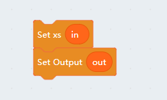

* 在绝大部分情况无论我们用了多少个模型，总体的输入和输出只要一组，因此数据指定不需要模型参数。

指定完数据我们就可以开始训练模型了，其中5表示循环的次数。
我们还建议大家将训练完成的帽子方块也加上，针对很多数据的时候整个训练过程可能长达几分钟或几小时。。。

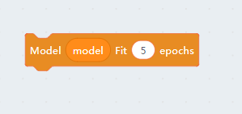

点击Model Fit方块，我们会发现猫咪一瞬间就告诉我们训练完成了，这是因为这个模型实在太简单了。

## 预测数据

模型训练完了，我们当然要拿他来做计算了~

这个模型大家一眼就能看出来输出应该是输入的两倍关系，那么机器从5组数据中是不是理解到其中的真谛了呢？

我们这里使用Model Predict方块，参数填一个6，之后点击方块

呃... 好像有误差啊，这么简单的问题都做错了。是不是我们训练次数不够呢？

**我们重新点击绿旗帜初始化模型，并且将Model Fit中的循环次数改成50，之后重新训练**

之后重新做上面的实验

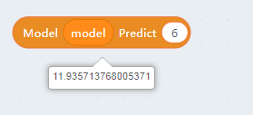

是不是发现精确多了

但是并不是训练次数越多越好，这其中存在过拟合的问题。当然也可以调整模型和训练参数让模型更快的收敛，要理解其中的精妙之处就需要大家去通读机器学习相关的专业书籍了。

这节主要给大家讲解TensorFlow插件最基本的使用方法，对整个流程有一个大致的印象。

#### PS

大家可以按键盘的Esc下的“~”按键，调出调试窗口，TensorFlow的模型建立，数据导入，模型训练的情况都会显示在调试窗口上。

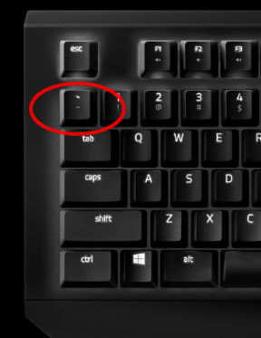

#### PS2

本系列中的所有教程的sb3文件我们都共享到了服务器，大家可以直接下载

[https://www.kittenbot.cn/newsinfo/969082.html?no-cache=1](https://www.kittenbot.cn/newsinfo/969082.html?no-cache=1)

