# 鸢尾花(Iris)分类

鸢(yuān )尾花分类相当于机器学习中的Helloworld问题，如果这个问题你能解开了那么说明你机器学习已经入门了。

上一节，我们做了一个最简单的TensorFlow的例子。例子中的数据是我们自己为了做这个例子而随意举例子给出来的。本节我们用TensorFlow解决鸢尾花分类。鸢尾花分类有很多中分类，它们一般通过花萼长度、花萼宽度、花瓣长度、花瓣宽度进行区分出不同种类。

有没有可能？我们让机器学习关于这个鸢尾花分类的一组大数据，然后建立模型，训练，后面直接给出花的四个特征，就能直接判断花的分类呢？

我们来试一试吧！

这篇教程所使用的的数据全称是：安德森鸢尾花卉数据集.

安德森是一名植物学家，这个数据集他已经进行标定过。所谓的标定，就是他本身作为植物学家，对这些植物了解很透彻，很轻易就将这些花进行了分门类别，并且把他们之间的一些特征进行测量。（这个数据集，比我们上一节的数据集有实际意义）

完整的数据如下表：

五列数据分别对应花萼长度、花萼宽度、花瓣长度、花瓣宽度和种类，其中种类分别为山鸢尾、变色鸢尾和维吉尼亚鸢尾三个类别。

	5.1,3.5,1.4,0.2,Iris-setosa
	4.9,3.0,1.4,0.2,Iris-setosa
	4.7,3.2,1.3,0.2,Iris-setosa
	4.6,3.1,1.5,0.2,Iris-setosa
	5.0,3.6,1.4,0.2,Iris-setosa
	5.4,3.9,1.7,0.4,Iris-setosa
	4.6,3.4,1.4,0.3,Iris-setosa
	5.0,3.4,1.5,0.2,Iris-setosa
	4.4,2.9,1.4,0.2,Iris-setosa
	4.9,3.1,1.5,0.1,Iris-setosa
	5.4,3.7,1.5,0.2,Iris-setosa
	4.8,3.4,1.6,0.2,Iris-setosa
	4.8,3.0,1.4,0.1,Iris-setosa
	4.3,3.0,1.1,0.1,Iris-setosa
	5.8,4.0,1.2,0.2,Iris-setosa
	5.7,4.4,1.5,0.4,Iris-setosa
	5.4,3.9,1.3,0.4,Iris-setosa
	5.1,3.5,1.4,0.3,Iris-setosa
	5.7,3.8,1.7,0.3,Iris-setosa
	5.1,3.8,1.5,0.3,Iris-setosa
	5.4,3.4,1.7,0.2,Iris-setosa
	5.1,3.7,1.5,0.4,Iris-setosa
	4.6,3.6,1.0,0.2,Iris-setosa
	5.1,3.3,1.7,0.5,Iris-setosa
	4.8,3.4,1.9,0.2,Iris-setosa
	5.0,3.0,1.6,0.2,Iris-setosa
	5.0,3.4,1.6,0.4,Iris-setosa
	5.2,3.5,1.5,0.2,Iris-setosa
	5.2,3.4,1.4,0.2,Iris-setosa
	4.7,3.2,1.6,0.2,Iris-setosa
	4.8,3.1,1.6,0.2,Iris-setosa
	5.4,3.4,1.5,0.4,Iris-setosa
	5.2,4.1,1.5,0.1,Iris-setosa
	5.5,4.2,1.4,0.2,Iris-setosa
	4.9,3.1,1.5,0.1,Iris-setosa
	5.0,3.2,1.2,0.2,Iris-setosa
	5.5,3.5,1.3,0.2,Iris-setosa
	4.9,3.1,1.5,0.1,Iris-setosa
	4.4,3.0,1.3,0.2,Iris-setosa
	5.1,3.4,1.5,0.2,Iris-setosa
	5.0,3.5,1.3,0.3,Iris-setosa
	4.5,2.3,1.3,0.3,Iris-setosa
	4.4,3.2,1.3,0.2,Iris-setosa
	5.0,3.5,1.6,0.6,Iris-setosa
	5.1,3.8,1.9,0.4,Iris-setosa
	4.8,3.0,1.4,0.3,Iris-setosa
	5.1,3.8,1.6,0.2,Iris-setosa
	4.6,3.2,1.4,0.2,Iris-setosa
	5.3,3.7,1.5,0.2,Iris-setosa
	5.0,3.3,1.4,0.2,Iris-setosa
	7.0,3.2,4.7,1.4,Iris-versicolor
	6.4,3.2,4.5,1.5,Iris-versicolor
	6.9,3.1,4.9,1.5,Iris-versicolor
	5.5,2.3,4.0,1.3,Iris-versicolor
	6.5,2.8,4.6,1.5,Iris-versicolor
	5.7,2.8,4.5,1.3,Iris-versicolor
	6.3,3.3,4.7,1.6,Iris-versicolor
	4.9,2.4,3.3,1.0,Iris-versicolor
	6.6,2.9,4.6,1.3,Iris-versicolor
	5.2,2.7,3.9,1.4,Iris-versicolor
	5.0,2.0,3.5,1.0,Iris-versicolor
	5.9,3.0,4.2,1.5,Iris-versicolor
	6.0,2.2,4.0,1.0,Iris-versicolor
	6.1,2.9,4.7,1.4,Iris-versicolor
	5.6,2.9,3.6,1.3,Iris-versicolor
	6.7,3.1,4.4,1.4,Iris-versicolor
	5.6,3.0,4.5,1.5,Iris-versicolor
	5.8,2.7,4.1,1.0,Iris-versicolor
	6.2,2.2,4.5,1.5,Iris-versicolor
	5.6,2.5,3.9,1.1,Iris-versicolor
	5.9,3.2,4.8,1.8,Iris-versicolor
	6.1,2.8,4.0,1.3,Iris-versicolor
	6.3,2.5,4.9,1.5,Iris-versicolor
	6.1,2.8,4.7,1.2,Iris-versicolor
	6.4,2.9,4.3,1.3,Iris-versicolor
	6.6,3.0,4.4,1.4,Iris-versicolor
	6.8,2.8,4.8,1.4,Iris-versicolor
	6.7,3.0,5.0,1.7,Iris-versicolor
	6.0,2.9,4.5,1.5,Iris-versicolor
	5.7,2.6,3.5,1.0,Iris-versicolor
	5.5,2.4,3.8,1.1,Iris-versicolor
	5.5,2.4,3.7,1.0,Iris-versicolor
	5.8,2.7,3.9,1.2,Iris-versicolor
	6.0,2.7,5.1,1.6,Iris-versicolor
	5.4,3.0,4.5,1.5,Iris-versicolor
	6.0,3.4,4.5,1.6,Iris-versicolor
	6.7,3.1,4.7,1.5,Iris-versicolor
	6.3,2.3,4.4,1.3,Iris-versicolor
	5.6,3.0,4.1,1.3,Iris-versicolor
	5.5,2.5,4.0,1.3,Iris-versicolor
	5.5,2.6,4.4,1.2,Iris-versicolor
	6.1,3.0,4.6,1.4,Iris-versicolor
	5.8,2.6,4.0,1.2,Iris-versicolor
	5.0,2.3,3.3,1.0,Iris-versicolor
	5.6,2.7,4.2,1.3,Iris-versicolor
	5.7,3.0,4.2,1.2,Iris-versicolor
	5.7,2.9,4.2,1.3,Iris-versicolor
	6.2,2.9,4.3,1.3,Iris-versicolor
	5.1,2.5,3.0,1.1,Iris-versicolor
	5.7,2.8,4.1,1.3,Iris-versicolor
	6.3,3.3,6.0,2.5,Iris-virginica
	5.8,2.7,5.1,1.9,Iris-virginica
	7.1,3.0,5.9,2.1,Iris-virginica
	6.3,2.9,5.6,1.8,Iris-virginica
	6.5,3.0,5.8,2.2,Iris-virginica
	7.6,3.0,6.6,2.1,Iris-virginica
	4.9,2.5,4.5,1.7,Iris-virginica
	7.3,2.9,6.3,1.8,Iris-virginica
	6.7,2.5,5.8,1.8,Iris-virginica
	7.2,3.6,6.1,2.5,Iris-virginica
	6.5,3.2,5.1,2.0,Iris-virginica
	6.4,2.7,5.3,1.9,Iris-virginica
	6.8,3.0,5.5,2.1,Iris-virginica
	5.7,2.5,5.0,2.0,Iris-virginica
	5.8,2.8,5.1,2.4,Iris-virginica
	6.4,3.2,5.3,2.3,Iris-virginica
	6.5,3.0,5.5,1.8,Iris-virginica
	7.7,3.8,6.7,2.2,Iris-virginica
	7.7,2.6,6.9,2.3,Iris-virginica
	6.0,2.2,5.0,1.5,Iris-virginica
	6.9,3.2,5.7,2.3,Iris-virginica
	5.6,2.8,4.9,2.0,Iris-virginica
	7.7,2.8,6.7,2.0,Iris-virginica
	6.3,2.7,4.9,1.8,Iris-virginica
	6.7,3.3,5.7,2.1,Iris-virginica
	7.2,3.2,6.0,1.8,Iris-virginica
	6.2,2.8,4.8,1.8,Iris-virginica
	6.1,3.0,4.9,1.8,Iris-virginica
	6.4,2.8,5.6,2.1,Iris-virginica
	7.2,3.0,5.8,1.6,Iris-virginica
	7.4,2.8,6.1,1.9,Iris-virginica
	7.9,3.8,6.4,2.0,Iris-virginica
	6.4,2.8,5.6,2.2,Iris-virginica
	6.3,2.8,5.1,1.5,Iris-virginica
	6.1,2.6,5.6,1.4,Iris-virginica
	7.7,3.0,6.1,2.3,Iris-virginica
	6.3,3.4,5.6,2.4,Iris-virginica
	6.4,3.1,5.5,1.8,Iris-virginica
	6.0,3.0,4.8,1.8,Iris-virginica
	6.9,3.1,5.4,2.1,Iris-virginica
	6.7,3.1,5.6,2.4,Iris-virginica
	6.9,3.1,5.1,2.3,Iris-virginica
	5.8,2.7,5.1,1.9,Iris-virginica
	6.8,3.2,5.9,2.3,Iris-virginica
	6.7,3.3,5.7,2.5,Iris-virginica
	6.7,3.0,5.2,2.3,Iris-virginica
	6.3,2.5,5.0,1.9,Iris-virginica
	6.5,3.0,5.2,2.0,Iris-virginica
	6.2,3.4,5.4,2.3,Iris-virginica
	5.9,3.0,5.1,1.8,Iris-virginica

那么这个问题就是我们有花萼长度、花萼宽度、花瓣长度、花瓣宽度四个参数,怎样判断它属于哪个种类呢？

## 操作过程大纲

依旧是同样的操作方法，只是数据与模型变动了。

## 将数据以CSV的格式存储

数据集全选，右键复制

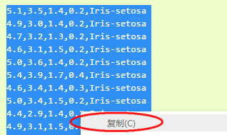

在D盘新建一个txt文本，把数据粘贴到文本中

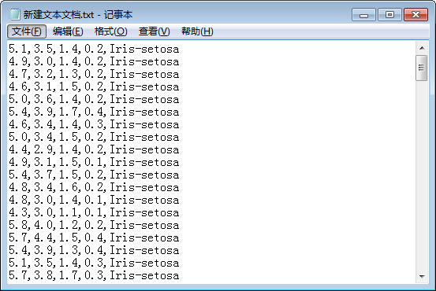

将txt文本重新命名为iris.csv，更改后缀名会弹出提示框，确认即可。

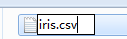

## 导入数据

在Kittenblock内新建一个项目，导入TensorFlow插件。

第一步首先我们要建立两个列表（list）变量，分别叫xs和ys，对应我们的前四列输入数据和最后一列输出名字。（新建列表变量步骤上节写的很清楚了，这节不在赘述）

之后拖入数据导入方块并执行：

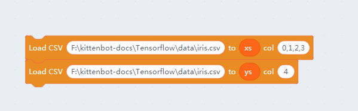

数据导入后我们可以看到xs和ys的内容如下：

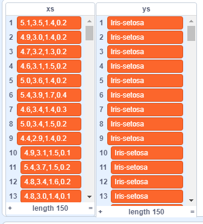

这里不建议大家在学习TensorFlow的过程中一直将数据显示打开，特别是xs列，因为后面我们接触到图像识别中xs中保存了成千上万的图像数据，在舞台中显示会活生生将软件拖死。

关闭列表显示，把蓝色的勾勾去掉即可。

## 模型建立

建立模型前我们还是要记得新建一个变量保存模型的名字，这里就叫**model**。

* 第一个方块初始化一个输入参数为4的模型，因为我们有花萼长度、花萼宽度、花瓣长度、花瓣宽度四个参数。
* 第二个方块我们添加了一层有10个神经元的全连接网络
* 第三个方块我们添加了一层有3个神经元的全连接网络，注意这是我们最后一层也就是输出层一定要跟我们的数据的矩阵大小一样才行，这里我们有三个分类。之后我们这里使用了softmax激活函数，因为我们的输出结果只能是3个其中一种，只要取概率最高的就行了。
* 最后编译模型，这里我们使用adam优化器和熵减损失计算。注意要将学习速率调低到0.01，防止训练步长过大导致震荡无法收敛结果。

整个模型如下图：

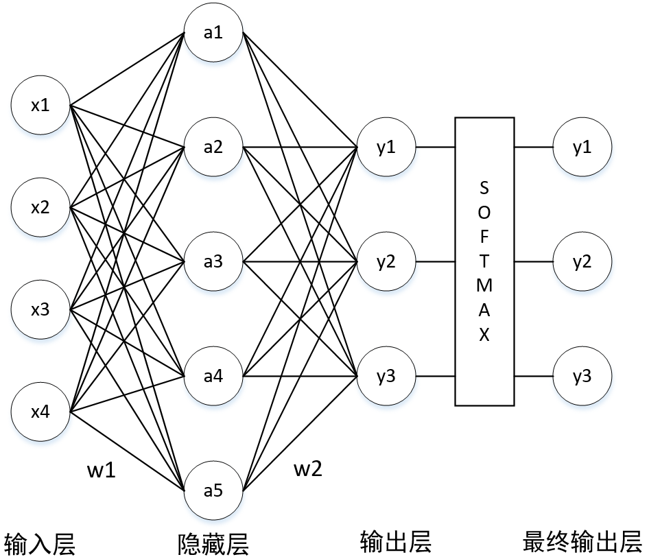

其中隐藏层有10个神经元，图中只画出了5个，实际上每个神经元还是跟前一级所有输入进行连接。

## 数据导入

同理我们需要将数据导入给TensorFlow引擎

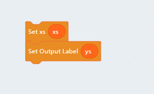

注意，这里很容易搞混~注意不要拖错积木块

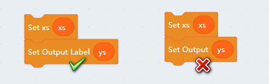

需要注意的是这里我们ys是一系列的标签，也就是输出为所有可能标签的某一个，大家看机器学习的书中说到onehot就是指的这个。

例如：`5.1,3.5,1.4,0.3,Iris-setosa`这一组数据的输出是**Iris-setosa**，但是机器并不认识这个单词。它跟喜欢的是形如**[1,0,0]**这样的矩阵，这样它就知道这一组数据输出是第一个类别。

同理：`6.2,2.9,4.3,1.3,Iris-versicolor`这一组的数据输出就应该是**[0,0,1]**

因此我们这里需要使用Output Label方块，这个方块将ys数据直接转换成onehot矩阵，并且保存了对应的标签映射。以后遇到标签类型的，我们都可以这样处理。

## 模型训练

之后我们加入模型训练方块，完整的图形化代码如下：

点击绿旗子运行，小喵说训练完成~

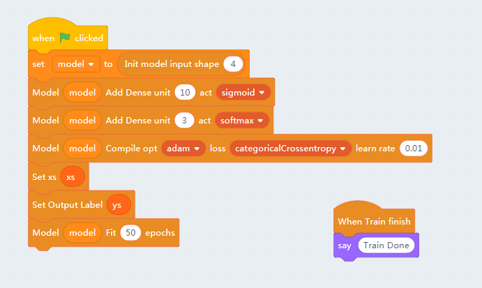

大家可以打开Kittenblock的调试窗口（按F12）查看模型的收敛过程：

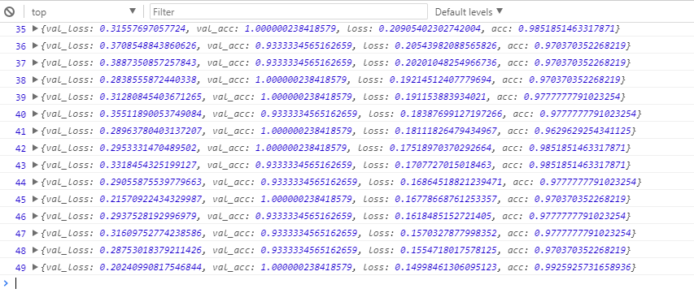

## 测试检测

训练完成后，我们加入模型预测方块

注意我们将ys标签化了，所以我们需要用Predict By Label让它输出正确的方块。点击方块，猫咪就会告诉你正确的类别喽~

当然大家也可以不用标签输出，那么模型预测将给出三组概率，其中最高那个就是我们需要的类别了。只是没那么直观。

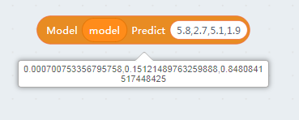