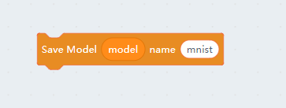
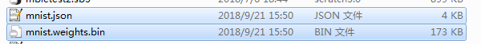
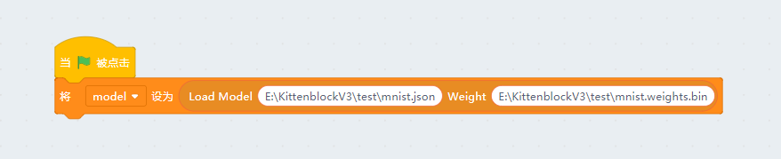
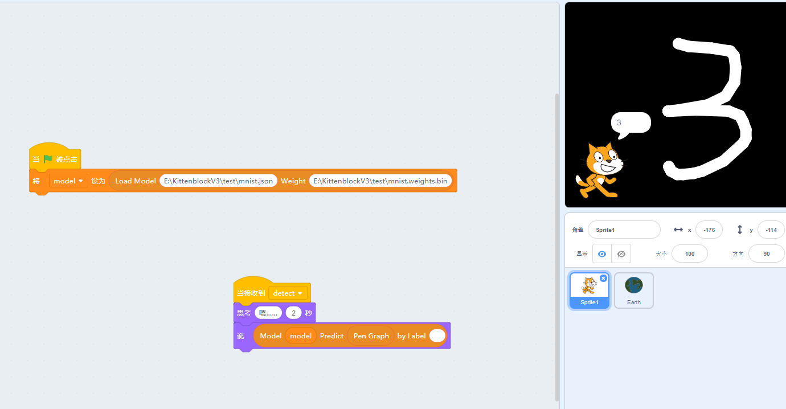

# MNIST 模型的保存和加载

还记得我们上一节让大家保存的sb3项目吗？我们关了Kittenblock重现打开这个项目，发现识别的结果完全不对啊！怎么办呢？是数据丢了？

这是因为TensorFlow本质上是一个插件并不是Scratch3的一部分，sb3保存的时候也并没有将模型进行保存，所有东西都在你的显卡内存中如果重启了软件当然都丢失了喽。

那么这个时候我们只能重新点击绿旗帜建立模型，之后还有导入数据给TensorFlow引擎，最后开始重新训练。每次都要执行这个流程吗？这个效率很低啊~

其实Kittenblock有对应的方块将训练好的模型和进行保存。首先大家还是先耐心的将上一节的项目重新训练下：）

## 保存训练的结果

我们可以使用如下的方块保存训练结果，点击这个方块后连续弹出两次保存框，一个是模型本身的拓扑结构，一个是模型的训练权重。

下面这两个文件就是模型的保存文件

## 加载训练结果

我们重新建立一个工程，画笔那部分还是照着前一个项目那样拖一个代码

之后新建一个model变量，加入如下方块

第一个参数是模型的拓扑结构文件的路径（*.json）,第二个参数就是模型的权重文件（*.weights.bin）

我们打开sb3后只需要执行这一个方块就可以了，将你的机器学习项目分享给别的小伙伴的时候也记得带上这个模型的保存结果。

