# 使用MobileNet模型进行任意物体识别——剪刀石头布为例

从上一节我们可以看到MobileNet是个相当优秀的模型，它可以识别生活中常见的大部分物品，当然准确率跟商业的在线api还差一些，不过胜在精巧和快速。

但是如果我们自己有一个分类，那么该怎么办呢？是不是该从零开始训练呢？

Mobilenet虽然轻巧，但是从零开始训练的工作量也是相当巨大的，而且不是我们一般家用电脑能消耗的起的。还记得之前说过卷积网络层的作用类似视网膜后的第一阶段的神经元，主要是将图像抽象化并做预处理，方便第二阶段大脑其他神经元做具体的处理。那么我们这里要借用的就是这个预处理好的网络，这样可以大大减小我们的训练工作量，只需要重新训练第二阶段分类的功能就行了。

我们重新看看MobileNet的网络图，我们这里要在卷积最后输出的地方截断之后连入我们自己的神经网络。

注意配图中的MobileNet跟我们所用的版本（v1.05）矩阵尺寸维度不一样，但是原理和思想是一样的。

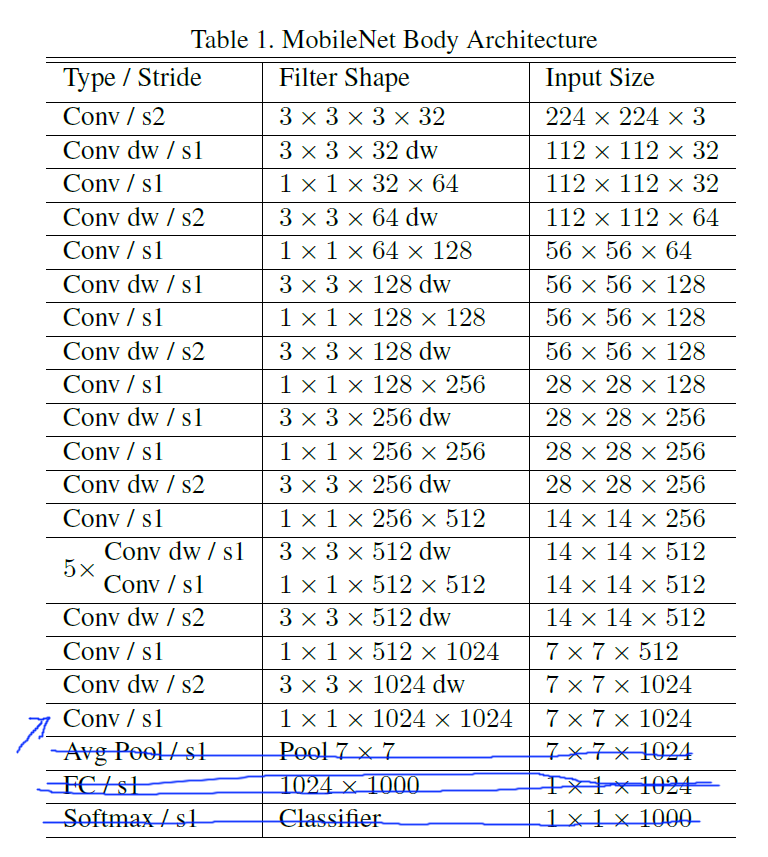

## 加载和建立模型

经过截断的MobileNet模型在我们[github仓库](https://github.com/KittenBot/kittenbot-docs/tree/master/Tensorflow/data)中有，下载方式参照上一节（**点进去**后再另存为），名字叫mobilenet_244g

因为我们这里使用了摄像头数据，大家还需要加载摄像头的插件（我们的PM大人把这个插件命名为AI），我们这里只用摄像头原始数据。

首先新建立一个叫**mobilenet**的变量，之后如下拖入代码：

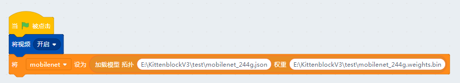

之后我们再新建一个变量，名字叫link，它的输入的mobilenet模型的卷积输出，输出对应我们想要的图片分类。

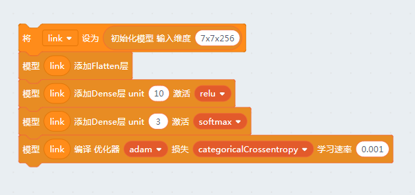

**注意：我们这里使用的MobileNet模型的最终输出是7x7x256维度的矩阵**

连接卷积层的第一步一般都是将它平化，我们添加一个flatten layer。

之后我们建立两层全连接的神经网络，输出三个标签分别对应石头、剪刀、布，输出层需要用softmax表征这是一个三选一的输出。

## 准备数据

由于我们的模型输入是mobilenet网络的卷积输出，有了模型那数据怎么办呢？

很明显这里给我们模型准备的不是石头剪刀布的图片，而是带标签的7x7x256矩阵数据。

这里我们还是先建立两个list变量，分别叫xs和gesture。

之后大家先看看mobile模型预测的输出如下，是7x7x256的权重分布。具体每个值代表什么这个世界没人知道，这是根据算法高度抽象化的图片特征信息。

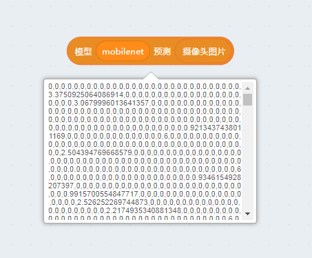

### 录入数据

那么我们接下来要做的就很简单了，为剪刀石头布三个手势分别准备50组mobilenet的输出矩阵就行了。（手势可以稍微变动下，对模型的适应性有帮助）

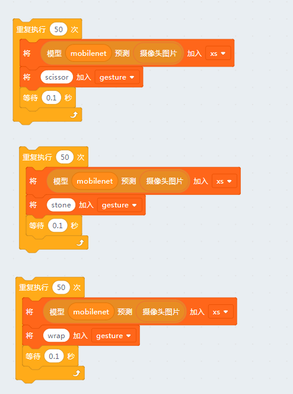

大家一定要在摄像头前面摆好对应的手势, 之后点击每个代码块，并且等到每个代码块结束后再给下一个手势准备数据。

### 如何清除数据

如果中间有地方弄错了就需要把数据清了重来了：

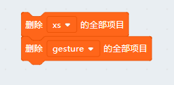

数据采集结束后大家可以打开gesture变量看看

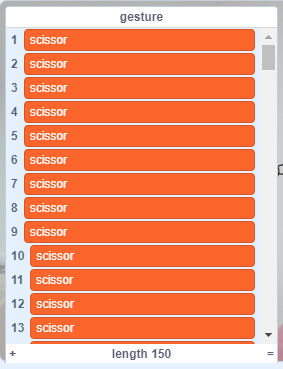

由于我们这里只有150组数据，大家可以对数据洗牌也可以不洗牌，影响不大。

## 模型训练

全部准备工作做完，最后记得将list数据导入给TensorFlow引擎。

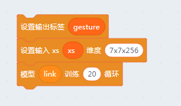

由于数据量比较小和最终的神经网络只有两层，很快就能收敛了。

最终看看是不是跟我们的结果一样呢？

## 测试应用

这段积木块点击后，小猫就会自动捕抓摄像头拍回来的照片，并且小猫说出来。

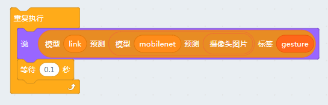

当然你也可以用图片来表示你的手势（如下图），这就看你怎么编了。

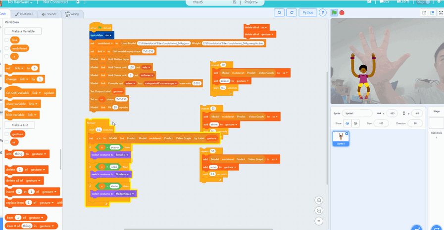

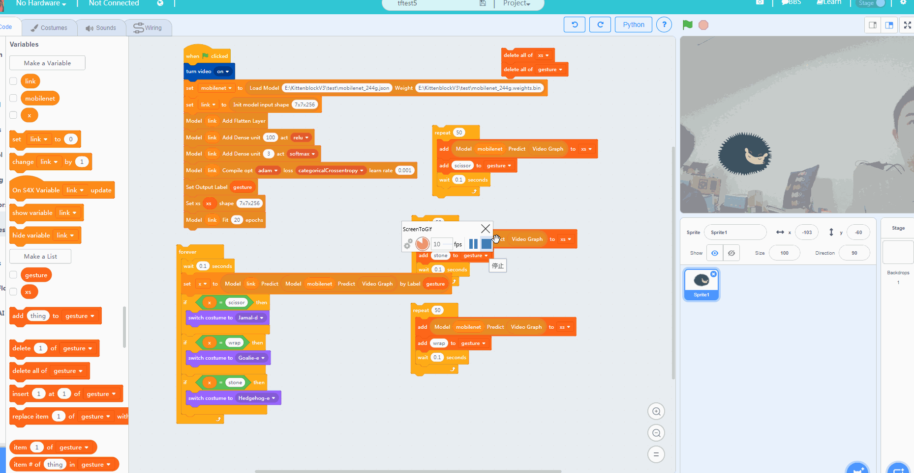

类似我们可以借用mobile的卷积神经网络训练任意分类的图片，就看大家的脑洞了 ~

### PS
MobileNet只对现实生活中的图片有比较好的输出，而对动漫、插画等等的结果都比较糟糕。因为喂给MobileNet的图片都是现实生活中的图片，根据训练的内容，所以MobileNet有这样的特性。
