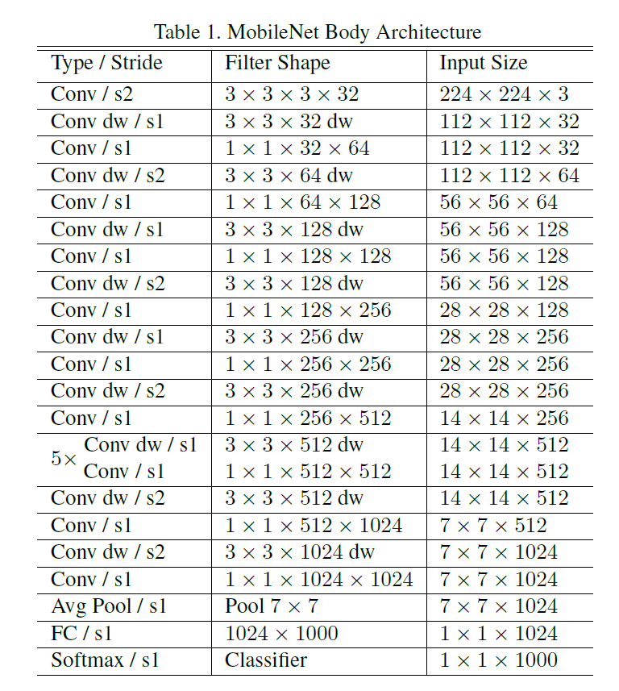
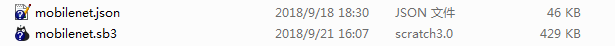
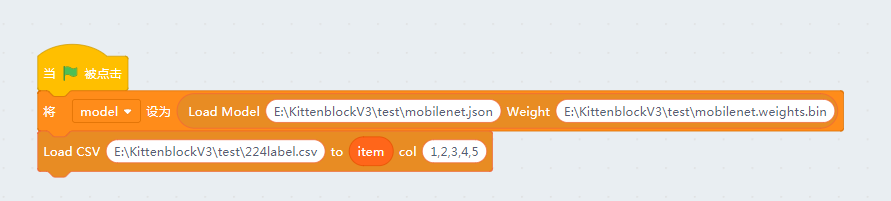
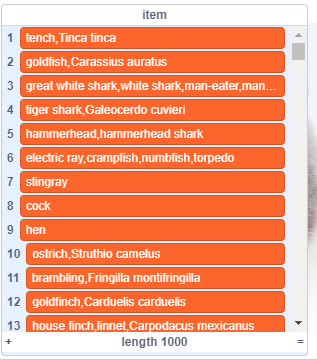
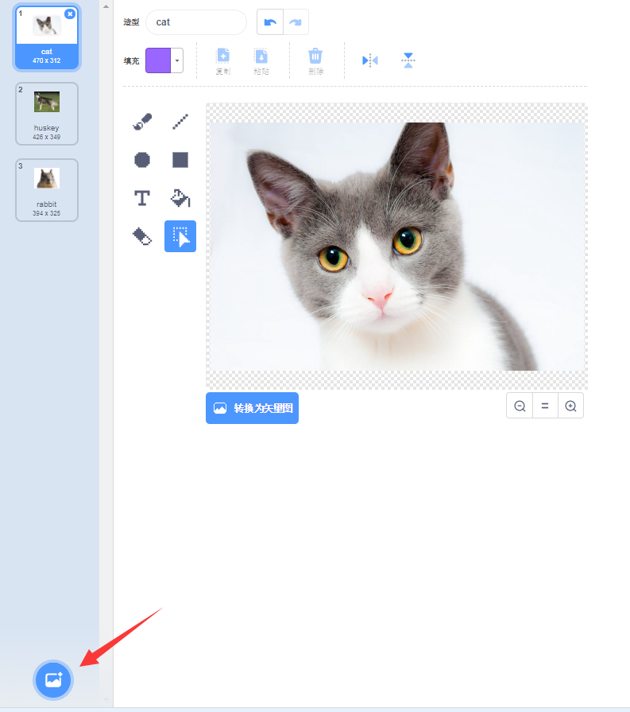
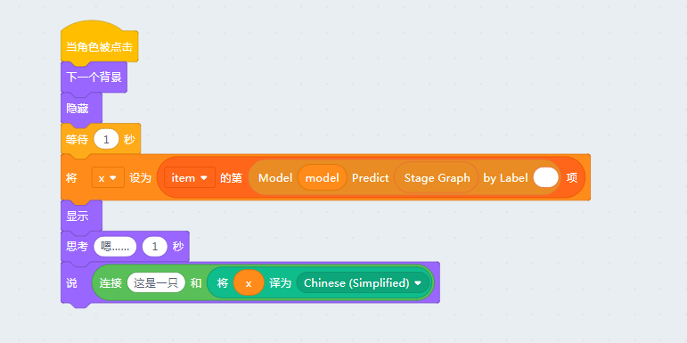
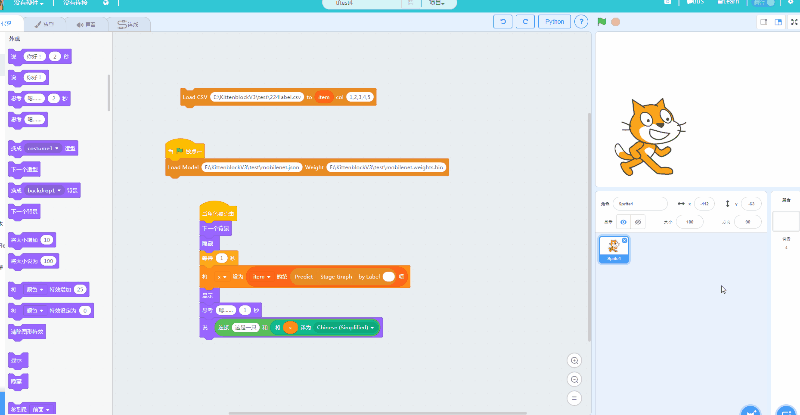

# 使用MobileNet模型进行物体识别

我们上一讲介绍如何加载已经训练好的模型和权重，其实这就给大家开了一扇无限大的门。我们可以使用别人已经训练好的模型做各种有趣的项目。

这里我们就使用大名鼎鼎的MobileNet识别物体

## 加载MobileNet模型

MobileNet是一个轻量化的神经网络模型，所谓轻量化就是可以在一般的家用pc和手机上跑起来的模型。一般我们人工智能的在线服务后端很可能是一个有几千层，还有n个模型相互嵌套的引擎，并且还有伴随着很多人工的优化和结果处理。而MobileNet全部细分层加起来也只有88个，最后结果输出1000个常见物品的分类。

下图是mobilenet的拓扑结构

我们新建一个项目，并且记得先新建一个model变量保存模型的名字。

之后我们需要mobilenet的模型和训练权重，这两个文件可以在我们[github仓库](https://github.com/KittenBot/kittenbot-docs/tree/master/Tensorflow/data)找到

拖入如下的加载代码

第二个方块是加载模型的输出结果名称，因为机器输出的是0~999这样的数字，我们需要将这些数字转换成名字。其中**224label.csv**这个文件就保存了我们需要的名称。其中item是一个list变量，加载之后我们可以看看item的内容：

## 添加图片

我们这个示例项目的思路是在背景中加入不同的小动物图片，切换这些图片的过程中识别背景中的动物。

猫咪精灵的代码如下

注意在识别的过程中将猫咪隐藏，防止干扰识别结果。我们还加入了Scratch3的中文翻译功能，需要大家联网，毕竟item列表中的很多单词我也不认识 。。。

最后效果如下~

