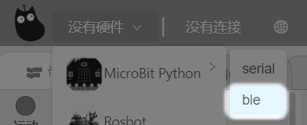
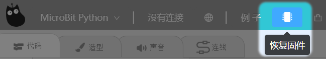
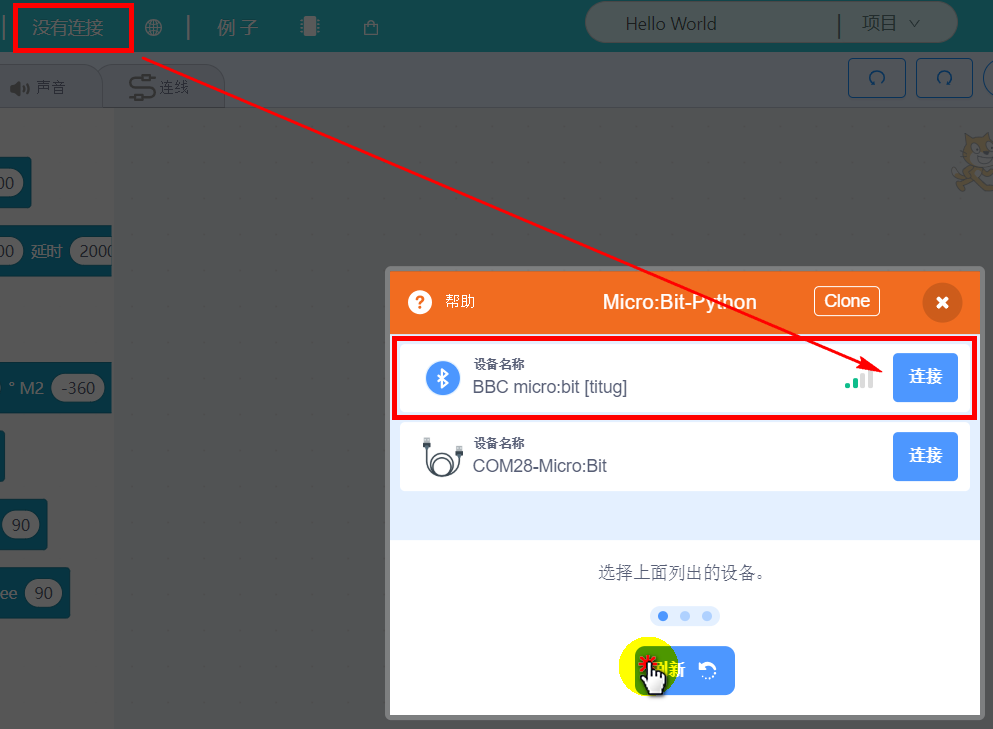
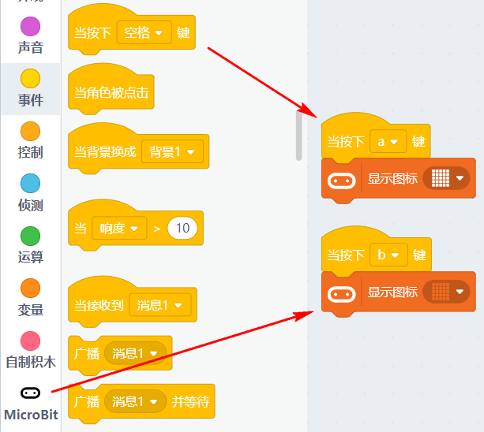
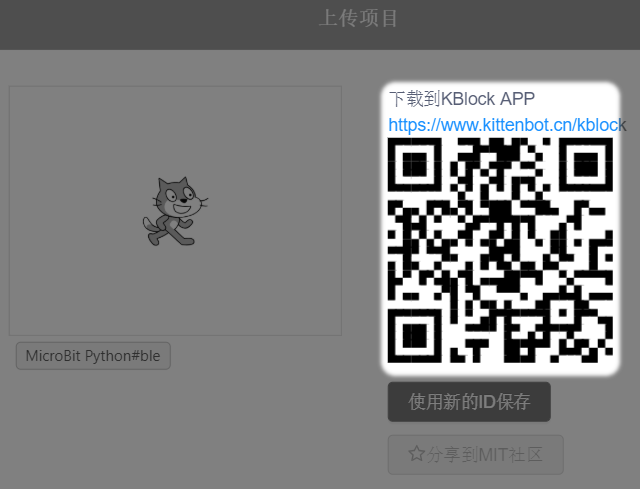
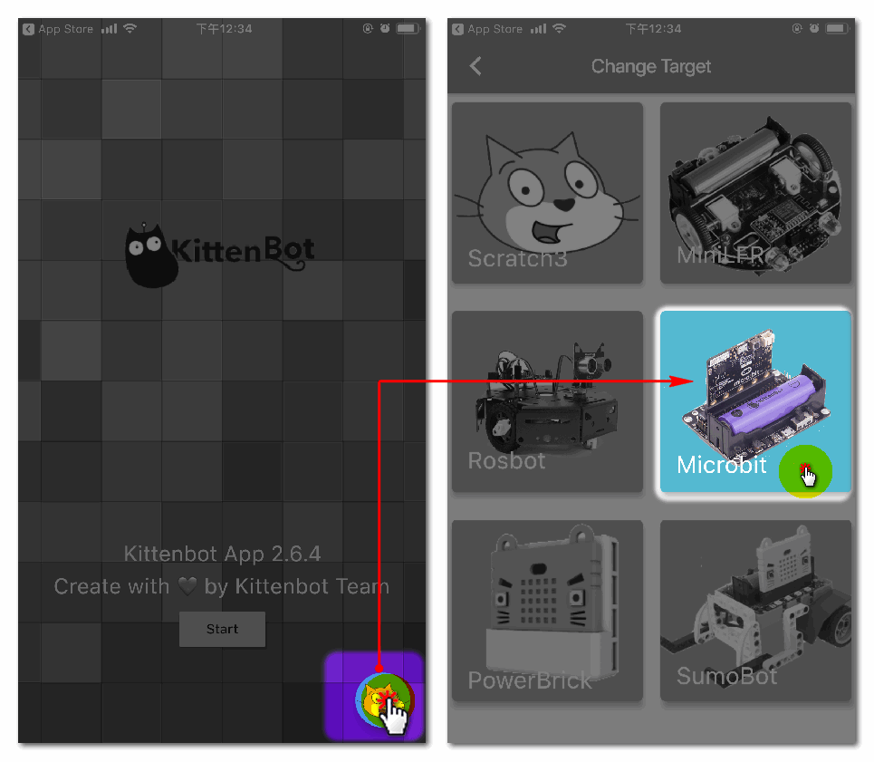

# 手机控制Microbit

## 简介

物联网中，其中最重要也是我们最关心的一环是我们手机控制我们的智能家居的设备。

在很多DIY制作中，只要涉及到手机控制，我们都会学习一个软件叫APP inventor。这个软件也算是专业的DIY用户必学的软件，它可以直接制作成apk，安卓手机能用的安装包。不过对于初学者来说，存在一个学习成本的问题。

因此小喵为了降低用户的学习成本。在Kittenblock中直接打通了，PC端与手机端的程序。换句话说，你在PC端编写一个与硬件交互的程序后，通过二维码扫描传输，把PC端程序传到手机端上，手机端通过蓝牙可以与软件进行交互。

## Microbit刷入蓝牙固件

- 硬件选择

- 恢复固件

- 如果你已经买了喵家的USB蓝牙设配器，你可以开启在右上角的齿轮设置——启动蓝牙驱动（1.8.4t版本）

- 如果你没有买喵家的USB设配器，这一步骤可以跳过，不影响手机控制Microbit。

如果你没有买喵家的USB设配器，这一步骤可以跳过，不影响手机控制Microbit。

## Kittenblock编写程序

在Kittenblock中编写键盘的A和B按键控制 Microbit点阵亮灭，模拟智能家居开关灯的效果。

## 手机安装Kblock APP

## 二维码扫描传输

如图操作，将PC端的程序生成二维码链接传输到手机APP上

生成二维码，等待手机Kblock APP的扫描

## 手机蓝牙连接Microbit

- 手机需要安装喵家Kblock APP

安卓端下载地址：https://www.kittenbot.cn/kblock

苹果端，可以在APP Store搜索Kittenblock

首次打开软件，需要等待软件热更新2.60-》2.64，请保证你在联网状态下进行更新。需要稍等一会。

- 选择硬件

- 选择从二维码创建程序

- 蓝牙选择连接Microbit（请确保你手机的蓝牙已开启）

## 实验测试

如果以上操作都没有问题，我们就可以用手机对Microbit点阵进行控制。

## 拓展与提升

手机已经能控制硬件了，那么硬件上的传感器数值能不能传回给手机呢？答案是肯定的！

这边编写一个读取Microbit的温度程序。通过上面的方式，可以使用手机界面读取Microbit的温度了。

